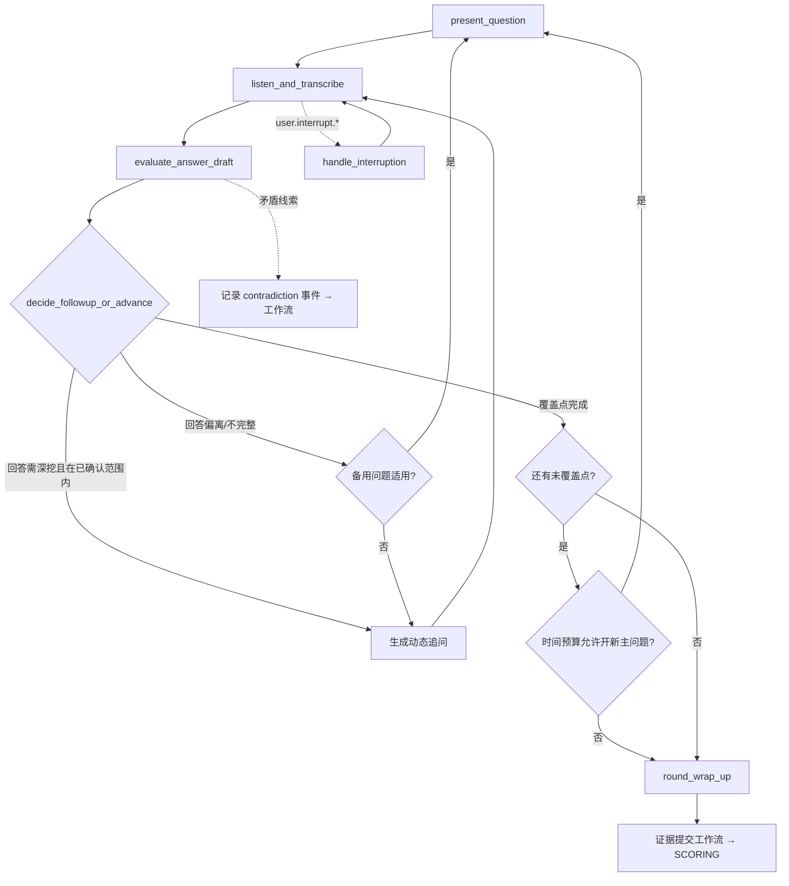

# AI 编排规范（AI-ORCHESTRATION）

| 字段 | 内容 |
|---|---|
| 文档编号 | AI-ORCH-001 |
| 版本 | 0.1.0（已批准 2026-08-01 规范评审） |
| 追踪 | PRD-001 "Architectural Decisions"（业务工作流与 AI 决策分离、对话与评分分离）；US-02、US-03、US-04；FR-009 ~ FR-012、FR-023、FR-024；ADR-0001、ADR-0002 |
| 一致性锚点 | `docs/domain/INTERVIEW-STATE-MACHINE.md`（业务状态唯一事实源）、`docs/ai/SCORING-SPEC.md`、`docs/ai/HANDOFF-SPEC.md`、`docs/ai/PROMPT-POLICY.md`、`config/interview-flows/v1/default.yaml`、`config/safety/policy.yaml` |

## 1. 目的

定义面个蛋 AI 编排层（LangGraph 决策图 + 模型网关）的节点、状态、条件路由、检查点、工具权限与失败策略，使"概率性 AI 决策"与"确定性业务状态"在工程上严格分离、可恢复、可评测。

## 2. 范围

- 面试官决策图（实时面试中的提问、倾听、追问、打断、工具使用、收尾）。
- 五条 AI 链路：计划生成、问题主线、动态追问、跨轮交接、报告与训练。
- AI 侧版本、灰度、检查点与失败策略。

## 3. 非目标

- 不定义业务状态机（见 INTERVIEW-STATE-MACHINE）；AI 图中不存在"改分/改解锁/改额度"的路径。
- 不定义评分算法（见 SCORING-SPEC）；面试官与问题生成模型只提交证据，不写最终分数。
- 不定义提示词文本本身（见 `ai/prompts/` 契约与 PROMPT-POLICY）。
- 不选定模型供应商（见 PROVIDER-ADAPTERS，OD-01）。

## 4. 总原则：确定性业务状态 vs 概率性 AI 决策

| 层 | 技术 | 职责 | 能做 | 禁止 |
|---|---|---|---|---|
| 业务工作流 | Temporal（Go/Python 活动） | 项目/轮次/评分/复核/计费/删除状态；超时、重试、幂等 | 改变业务状态、写账本、发事件 | 依赖 LLM 输出做未校验的状态迁移 |
| AI 决策图 | LangGraph（Python） | 覆盖点推进、动态追问、打断处理、交接构建 | 产出问题文本、证据草稿、摘要 | 写业务状态、写评分、访问密钥/他人数据 |
| 评分服务 | 独立服务 | 冻结量表 + 冻结证据 → ScoreVersion | 按 SCORING-SPEC 计算 | 接受模型直接写入的最终分 |

交互规则：

1. 工作流 → AI 图：以不可变输入调用（计划快照、交接包、回合上下文），输入经 Schema 校验。
2. AI 图 → 工作流：只通过显式输出端口返回结构化结果（下一问题、证据草稿、交接包草稿）；工作流负责校验（Schema + 安全过滤 + 语义去重）后持久化。
3. 证据账本只由工作流侧写入；AI 图的"证据草稿"须经提交管道（含实际播放核对）才成为 EvidenceItem。

## 5. 面试官决策图（Realtime Interviewer Graph）

### 5.1 节点定义

| 节点 | 职责 | 输入 | 输出 |
|---|---|---|---|
| `load_context` | 加载计划快照、交接包（第 2 轮起）、便利设置、风格参数 | session 启动消息 | 初始图状态；缺失交接包时报错并阻止开始 |
| `present_question` | 产出当前主问题（从预生成主线取题，安全过滤后下发 TTS/数字人） | 覆盖点计划、do_not_repeat 清单 | 候选问题 → 校验 → 待播放问题 |
| `listen_and_transcribe` | 接收 ASR 最终文本/文字输入/工具事件；管理修订窗口 | asr.final、文字提交、tool.event | 回合回答草稿（标注 input_modes_used） |
| `evaluate_answer_draft` | 生成**证据草稿**：覆盖点命中、回答要点、矛盾线索（非评分） | 回答草稿 | EvidenceDraft（提交工作流，不评分） |
| `decide_followup_or_advance` | 条件路由：追问 / 推进下一覆盖点 / 备用问题 / 收尾 | 覆盖进度、时间预算、风格参数 | 路由决策 + 追问文本（须不越出已确认范围） |
| `handle_interruption` | 用户打断（语音/按钮/文字提交）→ 停止输出、切换聆听 | user.interrupt.* | 停止确认；未播放内容丢弃（不写入正式问题） |
| `use_job_tool` | 按预配置工具组织任务（代码/白板/案例/作品集） | 轮次工具配置 | 工具任务说明 + tool.activated |
| `round_wrap_up` | 到目标时间或无剩余覆盖点 → 收尾，不再开新主问题 | 时间信号、覆盖进度 | 收尾话术 + 回合结束请求 |
| `handoff_builder` | 本轮通过后构建交接包草稿（见 HANDOFF-SPEC） | 全轮证据草稿、ScoreVersion 引用 | HandoffPackage 草稿（交工作流校验） |

### 5.2 图状态对象（InterviewerState）

```json
{
  "project_id": "uuid",
  "session_id": "uuid",
  "round_sequence": 2,
  "plan_snapshot": {"plan_version": 3, "rubric_version": "rubrics/v1/default", "coverage_points": [], "critical_dimensions": []},
  "handoff_package": {"package_id": "uuid", "do_not_repeat_questions": [], "follow_up_focus": []},
  "coverage_progress": [{"coverage_id": "cp-01", "status": "pending|in_progress|covered|skipped_timeout"}],
  "current_turn": {"turn_index": 4, "question_id": "q-...", "answer_status": "listening"},
  "style_parameters": {"tone": "professional", "followup_intensity": "medium", "pressure_level": "low"},
  "accommodations": ["extended_time", "no_proactive_interruption"],
  "safety_flags": {"injection_detected": false, "blocked_attempts": 0},
  "time_budget": {"target_minutes": 30, "wrap_up_started": false}
}
```

### 5.3 条件路由



路由规则（强制）：

1. 追问必须落在计划确认的**能力目标与覆盖点范围**内；越界候选一律丢弃并重选（≤3 次，失败则推进下一覆盖点）。
2. 到目标时间后 `wrap_up_started = true`：不再开新主问题，允许当前回答、必要追问与收尾（偏差约 ±5 分钟）。
3. 候选主问题先经 `do_not_repeat_questions` 语义去重，再经安全过滤（config/safety/policy.yaml），任一不通过即重选。
4. 数字人礼貌打断仅在 `polite_interruption_allowed` 且未设 `no_proactive_interruption`，且用户严重偏题/超时/持续过长时触发；无法判断用户是否答完时，询问而非假设。

### 5.4 检查点（Checkpoint）

- 每回合结束写检查点：图状态 + 当前覆盖进度 + 已提交证据引用；存储于区域内持久化层。
- 崩溃恢复：从最近检查点重建图状态；业务侧以"最后已确认回合"为准（与 INTERVIEW-STATE-MACHINE 重连规则一致）。
- 检查点不含敏感字段；不含原始音视频。

### 5.5 工具权限（白名单）

| 允许 | 说明 |
|---|---|
| 读取本会话转写/修订文本 | 仅当前 project/session 范围 |
| 写入证据草稿、tool 事件草稿 | 经工作流校验后入账本 |
| 读取计时/回合信号 | 用于收尾决策 |
| 读取计划快照与交接包 | 只读 |

| 禁止（硬约束） | 说明 |
|---|---|
| 写分数/解锁/额度/授权 | 业务状态只能由工作流改变 |
| 访问密钥、密钥引用值 | 模型不接触任何凭证 |
| 读取其他用户/其他机构数据 | 租户硬隔离 |
| 白名单外工具调用 | 一律拒绝并写安全审计 |

### 5.6 失败策略

| 失败 | 策略 |
|---|---|
| LLM 单次调用超时/错误 | 指数退避重试 ≤2 次（供应商适配层可切换备用，见 PROVIDER-ADAPTERS） |
| 结构化输出校验失败 | 重试 ≤2 次 → 降级为备用问题/预生成内容 |
| 追问重选 3 次仍越界或不安全 | 放弃追问，推进下一覆盖点 |
| 数字人音视频持续故障 | 交业务侧故障流程：暂停计时、保存状态、自动重连、询问文字降级、拒绝则评估未完成（AI 图不自行决策状态） |
| 评分服务不可用 | 本轮进入 SCORING_FAILED 重试；仍失败 → EVALUATION_INCOMPLETE（不判失败） |
| 注入检测命中 | sanitize_and_log；按数据处理，不影响面试继续 |

## 6. 五条链路

### 6.1 计划生成（Plan Generation）

输入：已确认 ResumeVersion / JobVersion、ProcessSource 列表、降级模式同意。流程：

1. 来源融合：官方优先（official_careers_page > official_recruiting_content > credible_public_material > candidate_experience[标记非官方]）；无可靠来源 → 通用岗位/级别模板并 `flow_uses_generic_template = true` + AI 推导标记。
2. 轮次建议：AI 生成 2–5 轮（`config/interview-flows/v1/default.yaml` 边界；用户可调 1–5）；默认推荐三轮（筛选与简历深挖 → 岗位专业能力 → 综合/终面）。
3. 每轮产出：角色、重点、时长（15–60 推荐）、难度、关键维度、工具、**能力目标 + 主问题方向 + 行为锚点引用 + 覆盖点 + 备用问题**（正式问题内容不向用户展示）。
4. 安全过滤：全部生成内容过 `config/safety/policy.yaml`（歧视/隐私/危险/侮辱/作弊/录用预测/PII 复述）；命中即重新生成 ≤3 次，仍失败则该模块失败 → 项目进 PLAN_FAILED，只重试失败模块。
5. 校验与确认：总权重 = 100、单维调整 ≤ ±5、每轮量表绑定；用户确认后冻结（不可改评分算法、60 门槛、解锁与交接规则）。

### 6.2 问题主线（Pre-generated Mainline）

- 会前随 PlanVersion 冻结：capability_targets、main_question_directions、behavior_anchor_refs、coverage_points（含 weight_in_dimension）、backup_questions。
- 主线只定义方向与覆盖，不写死逐字问题；正式措辞由面试官图在范围内生成并经安全过滤。
- 主线缺失（任一轮无覆盖方案或量表）→ 该轮禁止开始（FR-011）。

### 6.3 动态追问（Dynamic Follow-up）

- 触发：回答模糊、缺少量化、与简历/前序回答矛盾、覆盖点未打透。
- 约束：不越出已确认范围；压力等级由 style_parameters 决定但受 `config/safety/policy.yaml` 高压护栏限制（禁侮辱/歧视/无关隐私）。
- 打断处理：收到 user.interrupt.* → 立即停止输出（未播放内容不写入正式问题），切换聆听；输出 P95 ≤500ms 内停止（NFR-009）。
- 不确定用户是否答完：明确询问"请问您回答完了吗？"而非静默假设。

### 6.4 跨轮交接（Handoff）

按 HANDOFF-SPEC 执行：八类必需内容、压缩预算 max_tokens、事实完整性校验（不引入新事实、可回溯、敏感字段零携带）、禁止重复清单与两类允许重新验证例外。交接包由 `handoff_builder` 产草稿，工作流校验通过后冻结；校验失败 → 下一轮不可开始，重试生成 ≤3 次后升级人工。

### 6.5 报告与训练（Report & Coaching）

- 报告生成按模块（overview/radar/job_match/rounds/communication_analysis/tool_performance/training_plan）独立生成与重试（FR-026）；雷达必带文字等价；全部输出标记"模拟训练结果，不代表真实企业录用结论"。
- AI 教练：依据失败点/未覆盖点生成原题练习或变体、提示、答题框架、示例与逐步反馈；**练习内容不写入正式证据链，永不改变正式分数与解锁**；练习与正式重试在数据模型上严格分离（Practice vs RetryAttempt）。
- 报告/教练内容同样过安全过滤；反馈聚焦行为与证据，先优势后改进。

## 7. 版本与灰度

1. 提示词、模型、量表、工作流、前端独立版本化与灰度回滚（FR-038）。
2. 活跃正式面试固定开始时的模型/提示词/量表/供应商版本；故障切换记录原因并暂停计时。
3. 变更路径：离线评测 → 影子运行 → 小流量灰度 → 放量；任一阶段指标退化自动/人工回滚，仅影响新会话。
4. 每次推理将 model_version / prompt_version / rubric_version 写入 ScoreVersion.version_lineage。

## 8. 关键规则（红线）

1. LLM 无权直接改变业务状态；问题生成模型只提交证据，不写最终分数。
2. 追问不越出已确认范围；已通过的相同问题不重复（例外见 HANDOFF-SPEC 5.3）。
3. 所有生成内容过安全过滤后才允许进入用户房间；练习永不改分。
4. 简历/JD/网页视为不可信数据；注入按数据处理并记录。
5. 检查点与证据不含敏感字段与原始媒体；故障走业务侧恢复流程，AI 图不自行判失败。

## 9. 异常处理

| 异常 | 处理 |
|---|---|
| 计划生成部分模块失败 | 保留成功模块与材料，项目 PLAN_FAILED，只重试失败模块 |
| 面试官图崩溃 | 检查点恢复；媒体面故障走 INTERVIEW-STATE-MACHINE 恢复矩阵 |
| 交接包校验失败 | 下一轮禁止开始；重新生成 ≤3 次 → 人工 |
| 安全过滤连续命中 | 该内容放弃并重选/推进；记录 blocked_attempts，超阈值升级 |
| 模型版本灰度退化 | 新会话回滚稳定版本；进行中会话不中途改变 |

## 10. 验证方式

1. 契约测试：图输入/输出符合 ai/schemas；工作流-图接口的校验与幂等。
2. 路由测试：追问越界丢弃、到时收尾、打断即停、重复问题去重的确定性用例。
3. 故障注入：LLM 超时、校验失败、熔断切换后检查点恢复一致性。
4. AI 评测：`ai/evals/` 回归（不重复率 ≥95%、注入阻断、证据草稿质量）。
5. 端到端：US-02 场景 1–5、US-03 场景 1–4 的链路验证。
