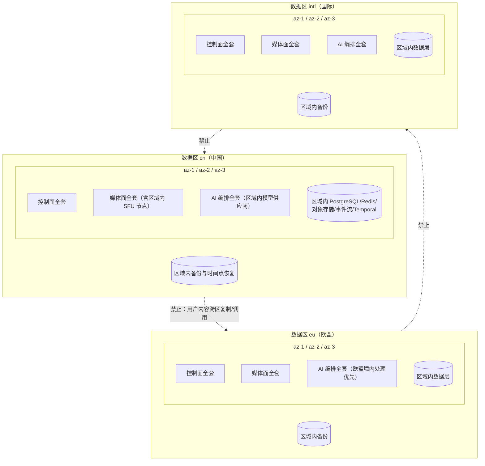
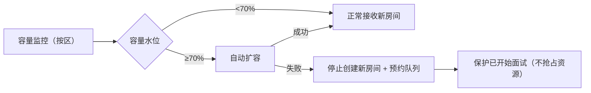

# 部署架构（DEPLOYMENT）

| 字段 | 内容 |
|---|---|
| 文档编号 | ARCH-002 |
| 版本 | 0.1.0（已批准 2026-08-01 规范评审） |
| 追踪 | PRD-001 "Data Regions"、"Scaling Strategy"、NFR-004、Recovery and Disaster Recovery、Phase 3；ADR-0005；IMPLEMENTATION_PLAN EPIC-01、EPIC-10 |
| 未决依赖 | OD-01（供应商）、OD-03（法律实施方案）、OD-05（峰值容量基线） |

## 1. 目的

定义中国（cn）、欧盟（eu）、国际（intl）三数据区的部署拓扑、容灾、RTO/RPO、扩缩容与供应商故障切换规则，保证"区域隔离"与"恢复优先"两条 PRD 红线可落地、可演练、可验证。

## 2. 范围

- 三数据区部署清单与多可用区拓扑。
- 备份、恢复演练、容量管理与供应商切换。
- 账户区域归属与区域路由规则。

## 3. 非目标

- 不选定云厂商与具体 Region（OD-01/OD-03 关闭后确定，本文用 `az-1/az-2/az-3` 抽象）。
- 不定义成本预算（OD-05）。
- 不重复系统组件职责（见 SYSTEM-ARCHITECTURE.md）。

## 4. 总体拓扑

区域红线（ADR-0005）：

1. 每区部署**完整链路**（控制面、媒体面、AI 编排、评分、证据账本、数据层、观测），任何一区可独立提供全部产品能力。
2. 备用与灾备系统位于**同一法定数据区域**；数据不得跨区静默复制，容灾不得擅自跨境。
3. 中国区内容不默认调用境外模型；欧盟区优先在欧盟境内处理。
4. 发生合法跨境需求时，必须完成影响评估、适用合同、备案或安全评估与单独告知（OD-03 关闭前禁止开通任何跨境链路）。

## 5. 每区部署清单

| 组件族 | 内容 | 每区实例 | 可用区分布 | 备注 |
|---|---|---|---|---|
| 边缘 | 身份/API 网关、WAF、区域路由 | ≥2 | az-1/2/3 | 按账户 `data_region` 路由，区域不匹配即拒绝 |
| 控制面 | Go 服务（账户/项目/计费/机构/治理/删除编排/审计） | 水平扩展 | az-1/2/3 | 无状态；状态在 PostgreSQL/Temporal |
| 工作流 | Temporal 集群 + 区域命名空间 | 1 集群 | az-1/2/3 | 跨 AZ 持久化 |
| 媒体面 | SFU 节点、媒体代理、数字人驱动 | 水平扩展 | az-1/2/3 | 就近接入；弱网优先连续音频 |
| AI 编排 | Python 服务（解析/决策图/模型网关/报告/评测） | 水平扩展 | az-1/2/3 | 模型供应商端点为本区端点 |
| 评分 | 评分/复核/公平性监控 | 水平扩展 | az-1/2/3 | 无状态计算 + 账本读写 |
| 数据层 | PostgreSQL（主+同步副本）、Redis、对象存储、事件流、搜索索引 | 每类 ≥3 AZ 副本 | az-1/2/3 | 证据相关写入跨 AZ 同步（RPO=0） |
| 观测 | OTel 采集、指标、日志、状态页发布 | ≥2 | az-1/2/3 | 内容默认脱敏 |
| 备份 | 每日完整 + 持续增量 + PITR | 区域内独立故障域 | 与主数据不同 AZ | 备份不出区域 |

## 6. 容灾与恢复目标

| 场景 | 目标 | 机制 |
|---|---|---|
| 单可用区故障 | 60 秒内自动接管 | 多 AZ 健康检查 + 流量切换；媒体面房间按故障恢复规则（暂停计时、重连） |
| 区域级严重故障 | RTO ≤ 30 分钟 | 区域内独立故障域备份 + 预置恢复编排；**不**切换到其他数据区 |
| 已确认回答与评分证据 | RPO = 0 | 账本跨 AZ 同步写入，确认后才推进回合（NFR-005） |
| 其他非关键状态 | RPO ≤ 5 秒 | 异步复制 + 事件流重放 |
| 数据备份 | 每日完整 + 持续增量 + 时间点恢复 | 每季度真实恢复演练并出报告 |
| 供应商断连 / 数据库故障 / 消息积压 / 区域故障 | 每半年演练一次 | 演练记录入 Incident 与复盘 |

恢复原则：任何恢复动作不得改变已冻结证据与分数；恢复后活跃正式面试继续按冻结版本执行。

## 7. 扩缩容与容量保护

1. 媒体面、AI 代理、异步 Worker 水平扩缩；控制面无状态扩展。
2. 可用容量达 70% 时自动扩容；无法扩容时**停止创建新房间并提供预约**，保护已开始面试（PRD Scaling Strategy）。
3. 每个数据区发布前通过**预计峰值 2 倍**的完整数字人并发压测（Phase 3 / TASK-092）。
4. 容量指标按区域、语言、供应商切分上报；错误预算耗尽时暂停非必要发布。

## 8. 供应商故障切换

1. 路由维度：数据区、语言、能力、实时健康（延迟/错误率/熔断状态）。
2. 切换规则：
   - 新会话：按区域规则切换到**已验证替代方案**（每项核心能力至少一主一备，Phase 0 出口）。
   - 活跃正式面试：固定开始时版本与供应商；故障时按 INTERVIEW-STATE-MACHINE 的暂停/重连/降级流程处理，**不中途无记录切换**；确需切换时暂停计时、记录原因（Incident），等待时间不计入回答时间也不计费。
3. 熔断：单供应商错误率或延迟超阈值自动熔断并告警；熔断事件进供应商注册表审计。
4. 切换不得跨区域：cn 区供应商故障只能在 cn 区合规供应商间切换。

## 9. 账户区域归属与路由

1. 注册时按常住地区推荐数据区并由用户**确认**；`data_region` 创建后不得静默迁移。
2. 请求路由：网关校验账户区域与请求区域一致；不一致即拒绝并提示（不自动转发到其他区）。
3. 跨区访问场景（如用户旅行）：服务仍连接其归属区域；不改变数据存储位置。
4. 合法迁移（如搬家）：属 OD-03 法律实施方案范围；实施前仅提供导出 + 新区重新注册路径。

## 10. 关键规则

1. 区域隔离是硬约束：任何"临时"跨区数据通路都视为 P0 事故。
2. 备份、演练、压测记录必须可重现、可审计。
3. 扩容保护已开始面试；降级顺序：停新房间 → 预约 → 绝不牺牲进行中会话。
4. 观测数据同样区域化且脱敏；状态页中英文同步发布。

## 11. 异常处理

| 异常 | 处理 |
|---|---|
| AZ 失联 | 60 秒自动接管；媒体会话按重连/暂停规则；Incident 记录 |
| 备份损坏（演练发现） | 立即修复备份链路并重新全量；升级 P0 复盘 |
| 供应商全区不可用 | 熔断 + 切换已验证替代 + 状态页公告；活跃会话故障恢复流程 |
| 事件流积压 | 消费者扩容；证据相关流优先；超阈值告警并暂停非关键任务 |
| 误配跨区路由 | 部署守门拒绝（CI 校验区域配置）；已发生按数据泄露事故响应 |

## 12. 验证方式

1. 部署守门：IaC 静态检查每区组件完整性（第 5 节清单）与无跨区资源引用。
2. 演练：第 6 节全部场景按计划执行并留存证据（TASK-008、TASK-092）。
3. 压测：2 倍峰值数字人并发（TASK-092）达标才可进入 Phase 3 退出评审。
4. 审计：季度核对备份位置、供应商端点与密钥配置的区域一致性。
