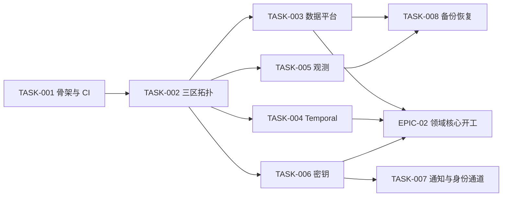

# EPIC-01 基础设施与数据区：详细实施设计

| 字段 | 内容 |
|---|---|
| 文档编号 | ARCH-EPIC01-001 |
| 版本 | 0.1.0（已批准 2026-08-01 规范评审） |
| 追踪 | IMPLEMENTATION_PLAN.md EPIC-01（TASK-001 ~ TASK-008）；NFR-001 ~ NFR-006；ADR-0003、ADR-0004、ADR-0005 |
| 一致性锚点 | `docs/architecture/SYSTEM-ARCHITECTURE.md`、`docs/architecture/DEPLOYMENT.md`、`.env.example`、`tools/validate_docs.py` |

## 1. 目的

把 EPIC-01 的 8 个任务落成具体的工程结构：单仓布局、分支与 CI、三数据区拓扑、数据平台、Temporal、观测、密钥与备份，使第一批开发任务可以直接开工。

## 2. 范围

TASK-001 ~ TASK-008 的实施设计；不涉及 EPIC-02+ 的业务实现细节（仅预留位置）。

## 3. 非目标

- 不选定云厂商与商业供应商（OD-01；IaC 保持供应商中立抽象）。
- 不生成正式产品源代码（本文件为结构设计；骨架代码属 TASK-001 实施产物）。

## 4. TASK-001：单仓工程骨架与 CI

### 4.1 单仓目录结构（在现有规范目录上扩展，不移动已有内容）

```text
面个蛋/
├── apps/
│   ├── web/                    # Next.js/React/TypeScript PWA（EPIC-02/03 落地）
│   └── admin/                  # 运营治理后台（EPIC-09 落地）
├── services/                   # Go 控制面服务（每服务一个模块）
│   ├── identity/               # 身份与账户（TASK-010）
│   ├── consent/                # 授权中心（TASK-011）
│   ├── ingestion/              # 材料上传与文件安全（TASK-012）
│   ├── project/                # 项目/计划/状态机 API（TASK-016~018）
│   ├── billing/                # 权益/订单/账本（EPIC-07）
│   ├── org/                    # 机构租户（EPIC-08）
│   └── adminapi/               # 后台 BFF（EPIC-09）
├── ai/
│   ├── prompts/                # 已有：提示词契约
│   ├── schemas/                # 已有：JSON Schema 契约
│   ├── evals/                  # 已有：评测数据集与预期结果
│   └── services/               # 新增：Python AI 服务
│       ├── parsing/            # 简历/JD 解析（TASK-013/014）
│       ├── orchestrator/       # LangGraph 面试官（TASK-032）
│       ├── scoring/            # 评分与复核（TASK-040~045）
│       └── report/             # 报告与教练（TASK-050~052）
├── contracts/                  # 由 docs/api 与 ai/schemas 生成的类型/客户端（CI 产物）
├── workflows/                  # Temporal 工作流定义（Go/Python 共享契约）
├── infra/
│   ├── modules/                # IaC 可复用模块（网络、数据库、存储、SFU、Temporal）
│   └── regions/                # cn/ eu/ intl 三区实例化配置（见第 5 节）
├── config/                     # 已有：量表/流程/安全政策/功能开关
├── docs/                       # 已有：全部规范
├── fixtures/                   # 已有：合成测试材料
├── tools/
│   ├── validate_docs.py        # 已有：文档与契约校验（CI 门禁）
│   └── ci/                     # 新增：CI 辅助脚本
└── .github/workflows/          # CI 流水线定义（或等效 CI 平台配置）
```

### 4.2 分支与提交策略

- 主干开发：`main` 受保护；功能分支 `task/TASK-xxx-简述`，短生命周期，squash 合并。
- 提交标题引用任务与需求 ID（AGENTS.md 已规定）：`feat(TASK-012): 简历上传与恶意文件检测（FR-001, FR-006）`。
- 文档与代码同 PR：契约变更必须同 PR 更新对应规范文档（AGENTS.md 第 5 节）。

### 4.3 CI 流水线（PR 门禁，全部通过才可合并）

| 阶段 | 内容 | 工具/规则 |
|---|---|---|
| 1. 规范校验 | `python tools/validate_docs.py`（契约、覆盖、密钥扫描） | 必须 0 失败 |
| 2. 静态检查 | Markdown/YAML/JSON lint；Go vet/golangci-lint；Python ruff/mypy；TS eslint/tsc | 0 error |
| 3. 单元测试 | 各模块单测；评分边界案例 SC-EC-01~24 回归 | 全过 |
| 4. 契约测试 | OpenAPI 校验、JSON Schema 样例校验、事件目录一致性 | 全过 |
| 5. 安全扫描 | 密钥扫描、依赖漏洞（SBOM）、SAST | 高危阻断 |
| 6. 构建 | 全部服务与前端构建通过 | 全过 |

主分支追加：集成测试（Temporal 工作流、证据管道）、评测集回归（ai_eval）、部署到 dev 环境。

## 5. TASK-002：三数据区环境拓扑与区域路由

### 5.1 拓扑原则（落实 ADR-0005）

- 每区一套完整、独立的环境：`env-{cn,eu,intl}-{dev,staging,prod}`，共 9 个命名空间级别环境；dev/staging 可缩减副本数，但拓扑同构。
- `infra/regions/{cn,eu,intl}/` 各自持有：网络、数据库、对象存储桶、事件流、SFU 节点、Temporal 命名空间、密钥引用、供应商白名单——**区域间无任何默认通路**（无跨区 VPC 对等、无跨区复制、无共享密钥）。
- 区域路由：账户 `data_region` 为硬归属；全球入口按用户区域路由到对应区域网关，区域不匹配请求拒绝并告警。

### 5.2 环境配置与密钥

- 环境变量按 `.env.example` 分组；`[REGION-SCOPED]` 变量在每区密钥管理系统独立配置。
- 部署校验（fail-closed）：服务启动时校验 `DATA_REGION` 与所连基础设施区域一致，不一致即拒绝启动——防止配置错误导致静默跨区。

## 6. TASK-003 ~ TASK-008 实施要点

| 任务 | 实施要点 | 验收锚点 |
|---|---|---|
| TASK-003 数据平台 | PostgreSQL（每区主+跨 AZ 副本）、Redis（仅会话/限流/锁，标注"非证据存储"）、S3 兼容桶（uploads/exports/media 三桶隔离）、区域事件流；迁移工具可重复执行；追加式表在数据库层 REVOKE UPDATE/DELETE（ADR-0004） | 迁移幂等；证据表写路径仅 INSERT |
| TASK-004 Temporal | 每区独立集群/命名空间；任务队列按域划分（ingestion/plan/interview/scoring/report/billing/deletion）；工作流跨 AZ 故障恢复演练 | 故障注入测试通过 |
| TASK-005 观测 | OpenTelemetry 采集；日志管道内置正文/令牌过滤规则（SDK 级）；指标按数据区/语言/输入模式/供应商/岗位族/版本标签化；状态页骨架（中英双语） | 日志扫描用例（含合成敏感样本）通过 |
| TASK-006 密钥 | 密钥管理系统接入；`*.example` 中 `*_REF` 变量模式落地；轮换流程与责任人按 SECURITY-REQUIREMENTS 4.7 | 轮换演练不中断服务 |
| TASK-007 通知与身份通道 | 区域化邮件服务接入；身份提供商（邮箱验证码先行，Google/Apple/微信随区域开放） | 单区通道故障不影响他区 |
| TASK-008 备份与恢复 | 每日完整 + 持续增量 + PITR；恢复脚本一键化；季度恢复演练模板 | 演练 RTO/RPO 达标（证据 RPO=0） |

## 7. 实施顺序与依赖



- TASK-001 完成后即可并行推进 TASK-002；EPIC-02 的开工依赖 TASK-003/004/006 就绪。
- 与 Phase 0 供应商评测（`docs/testing/PHASE0-PROVIDER-EVALUATION.md`）并行：评测不阻塞本 Epic。

## 8. 关键规则

1. 区域隔离 fail-closed：配置错误必须导致部署/启动失败，而不是静默跨区（ADR-0005）。
2. Redis 永不作为唯一证据存储；追加式表数据库层无 UPDATE/DELETE（ADR-0004）。
3. CI 门禁不可降级：不得以降低覆盖率、删除用例或跳阶段方式让流水线变绿（AGENTS.md）。
4. 所有环境只有合成数据；真实用户数据不进入 dev/staging。
5. 密钥只进密钥管理系统；仓库、CI 日志、后台零明文。

## 9. 异常处理

| 异常 | 处理 |
|---|---|
| 区域配置错误（连错基础设施） | 启动自检 fail-closed，拒绝启动并告警 |
| 迁移脚本中途失败 | 事务回滚或幂等重跑；禁止手工半量修补 |
| CI 契约校验误报 | 修复校验器并补回归用例，不得绕过 |
| 备份恢复演练不达标 | 记 Incident，阻塞下一阶段并限期复练 |

## 10. 验证方式

- TASK-001 ~ TASK-008 按 IMPLEMENTATION_PLAN 验收要点逐项核验；本设计的一致性由 `tools/validate_docs.py` 与架构评审把关。
- EPIC-01 完成出口：三区 dev/staging 拓扑就绪、CI 门禁全绿、恢复演练首次达标、EPIC-02 开工条件满足。
