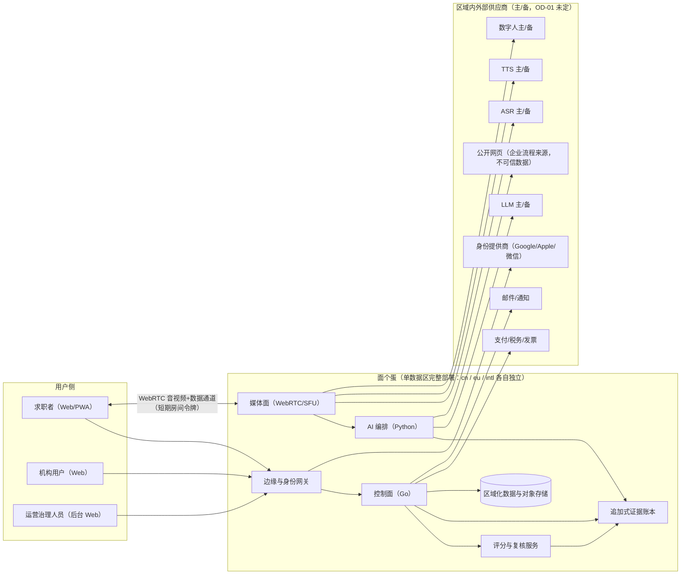
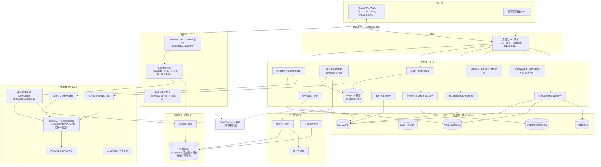
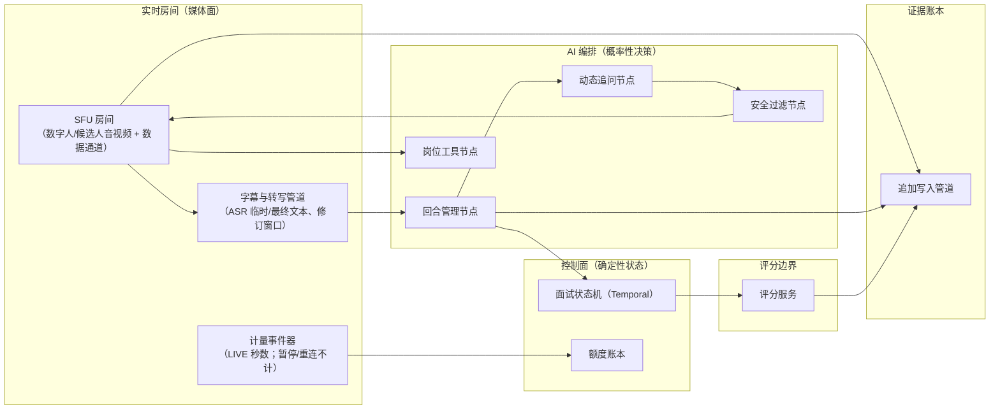

# 系统架构（SYSTEM-ARCHITECTURE）

| 字段 | 内容 |
|---|---|
| 文档编号 | ARCH-001 |
| 版本 | 0.1.0（草案，待工程评审） |
| 追踪 | PRD-001 "Technical Considerations"（High-Level Architecture、Architectural Decisions 1–6、Recommended Technology Baseline、Core Services）；NFR-001 ~ NFR-016 |
| 相关 ADR | ADR-0001 ~ ADR-0005 |

## 1. 目的

定义面个蛋的系统上下文、容器划分与核心组件，明确控制面、媒体面、AI 编排、评分与证据账本五大边界，使后续服务拆分、接口设计与容量规划有唯一架构事实源。

## 2. 范围

- 系统上下文图、容器图、核心组件图与端到端数据流。
- PRD 六条架构决策的落地结构（详见对应 ADR）。
- 安全边界：密钥持有、令牌隔离、内容脱敏链路。

## 3. 非目标

- 不选定最终商业供应商（OD-01；本文一律以"主/备供应商"表述）。
- 不定义具体 API 字段（见 `docs/api/openapi.yaml`）与数据库表结构（见 `docs/data/DATA-MODEL.md`）。
- 不定义部署拓扑细节（见 `docs/architecture/DEPLOYMENT.md`）。

## 4. 技术基线（PRD 冻结）

| 层 | 基线 | 约束 |
|---|---|---|
| Web/PWA | Next.js、React、TypeScript | 桌面优先响应式；SSR、国际化、可访问语义 |
| 实时媒体 | WebRTC/SFU（LiveKit 为技术基线） | 可自托管或云部署；音视频、数据通道、打断、弱网 |
| 核心后端 | Go | 账户、项目、计费、权限、业务 API、高并发控制面 |
| AI 服务 | Python | 文档解析、LangGraph、模型网关、评分、报告、评测 |
| 持久工作流 | Temporal | 跨故障恢复、超时、重试、幂等、长流程状态 |
| AI 决策图 | LangGraph | 会话状态、覆盖点、动态追问、跨轮上下文 |
| 事务存储 | PostgreSQL | 用户、项目、版本、分数、权限、订单、审计索引 |
| 对象存储 | S3 兼容区域存储 | 原始简历、导出物、明确授权的媒体 |
| 短期状态 | Redis | 短期会话、限流、锁、在线状态；**不作为唯一证据存储** |
| 异步事件 | 区域事件流 | 解析、评分、报告、通知、删除、补偿任务 |
| 检索 | 区域搜索索引 + 可审计来源库 | 企业流程、岗位知识、来源元数据 |
| 观测 | OpenTelemetry | 指标、追踪、结构化日志；内容默认脱敏 |

## 5. 系统上下文图



上下文要点：

1. **三数据区**：上图在 cn / eu / intl 各完整部署一套；区域之间无用户内容通路（ADR-0005）。中国区内容不默认调用境外模型；欧盟区优先在欧盟境内处理。
2. **浏览器零供应商密钥**：模型、支付、数字人密钥只存在于服务端密钥管理系统；浏览器只持有业务会话令牌与短期房间令牌，二者相互隔离。
3. **外部网页为不可信数据**：公开企业流程内容只经结构化提取进入来源库，绝不作为系统指令（防注入，见 `docs/ai/PROMPT-POLICY.md`）。

## 6. 容器图



## 7. 核心组件图（实时面试链路）



组件职责与边界规则：

| 边界 | 职责 | 无权做什么 |
|---|---|---|
| 控制面 | 业务状态机、计费、权限、版本冻结、删除编排 | 不处理媒体帧；不调用模型直连 SDK |
| 媒体面 | 音视频路由、数字人驱动、字幕转写、打断、计量事件 | 不持久化业务状态；不决定分数 |
| AI 编排 | 覆盖点推进、动态追问、交接包、报告、教练内容 | **无权直接改变业务状态**（分数/解锁/额度）；无密钥、无其他用户数据 |
| 评分边界 | 用冻结量表+冻结证据独立计算；正式复核 | 不生成问题；不接受对话模型直接写分 |
| 证据账本 | 追加记录问题实际播放内容、回答、修订、工具事件、评分、复核 | 无 UPDATE/DELETE 业务路径（ADR-0004） |

## 8. 端到端数据流与内容分级

```mermaid
sequenceDiagram
  participant U as 用户浏览器
  participant GW as 身份/API 网关
  participant CP as 控制面（Temporal）
  participant AI as AI 编排
  participant MP as 媒体面
  participant EL as 证据账本
  participant SC as 评分服务

  U->>GW: 上传简历/JD（用户内容）
  GW->>CP: 创建项目（含 data_region）
  CP->>AI: 结构化解析（内容不出区域）
  AI-->>CP: 结构化事实+置信度（敏感字段已排除）
  U->>GW: 校对确认
  CP->>AI: 生成计划（来源库+冻结规则）
  CP-->>U: 待确认计划（范围/标准，不泄题）
  U->>GW: 确认计划+额度
  CP->>MP: 创建房间（短期令牌）
  MP<-->>U: 实时音视频+字幕
  MP->>EL: 追加证据（实际播放内容/回答/修订/工具事件）
  CP->>SC: 提交冻结证据+量表+权重
  SC->>EL: ScoreVersion（追加）
  SC-->>CP: PASS / FAIL / EVALUATION_INCOMPLETE
  CP-->>U: 祝贺/阻断/评估未完成+报告
```

| 链路 | 携带内容 | 分级与约束 |
|---|---|---|
| 浏览器 ↔ 网关 | 用户材料、业务请求 | 用户内容；TLS；敏感字段独立密钥加密 |
| 浏览器 ↔ SFU | 音视频流、数据通道 | 用户内容；短期房间令牌；原始音视频默认不落盘 |
| 媒体面 → 证据账本 | 逐字稿、工具事件 | 用户内容；默认保存 12 个月 |
| AI 编排 ↔ 供应商 | 提示词+结构化上下文 | 用户内容；无密钥给模型；注入防护；不出区域 |
| 控制面/媒体面/AI → OTel | 指标、追踪、日志 | **匿名技术指标**；禁止正文/令牌/媒体（NFR 观测性） |
| 分析事件 | 稳定事件名+技术属性 | 不含简历正文、完整回答或原始媒体 |

## 9. 关键规则

1. 六条架构决策即红线（ADR-0001~0005）：任一服务设计违反即评审拒绝。
2. 每个容器归属唯一边界；跨边界调用只经契约接口（OpenAPI / 实时事件 / 内部 gRPC 契约）。
3. Redis 不存证据；证据 RPO=0 只由账本存储保证（NFR-005）。
4. 所有容器携带 `data_region` 标签；跨区调用默认拒绝（ADR-0005）。
5. 供应商一律经适配层（ADR-0003）；活跃正式面试固定开始版本。

## 10. 异常处理

- 媒体面整体故障：控制面状态不丢；按 INTERVIEW-STATE-MACHINE 第 7 节恢复矩阵处理。
- AI 编排降级：动态追问失败回退到预生成主线与备用问题；安全管道失败即阻断内容并升级。
- 评分服务故障：EVALUATION_INCOMPLETE（scoring_service_failure），事件可重放，不判失败。
- 证据写入失败：回合不得推进（NFR-005 前置），触发告警与自动重试。
- 观测降级：OTel 故障不得影响业务链路；脱敏管道故障时宁可丢日志不得泄露正文。

## 11. 验证方式

1. 架构守护测试：依赖方向静态检查（AI 编排不得 import 控制面写路径；浏览器包不得包含供应商 SDK 密钥）。
2. 契约测试：跨边界接口均有契约与 mock；事件名与 `docs/api/realtime-events.md` 一致。
3. 部署评审：每区部署清单与本文容器图逐项核对（DEPLOYMENT.md）。
4. 追踪核对：六条架构决策 ↔ ADR-0001~0005 ↔ 本图一一对应，由 CI 链接检查保证。
