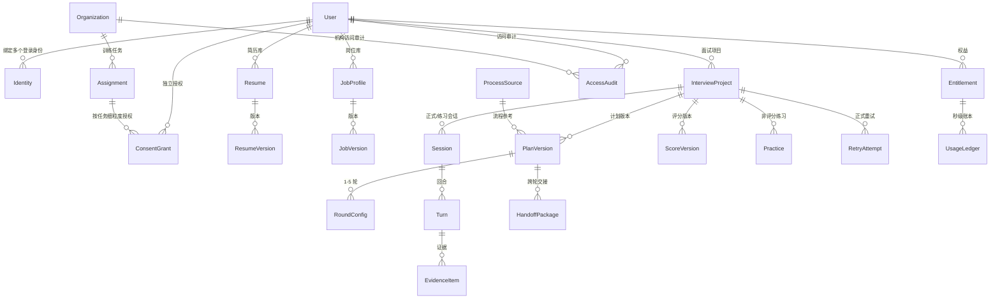

# 领域模型（DOMAIN-MODEL）

| 字段 | 内容 |
|---|---|
| 文档编号 | DOMAIN-001 |
| 版本 | 0.1.0（草案，待工程评审） |
| 追踪 | PRD-001 "Key Data Entities"、"Core Services"；US-01 ~ US-08；FR-001 ~ FR-040 |
| 一致性锚点 | `docs/domain/INTERVIEW-STATE-MACHINE.md`、`docs/domain/BILLING-STATE-MACHINE.md`、`ai/schemas/*.json`、`docs/data/DATA-MODEL.md` |

## 1. 目的

定义面个蛋核心领域实体、关系、生命周期、不可变字段与版本规则，作为 Go 控制面服务、Python AI 服务与数据库设计（`docs/data/DATA-MODEL.md`）的统一词汇表。

## 2. 范围

覆盖 PRD "Key Data Entities" 全部实体：User、Identity、ConsentGrant、Resume/ResumeVersion、JobProfile/JobVersion、ProcessSource、InterviewProject、PlanVersion、RoundConfig、Session、Turn、EvidenceItem、ScoreVersion、HandoffPackage、Practice、RetryAttempt、Entitlement、UsageLedger、Organization、Assignment、AccessAudit、Incident。

## 3. 非目标

- 不定义物理表结构与索引（见 `docs/data/DATA-MODEL.md`）。
- 不定义 API 传输结构（见 `docs/api/openapi.yaml`）与 AI 结构（见 `ai/schemas/`），但字段命名必须与二者一致。
- 不引入 PRD 之外的实体责任（如不引入雇主侧实体）。

## 4. 全局规则

1. **区域归属**：每个实体必须携带 `data_region ∈ {cn, eu, intl}`；跨区读取用户内容默认禁止。
2. **追加式账本**：EvidenceItem、ScoreVersion、UsageLedger、AccessAudit 只允许新增；纠正通过新版本/冲正条目实现；数据库层不提供 UPDATE/DELETE 路径（物理删除仅由删除编排执行，见 US-05 场景 5）。
3. **版本冻结**：ResumeVersion、JobVersion、PlanVersion、ScoreVersion 一经确认/冻结不可改写；历史版本全部保留。
4. **敏感字段隔离**：电话、邮箱、证件、地址、照片、保护属性不进入面试上下文相关实体（Resume 的面试安全结构、PlanVersion、EvidenceItem、HandoffPackage、ScoreVersion、Report）。
5. **租户隔离**：User 之间、Organization 之间、数据区之间为硬隔离；授权检查在行级/属性级执行并写 AccessAudit。

## 5. 实体关系图

## 6. 实体定义

### 6.1 User（用户）

| 要点 | 内容 |
|---|---|
| 职责 | 账户主体；语言、年龄状态、数据区域的权威来源 |
| 关键字段 | `user_id`、`data_region`、`ui_language`、`age_status`（`adult`/`minor_guardian_verified`/`minor_pending`/`under_16_demo_only`）、`status`（`active`/`deletion_pending`/`deleted_anonymized`）、`created_at` |
| 不可变字段 | `user_id`、`data_region`（创建后不得静默迁移）、`created_at` |
| 生命周期 | 注册（接受条款/隐私/数据处理说明）→ active → deletion_pending（重新验证后）→ deleted_anonymized（级联删除或不可逆匿名化；法定财务记录保留但解除内容关联） |
| 规则 | 未满 16 岁仅样例演示（无登录上传）；16 岁至当地成年年龄需可验证监护人同意（上传简历、保存记录、付费） |

### 6.2 Identity（登录身份）

| 要点 | 内容 |
|---|---|
| 职责 | 邮箱验证码、Google、Apple、微信等多身份；支持绑定多个身份 |
| 关键字段 | `identity_id`、`user_id`、`provider`（`email_otp`/`google`/`apple`/`wechat`）、`provider_subject`、`verified_at` |
| 不可变字段 | `identity_id`、`provider`、`provider_subject` |
| 规则 | 绑定新身份必须分别验证；存在账户冲突时不执行合并，提供恢复与人工支持路径；手机号码不作为必填项 |

### 6.3 ConsentGrant（授权）

| 要点 | 内容 |
|---|---|
| 职责 | 相互独立的授权记录：核心服务必要处理 / 保存原始音视频 / 机构共享 / 非必要产品分析 / 模型训练或研究 / 营销通知；机构结果分享按任务单独授权 |
| 关键字段 | `grant_id`、`user_id`、`consent_type`、`scope`（如 assignment_id、数据类别）、`status`（`granted`/`withdrawn`/`expired`）、`granted_at`、`expires_at`、`withdrawn_at`、`evidence`（同意文案版本、UI 上下文） |
| 版本规则 | 同一 (user, consent_type, scope) 的变更为新版本追加；撤回立即生效 |
| 规则 | 模型训练默认关闭，拒绝不影响核心服务；机构共享选择范围、有效期且可撤回；撤回后在线访问立即失效 |

### 6.4 Resume / ResumeVersion（简历与版本）

| 要点 | 内容 |
|---|---|
| 职责 | 原始文件（对象存储隔离桶）+ 结构化事实（`ai/schemas/resume-profile.schema.json`） |
| 关键字段 | `resume_id`、`user_id`；版本：`resume_version`、`original_file_ref`、`parse_meta`、`low_confidence_paths`、`confirmed_by_user`、`excluded_sensitive_fields` |
| 不可变字段 | 已确认版本的全部结构化字段（编辑产生新版本） |
| 保留 | 原件及结构化版本保存至用户删除或账户终止处理完成 |
| 规则 | 单文件 ≤10MB，`.pdf/.doc/.docx`；损坏/加密/超限/伪装/恶意文件拒绝并给出具体原因 |

### 6.5 JobProfile / JobVersion（岗位与版本）

| 要点 | 内容 |
|---|---|
| 职责 | JD 原文 + 结构化要求（`ai/schemas/job-profile.schema.json`） |
| 规则 | 薪资福利与招聘联系人不进入面试评分上下文；AI 推导面试重点必须标记；缺失材料降级模式需用户明确同意（ConsentGrant 记录） |

### 6.6 ProcessSource（企业流程来源）

| 要点 | 内容 |
|---|---|
| 职责 | 公开面试流程参考的来源元数据 |
| 关键字段 | `source_id`、`url`、`source_type`（官方招聘页/官方招聘内容/可信公开材料/候选人经验/通用模板）、`retrieved_at`、`credibility`、`expires_at`、`region`、`job_family`、`status`（`active`/`under_review`/`taken_down`） |
| 规则 | 经验内容标记非官方；无可靠来源回退通用模板并标记 AI 推导；支持冲突、复核、下架与版权投诉；禁止绕过网站协议/登录/验证码/反爬 |

### 6.7 InterviewProject（面试项目）

| 要点 | 内容 |
|---|---|
| 职责 | 一次围绕冻结简历/JD 的多轮面试的聚合根；状态机见 `INTERVIEW-STATE-MACHINE.md` |
| 关键字段 | `project_id`、`user_id`、`data_region`、`interview_language`、`degraded_mode`、`status`、`current_round_sequence`、`assignment_id`（可选，机构任务）、`created_at` |
| 不可变字段 | `project_id`、`user_id`、`data_region`；开始后简历/JD 版本引用冻结 |
| 规则 | 同一正式面试仅允许一台活动设备；复制项目复用简历/JD 但产生独立项目；删除级联至报告、训练与媒体 |

### 6.8 PlanVersion / RoundConfig（计划与轮次）

| 要点 | 内容 |
|---|---|
| 职责 | 面试计划版本（`ai/schemas/interview-plan.schema.json`）；RoundConfig 为其中每轮配置 |
| 不可变字段 | `frozen = true` 后：量表版本、维度权重、轮次权重、轮次列表、正式问题覆盖方案、计费版本 |
| 前置规则 | 每轮必须具备问题覆盖方案与评分量表，缺一禁止开始该轮；第 2 轮起另需 HandoffPackage |
| 规则 | 用户可增删重排轮次、编辑角色/重点/难度/时长/风格/数字人/声音；不可修改评分算法、60 分门槛、解锁逻辑、交接规则，不可提前查看正式问题与答案 |

### 6.9 Session（会话/房间）

| 要点 | 内容 |
|---|---|
| 职责 | 一次实时面试房间（正式轮次尝试、正式重试或练习）；状态机见 `INTERVIEW-STATE-MACHINE.md` 第 4 节 |
| 关键字段 | `session_id`、`project_id`、`round_sequence`、`attempt_id`、`kind`（`formal`/`formal_retry`/`practice`）、`status`、`room_provider_ref`、`active_device_id`、`billable_seconds`、`created_at` |
| 规则 | 数字人必须以实时音视频加入；用户摄像头/麦克风可关；练习与正式会话的证据链严格隔离 |

### 6.10 Turn / EvidenceItem（回合与证据）

| 要点 | 内容 |
|---|---|
| 职责 | 单回合问答（结构见 `ai/schemas/turn-evidence.schema.json`）；EvidenceItem 为追加式账本条目 |
| 不可变字段 | 全部内容字段；`frozen = true` 后连修订也禁止（进入下一主问题时冻结上一回合） |
| 规则 | 只记录实际播放的问题内容；修订文本作为评分证据，原始 ASR 仅诊断；下一主问题前完成上一有效回答持久化（NFR-005） |

### 6.11 ScoreVersion（评分版本）

| 要点 | 内容 |
|---|---|
| 职责 | 评分服务输出（`ai/schemas/scoring-result.schema.json`）；关联模型/提示词/量表/权重/证据/计算版本 |
| 不可变字段 | 全部；复核/重评产生新版本（`supersedes_score_id` 链接） |
| 规则 | 后台与任何接口不得直接编辑分数；系统性偏差只能停用版本并标记受影响项目"评估待复核"+ 免费重试 |

### 6.12 HandoffPackage（跨轮交接）

结构、生成与校验见 `docs/ai/HANDOFF-SPEC.md` 与 `ai/schemas/handoff-package.schema.json`。追加式保存；前序 ScoreVersion 被复核更新时重新生成。

### 6.13 Practice / RetryAttempt（练习与正式重试）

| 实体 | 要点 |
|---|---|
| Practice | 非评分训练记录（原题/变体、提示、框架、反馈）；**永不写入正式证据链，永不改变分数与解锁** |
| RetryAttempt | 正式重试：新问题、维度锁定、新分替换失败维度旧分、矛盾解锁重评；与首轮尝试同为"正式尝试"，各允许一次正式复核 |

### 6.14 Entitlement / UsageLedger（权益与账本）

| 要点 | 内容 |
|---|---|
| 职责 | 免费 60 分钟、单项目包、Pro 订阅、加油包的权益与秒级使用账本；状态机见 `BILLING-STATE-MACHINE.md` |
| 不可变字段 | UsageLedger 条目全部（返还以冲正条目实现） |
| 规则 | 只计数字人已连接且正式进行中的实际秒数；每轮开始前预留；余额不足不得中断已开始的正式轮次；系统故障自动全额返还本轮预留 |

### 6.15 Organization / Assignment（机构与任务）

| 要点 | 内容 |
|---|---|
| 职责 | 机构租户（所有者/管理员/指导老师/隐私审计/财务/求职者角色分离）与训练任务 |
| 规则 | 机构默认只能看到任务状态（接受/未开始/进行中/已完成/退出、完成时间、系统故障、机构额度消耗）；个人结果按任务细粒度授权；聚合 <10 人不展示；禁止排名/筛选/雇主 API；机构模板不得改 60 分线/量表/证据规则/解锁/复核 |

### 6.16 AccessAudit / Incident（审计与事故）

| 要点 | 内容 |
|---|---|
| AccessAudit | 追加式敏感访问记录（谁、何时、何种角色、访问了什么、授权依据）；管理员不可删除；敏感访问通知用户 |
| Incident | 故障、破窗访问、发布与回滚、补偿记录；支撑状态页与事故复盘 |

## 7. 生命周期汇总

| 实体族 | 生命周期要点 |
|---|---|
| 账户族 | 注册 → active →（可选）deletion_pending → deleted_anonymized |
| 材料族 | 上传 → 解析 → 待校对 → 已确认（版本化）→（可替换产生新版本）→ 删除 |
| 项目族 | 详见 INTERVIEW-STATE-MACHINE（DRAFT → … → COMPLETED/EVALUATION_INCOMPLETE） |
| 证据族 | 产生 → 冻结 → 评分引用 → 12 个月保留 → 到期提醒 → 下载或删除 |
| 商业族 | 详见 BILLING-STATE-MACHINE（报价 → 预留 → 计费 → 结算/释放/返还/退款） |
| 授权族 | granted →（expired | withdrawn）→ 访问立即失效 |

## 8. 关键规则（红线）

1. 追加式实体无 UPDATE/DELETE 业务路径；后台无改分入口。
2. 敏感字段不进入面试上下文实体；摄像头/便利设置/付费状态不影响评分相关实体字段。
3. 冻结即不可变：材料确认、计划确认、回合冻结、评分版本。
4. 区域、用户、机构三重隔离默认拒绝，授权例外必须写 AccessAudit。

## 9. 异常处理

- 版本冲突（并发编辑同一材料）：乐观锁失败返回冲突错误，用户可选择基于最新版本重新编辑。
- 删除编排失败：删除任务保持 `failed` 并可重试，向用户展示真实进度（US-05 场景 5）。
- 授权撤回风暴（机构成员批量退出）：撤回即时生效；审计写入允许异步批量但不得丢失。

## 10. 验证方式

1. 实体与字段在 `docs/data/DATA-MODEL.md` 有对应表与索引设计。
2. 与 `ai/schemas/` 字段命名一致性由 CI 抽样比对（dimension 键、状态枚举、region 枚举）。
3. 不可变与追加式规则有数据库层约束与服务层测试（尝试 UPDATE 被拒）。
