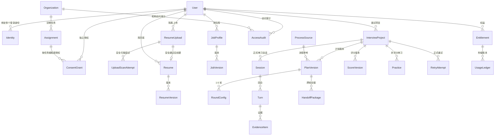

# 领域模型（DOMAIN-MODEL）

| 字段 | 内容 |
|---|---|
| 文档编号 | DOMAIN-001 |
| 版本 | 0.1.0（已批准 2026-08-01 规范评审） |
| 追踪 | PRD-001 "Key Data Entities"、"Core Services"；US-01 ~ US-08；FR-001 ~ FR-040 |
| 一致性锚点 | `docs/domain/INTERVIEW-STATE-MACHINE.md`、`docs/domain/BILLING-STATE-MACHINE.md`、`ai/schemas/*.json`、`docs/data/DATA-MODEL.md` |

## 1. 目的

定义面个蛋核心领域实体、关系、生命周期、不可变字段与版本规则，作为 Go 控制面服务、Python AI 服务与数据库设计（`docs/data/DATA-MODEL.md`）的统一词汇表。

## 2. 范围

覆盖 PRD "Key Data Entities" 全部实体，并定义材料摄取执行记录：User、Identity、ConsentGrant、ResumeUpload/UploadScanAttempt、Resume/ResumeVersion、JobProfile/JobVersion、ProcessSource、InterviewProject、PlanVersion、RoundConfig、Session、Turn、EvidenceItem、ScoreVersion、HandoffPackage、Practice、RetryAttempt、Entitlement、UsageLedger、Organization、Assignment、AccessAudit、Incident。

## 3. 非目标

- 不定义物理表结构与索引（见 `docs/data/DATA-MODEL.md`）。
- 不定义 API 传输结构（见 `docs/api/openapi.yaml`）与 AI 结构（见 `ai/schemas/`），但字段命名必须与二者一致。
- 不引入 PRD 之外的实体责任（如不引入雇主侧实体）。

## 4. 全局规则

1. **区域归属**：每个实体必须携带 `data_region ∈ {cn, eu, intl}`；跨区读取用户内容默认禁止。
2. **追加式账本**：EvidenceItem、ScoreVersion、UsageLedger、AccessAudit 只允许新增；纠正通过新版本/冲正条目实现；数据库层不提供 UPDATE/DELETE 路径（物理删除仅由删除编排执行，见 US-05 场景 5）。
3. **版本冻结**：ResumeVersion、JobVersion、PlanVersion、ScoreVersion 一经确认/冻结不可改写；历史版本全部保留。
4. **敏感字段隔离**：电话、邮箱、证件、地址、照片、保护属性不进入面试上下文相关实体（Resume 的面试安全结构、PlanVersion、EvidenceItem、HandoffPackage、ScoreVersion、Report）。
5. **租户隔离**：User 之间、Organization 之间、数据区之间为硬隔离；授权检查在行级/属性级执行并写 AccessAudit。

## 5. 实体关系图

## 6. 实体定义

### 6.1 User（用户）

| 要点 | 内容 |
|---|---|
| 职责 | 账户主体；语言、年龄状态、数据区域的权威来源 |
| 关键字段 | `user_id`、`data_region`、`ui_language`、`age_status`（`adult`/`minor_guardian_verified`/`minor_pending`）、`status`（`active`/`deletion_pending`/`deleted_anonymized`）、`registration_evidence`（条款/隐私/数据处理说明版本与接受上下文）、`created_at` |
| 不可变字段 | `user_id`、`data_region`（创建后不得静默迁移）、`created_at` |
| 生命周期 | 注册（接受条款/隐私/数据处理说明并保存版本证据）→ active → deletion_pending（重新验证后）→ deleted_anonymized（级联删除或不可逆匿名化；法定财务记录保留但解除内容关联） |
| 规则 | 未满 16 岁在账户创建前即被导向样例演示（无 User/Identity、无登录上传）；16 岁至当地成年年龄需可验证监护人同意（上传简历、保存记录、付费） |

### 6.2 Identity（登录身份）

| 要点 | 内容 |
|---|---|
| 职责 | 邮箱验证码、Google、Apple、微信等多身份；支持绑定多个身份 |
| 关键字段 | `identity_id`、`user_id`、`provider`（`email_otp`/`google`/`apple`/`wechat`）、`provider_subject_hash`、`verified_at`、`data_region` |
| 不可变字段 | `identity_id`、`provider`、`provider_subject_hash`、`data_region` |
| 验证与会话 | `IdentityVerification` 只保存主体/验证码/证明摘要和到期、消费状态；`IdentitySession` 只保存刷新令牌摘要及轮换状态；邮箱、验证码、OAuth 授权码、证明、业务/刷新令牌均不保存明文 |
| 规则 | 绑定新身份必须提交当前侧与目标侧两份独立、短期、单次使用的重新验证证明；目标身份已属于另一账户时仅追加 `IdentityConflict` 恢复案件，不移动身份、不合并账户，并提供恢复与人工支持路径；手机号码不作为必填项 |

### 6.3 ConsentGrant（授权）

| 要点 | 内容 |
|---|---|
| 职责 | 相互独立的授权记录：核心服务必要处理 / 保存原始音视频 / 机构共享 / 非必要产品分析 / 模型训练或研究 / 营销通知；机构结果分享按任务单独授权 |
| 关键字段 | `grant_id`、`user_id`、`consent_type`、封闭 `scope`（assignment_id / 数据类别 / 媒体类别 / 通知渠道）、`scope_hash`、`status`（`granted`/`withdrawn`/`expired`）、`granted_at`、`expires_at`、`withdrawn_at`、`evidence`（文案/隐私政策版本、展示时间、UI surface/flow/language、动作、服务端记录时间、证据哈希）、`version`、`supersedes_grant_id`、`request_key/hash`、`audit_id`、`data_region` |
| 版本规则 | 同一 `(user, consent_type, scope_hash)` 的变更只插入新版本，历史行无 UPDATE/DELETE；同一写请求按 `(data_region, user, operation, request_key)` 幂等；授予/撤回版本与对应 AccessAudit 在同一事务提交 |
| 规则 | 模型训练默认关闭，缺失记录按未授权处理；拒绝模型训练或其他非必要授权不影响核心服务；机构共享选择任务、范围、有效期且可撤回；原始音视频授权仅成人可用且最长 30 天；撤回返回后同范围在线访问立即失效，授权状态不确定时 fail-closed |

### 6.4 ResumeUpload / UploadScanAttempt（隔离上传与扫描尝试）

| 要点 | 内容 |
|---|---|
| 职责 | `ResumeUpload` 记录所属区域 uploads 桶中的隔离原件与安全扫描状态；`UploadScanAttempt` 记录首次扫描和可重试尝试的幂等执行状态（TASK-012） |
| 关键字段 | `upload_id`、`user_id`、`data_region`、`idempotency_key`、`content_fingerprint`、`filename`、`size_bytes`、`status`（`QUARANTINED/SCANNING/ACCEPTED/REJECTED/RETRYABLE_FAILURE`）、`object_bucket`、`object_key`、`rejection_reason`、`sandbox_attestation` |
| 桶边界 | 只能写 `{data_region}-uploads`；初始键为 `quarantine/`，安全通过后原子移动到 `accepted/`；接口层没有 exports/media 写能力 |
| 沙箱门槛 | 无出站网络、一次性、只读根文件系统、无凭证挂载；任一证明缺失即 fail-closed，文件不进入解析 |
| 拒绝与恢复 | 病毒、宏、压缩炸弹、伪装、超限、损坏、加密均以具体稳定原因拒绝；安全拒绝删除隔离副本。扫描超时/扫描器暂时不可用保留隔离原件，只重试扫描步骤，不计费、不影响评分 |
| 幂等 | `(data_region, user_id, idempotency_key)` 唯一；重试按 `(upload_id, idempotency_key)` 唯一；相同键不同内容散列返回冲突 |

### 6.5 Resume / ResumeVersion（简历与版本）

| 要点 | 内容 |
|---|---|
| 职责 | 只读 TASK-012 安全接受的所属区域 `uploads/accepted` 原件，经供应商中立适配层生成结构化事实（`ai/schemas/resume-profile.schema.json`） |
| 关键字段 | `resume_id`、`upload_id`、`user_id`、`data_region`；版本：`resume_version`、`base_version`、`parse_meta`（含 parser/prompt 版本、逐字段置信度与注入标记）、`low_confidence_paths`、`reviewed_low_confidence_paths`、`confirmed_by_user`、`excluded_sensitive_fields`（只含类别） |
| 不可变字段 | 所有 `ResumeVersion` 均为追加式；逐字段 add/replace/remove/confirm 和最终确认各产生新版本，历史版本不修改 |
| 保留 | 原件及结构化版本保存至用户删除或账户终止处理完成 |
| 解析规则 | L4 简历文本先预脱敏；Schema/暂时错误自动重试 ≤2 次，仍失败保留 accepted 原件并只重试解析步骤（不计费、不影响评分）；低置信度路径未逐项校对时禁止最终确认和计划生成 |
| 隐私硬门槛 | 电话、邮箱、证件、详细地址、照片、保护属性在调用适配层前移除、模型输出后递归清洗、版本写入前 Schema/零命中校验、上下文与评分材料组装前再次 fail-closed；敏感值只能留在 restricted 原件，结构化版本仅记录排除类别（FR-003、SEC-040） |
| 使用门槛 | 仅 `confirmed_by_user=true` 的冻结版本可进入计划、面试上下文或评分上游材料 |

### 6.6 JobProfile / JobVersion（岗位与版本）

| 要点 | 内容 |
|---|---|
| 职责 | 所属区受限 JD 原文/已确认安全简历引用 + 结构化要求（`ai/schemas/job-profile.schema.json`） |
| 关键字段 | `job_id`、`user_id`、`data_region`、`source_kind`（`jd_text`/`resume_inference`）、原文引用或 `source_resume_id/version` 二选一；版本含 `base_version`、`parse_meta`、`excluded_from_scoring`（仅类别）、`ai_derived_fields`、`confirmed_by_user` |
| 解析规则 | JD 是 L4 不可信数据；薪资福利、公司福利、招聘联系人在适配器调用前整段剔除，输出后递归清洗，写版本及下游组装前零命中 fail-closed；Schema/暂时错误自动重试 ≤2 次，仍失败保留原始输入且可只重试解析步骤（FR-004、NFR-015） |
| AI 推导 | 面试重点始终含 `inference_id`、`ai_inferred=true`、`editable=true`；仅简历模式只读 TASK-013 已确认安全画像，岗位核心字段全部登记 `ai_derived_fields` 且要求项标记 AI 推导。人工编辑产生新版本并设置 `edited_by_user`，不可移除来源标记 |
| 不可变/使用门槛 | 创建、解析、人工逐字段校对与确认均幂等；`JobVersion` 只追加不修改；仅 `confirmed_by_user=true` 的冻结版本可进入计划、面试上下文或评分上游 |

### 6.6.1 MaterialReadiness / DegradedModeConsent（材料影响与降级同意）

| 要点 | 内容 |
|---|---|
| 模式 | `full`：完整能力；`jd_only`：通用岗位、不虚构经历、不做简历深挖/经历匹配评分；`resume_only`：AI 推导岗位且人工确认、不展示岗位匹配百分比；`neither`：通用面试且只评估表达/逻辑/沟通/应变 |
| 弹窗快照 | `assessment_id` 冻结材料版本、模式、用户可见说明、全部功能影响与允许评分维度；只接受已确认的材料版本引用 |
| 明确同意 | 除 `full` 外必须追加 `DegradedModeConsent(accepted=true)`；同意与 `assessment_id`、用户、数据区、模式及影响快照严格绑定，不匹配时 fail-closed |
| 与隐私授权关系 | 功能降级同意不新增或替代同意中心的六类独立隐私授权；记录追加式、幂等、不可更新，项目创建只引用其 ID |

### 6.7 ProcessSource（企业流程来源）

| 要点 | 内容 |
|---|---|
| 职责 | 公开面试流程参考的来源元数据 |
| 关键字段 | `source_id`、`url`（通用模板为空）、`source_type`（官方招聘页/官方招聘内容/可信公开材料/候选人经验/通用模板）、`retrieved_at`、`credibility`（high/medium/low）、`expires_at`、`region`、`job_family`、`company`/`role`/`level`（检索维度）、`is_unofficial_experience`、`status`（`active`/`under_review`/`taken_down`）、`idempotency_key`（唯一）、`data_region`（物理归属，与 `region` 一致） |
| 检索链路 | 按公司/岗位/级别/地区经供应商中立搜索适配层（PROVIDER-ADAPTERS §4.5）查找公开流程（FR-007）；TASK-030 未开工前以契约接口 + 合成桩落地，禁止业务代码直连厂商 SDK（ADR-0003） |
| 优先级 | 官方招聘页 > 官方招聘内容 > 可信公开材料 > 候选人经验（FR-008）；候选人经验必须标记非官方且不作为"可靠来源" |
| 回退规则 | 无公司信息、检索故障（断网/不可达）或无可信来源时，自动回退通用岗位/级别模板（`source_type=generic_template`），并标记 AI 推导（`flow_uses_generic_template=true`、`ai_derived=true`），可人工校对，不伪装企业流程（US-02 规则 3、FR-008） |
| 幂等 | 检索与落库按 `idempotency_key` 去重；同 `(data_region, url)` 唯一（NFR-006） |
| 安全边界 | 外部网页内容仅作为不可信数据进入结构化提取，绝不作为系统指令（SEC-024/SEC-025）；来源内容不得进入评分证据（EvidenceItem/ScoreVersion 无来源正文引用） |
| 治理 | 支持冲突、复核、下架与版权投诉（`active` → `under_review` → `taken_down`）；禁止绕过网站协议/登录/验证码/反爬（US-08 规则 8） |

### 6.8 InterviewProject（面试项目）

| 要点 | 内容 |
|---|---|
| 职责 | 一次围绕冻结简历/JD 的多轮面试的聚合根；状态机见 `INTERVIEW-STATE-MACHINE.md` |
| 关键字段 | `project_id`、`user_id`、`data_region`、`interview_language`、`degraded_mode`、`status`、`current_round_sequence`、`assignment_id`（可选，机构任务）、`created_at` |
| 不可变字段 | `project_id`、`user_id`、`data_region`；开始后简历/JD 版本引用冻结 |
| 规则 | 同一正式面试仅允许一台活动设备；复制项目复用简历/JD 但产生独立项目；删除级联至报告、训练与媒体 |

### 6.9 PlanVersion / RoundConfig（计划与轮次）

| 要点 | 内容 |
|---|---|
| 职责 | 面试计划版本（`ai/schemas/interview-plan.schema.json`）；RoundConfig 为其中每轮配置 |
| 不可变字段 | `frozen = true` 后：量表版本、维度权重、轮次权重、轮次列表、正式问题覆盖方案、计费版本 |
| 前置规则 | 每轮必须具备问题覆盖方案与评分量表，缺一禁止开始该轮；第 2 轮起另需 HandoffPackage |
| 规则 | 用户可增删重排轮次、编辑角色/重点/难度/时长/风格/数字人/声音；不可修改评分算法、60 分门槛、解锁逻辑、交接规则，不可提前查看正式问题与答案 |

### 6.10 Session（会话/房间）

| 要点 | 内容 |
|---|---|
| 职责 | 一次实时面试房间（正式轮次尝试、正式重试或练习）；状态机见 `INTERVIEW-STATE-MACHINE.md` 第 4 节 |
| 关键字段 | `session_id`、`project_id`、`round_sequence`、`attempt_id`、`kind`（`formal`/`formal_retry`/`practice`）、`status`、`room_provider_ref`、`active_device_id`、`billable_seconds`、`created_at` |
| 规则 | 数字人必须以实时音视频加入；用户摄像头/麦克风可关；练习与正式会话的证据链严格隔离 |

### 6.11 Turn / EvidenceItem（回合与证据）

| 要点 | 内容 |
|---|---|
| 职责 | 单回合问答（结构见 `ai/schemas/turn-evidence.schema.json`）；EvidenceItem 为追加式账本条目 |
| 不可变字段 | 全部内容字段；`frozen = true` 后连修订也禁止（进入下一主问题时冻结上一回合） |
| 规则 | 只记录实际播放的问题内容；修订文本作为评分证据，原始 ASR 仅诊断；下一主问题前完成上一有效回答持久化（NFR-005） |

### 6.12 ScoreVersion（评分版本）

| 要点 | 内容 |
|---|---|
| 职责 | 评分服务输出（`ai/schemas/scoring-result.schema.json`）；关联模型/提示词/量表/权重/证据/计算版本 |
| 不可变字段 | 全部；复核/重评产生新版本（`supersedes_score_id` 链接） |
| 规则 | 后台与任何接口不得直接编辑分数；系统性偏差只能停用版本并标记受影响项目"评估待复核"+ 免费重试 |

### 6.13 HandoffPackage（跨轮交接）

结构、生成与校验见 `docs/ai/HANDOFF-SPEC.md` 与 `ai/schemas/handoff-package.schema.json`。追加式保存；前序 ScoreVersion 被复核更新时重新生成。

### 6.14 Practice / RetryAttempt（练习与正式重试）

| 实体 | 要点 |
|---|---|
| Practice | 非评分训练记录（原题/变体、提示、框架、反馈）；**永不写入正式证据链，永不改变分数与解锁** |
| RetryAttempt | 正式重试：新问题、维度锁定、新分替换失败维度旧分、矛盾解锁重评；与首轮尝试同为"正式尝试"，各允许一次正式复核 |

### 6.15 Entitlement / UsageLedger（权益与账本）

| 要点 | 内容 |
|---|---|
| 职责 | 免费 60 分钟、单项目包、Pro 订阅、加油包的权益与秒级使用账本；状态机见 `BILLING-STATE-MACHINE.md` |
| 不可变字段 | UsageLedger 条目全部（返还以冲正条目实现） |
| 规则 | 只计数字人已连接且正式进行中的实际秒数；每轮开始前预留；余额不足不得中断已开始的正式轮次；系统故障自动全额返还本轮预留 |

### 6.16 Organization / Assignment（机构与任务）

| 要点 | 内容 |
|---|---|
| 职责 | 机构租户（所有者/管理员/指导老师/隐私审计/财务/求职者角色分离）与训练任务 |
| 规则 | 机构默认只能看到任务状态（接受/未开始/进行中/已完成/退出、完成时间、系统故障、机构额度消耗）；个人结果按任务细粒度授权；聚合 <10 人不展示；禁止排名/筛选/雇主 API；机构模板不得改 60 分线/量表/证据规则/解锁/复核 |

### 6.17 AccessAudit / Incident（审计与事故）

### 6.18 UserLibrary / Preferences / ActiveDevice（用户材料库与设备锁，TASK-018）

| 要点 | 内容 |
|---|---|
| 职责 | 简历库/岗位库（引用 + 筛选元数据）、界面/面试语言独立偏好、正式面试单活动设备锁 |
| 规则 | 材料正文由解析服务持有，库条目保存引用与 company/job_title 筛选元数据（FR-029）；UI 语言与面试语言独立保存（FR-028），面试语言仍须按项目由用户确认；正式面试（READY 起）仅一台活动设备，第二台被拒（`device_active`），经确认安全转移后原设备会话失效（FR-030、US-05 场景 3） |

| 要点 | 内容 |
|---|---|
| AccessAudit | 追加式敏感访问记录（谁、何时、何种角色、访问了什么、授权依据）；管理员不可删除；敏感访问通知用户 |
| Incident | 故障、破窗访问、发布与回滚、补偿记录；支撑状态页与事故复盘 |

## 7. 生命周期汇总

| 实体族 | 生命周期要点 |
|---|---|
| 账户族 | 注册 → active →（可选）deletion_pending → deleted_anonymized |
| 材料族 | 隔离上传 → 安全扫描（可重试暂时失败）→ 接受或具体拒绝 → 解析 → 待校对 → 已确认（版本化）→（可替换产生新版本）→ 删除 |
| 项目族 | 详见 INTERVIEW-STATE-MACHINE（DRAFT → … → COMPLETED/EVALUATION_INCOMPLETE） |
| 证据族 | 产生 → 冻结 → 评分引用 → 12 个月保留 → 到期提醒 → 下载或删除 |
| 商业族 | 详见 BILLING-STATE-MACHINE（报价 → 预留 → 计费 → 结算/释放/返还/退款） |
| 授权族 | granted →（expired | withdrawn）→ 访问立即失效 |

## 8. 关键规则（红线）

1. 追加式实体无 UPDATE/DELETE 业务路径；后台无改分入口。
2. 敏感字段不进入面试上下文实体；摄像头/便利设置/付费状态不影响评分相关实体字段。
3. 冻结即不可变：材料确认、计划确认、回合冻结、评分版本。
4. 区域、用户、机构三重隔离默认拒绝，授权例外必须写 AccessAudit。

## 9. 异常处理

- 版本冲突（并发编辑同一材料）：乐观锁失败返回冲突错误，用户可选择基于最新版本重新编辑。
- 删除编排失败：删除任务保持 `failed` 并可重试，向用户展示真实进度（US-05 场景 5）。
- 授权撤回风暴（机构成员批量退出）：批量编排可异步拆分，但每一项撤回版本与审计必须同事务持久化后才可报告成功；成功返回后在线访问立即失效，任何失败项保持原状态并可按同一幂等键重试。

## 10. 验证方式

1. 实体与字段在 `docs/data/DATA-MODEL.md` 有对应表与索引设计。
2. 与 `ai/schemas/` 字段命名一致性由 CI 抽样比对（dimension 键、状态枚举、region 枚举）。
3. 不可变与追加式规则有数据库层约束与服务层测试（尝试 UPDATE 被拒）。
