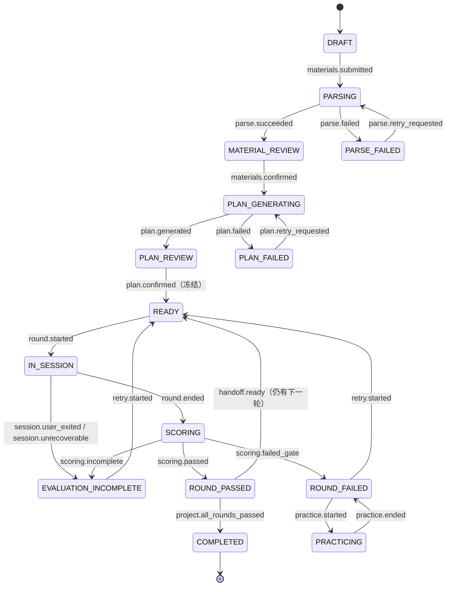

# 面试状态机（INTERVIEW-STATE-MACHINE）

| 字段 | 内容 |
|---|---|
| 文档编号 | DOMAIN-002 |
| 版本 | 0.1.0（已批准 2026-08-01 规范评审） |
| 追踪 | PRD-001 "Interview Project State Machine"、"Realtime Turn Sequence"；US-01 ~ US-05；FR-009 ~ FR-026；NFR-003、NFR-005、NFR-006；恢复规则（3 分钟重连、RPO） |
| 一致性锚点 | `docs/api/realtime-events.md`（事件名）、`docs/ai/SCORING-SPEC.md`（评分结论）、`docs/domain/BILLING-STATE-MACHINE.md`（额度联动） |

## 1. 目的

精确定义面试项目、轮次、实时房间、评分、复核、练习与重试的状态、事件、前置条件、结果、幂等规则与异常恢复，作为 Temporal 业务工作流的唯一状态事实源。AI 决策图（LangGraph）只影响提问内容，不改变本文定义的任何状态。

## 2. 范围

- 项目级状态机（与 PRD 状态图一一对应）。
- 轮次尝试、实时房间、评分、复核、练习、重试子状态机。
- 三分钟重连、数字人故障降级、用户退出、令牌刷新失败、评估未完成的处理。

## 3. 非目标

- 不定义 UI 展示细节（见 SCREEN-SPEC）。
- 不定义计费金额计算（见 BILLING-STATE-MACHINE），仅定义状态联动点。
- 不定义面试官内部决策状态（见 AI-ORCHESTRATION）。

## 4. 通用规则

1. **状态权威**：项目与轮次状态由 Temporal 工作流持久化；媒体面故障不丢失项目状态（控制面/媒体面分离）。
2. **幂等**：所有状态迁移事件携带 `event_id`（UUID）与幂等键；重复事件返回当前状态，不产生重复副作用（NFR-006）。
3. **审计**：每次迁移写追加式状态迁移记录（from、to、event、actor、at、reason）。
4. **故障红线**：任何系统责任故障不得自动判失败，不得计数字人时长，证据 RPO = 0。
5. **冻结点**：计划确认（PLAN_REVIEW → READY 前）、每轮开始、回合冻结（下一主问题开始）为不可回退的冻结点。

## 5. 项目状态机

### 5.1 状态集合（与 PRD 中文状态对照）

| 英文状态 | PRD 中文 | 含义 |
|---|---|---|
| `DRAFT` | 草稿 | 材料未提交完整 |
| `PARSING` | 解析中 | 简历/JD 解析进行中 |
| `MATERIAL_REVIEW` | 待校对 | 等待用户校对确认结构化结果 |
| `PARSE_FAILED` | 解析失败 | 文件或服务异常（保留原始输入） |
| `PLAN_GENERATING` | 计划生成中 | 生成多轮计划 |
| `PLAN_REVIEW` | 待确认计划 | 等待用户确认计划与额度 |
| `PLAN_FAILED` | 计划失败 | 生成失败（保留成功部分） |
| `READY` | 已就绪 | 可开始当前轮 |
| `IN_SESSION` | 面试中 | 当前轮实时面试进行 |
| `SCORING` | 审核中 | 当前轮评分中 |
| `ROUND_PASSED` | 当前轮通过 | 达到双门槛 |
| `ROUND_FAILED` | 当前轮未通过 | 未达门槛（阻断后续轮次） |
| `PRACTICING` | 练习中 | 非评分练习 |
| `EVALUATION_INCOMPLETE` | 评估未完成 | 证据不足/系统故障/用户结束 |
| `COMPLETED` | 全部完成 | 全部必需轮次通过（终态） |

### 5.2 迁移表

| 当前状态 | 事件 | 前置条件 | 目标状态 | 副作用/结果 |
|---|---|---|---|---|
| DRAFT | `materials.submitted` | 简历上传成功或 JD 粘贴提交（至少一项进行中） | PARSING | 启动解析工作流 |
| PARSING | `parse.succeeded` | 解析完成 | MATERIAL_REVIEW | 展示结构化字段、低置信度与面试线索 |
| PARSING | `parse.failed` | 文件损坏/加密/超限/伪装/恶意或服务异常 | PARSE_FAILED | 保留原始输入与具体原因 |
| PARSE_FAILED | `parse.retry_requested` | 用户重试失败步骤或改为手动编辑 | PARSING | 只重试失败步骤 |
| MATERIAL_REVIEW | `materials.confirmed` | 用户确认（缺失模式须先有降级同意 ConsentGrant） | PLAN_GENERATING | 敏感字段排除生效；写 `resume_parse_confirmed`/`jd_parse_confirmed` |
| PLAN_GENERATING | `plan.generated` | 计划 + 每轮问题覆盖方案 + 量表全部就绪且安全检查通过 | PLAN_REVIEW | 展示来源/可信度；不完整计划不得进入本状态 |
| PLAN_GENERATING | `plan.failed` | 任一模块失败 | PLAN_FAILED | 保留材料与成功模块 |
| PLAN_FAILED | `plan.retry_requested` | 用户或自动重试 | PLAN_GENERATING | 只重试失败模块 |
| PLAN_REVIEW | `plan.confirmed` | 用户确认计划、便利设置与额度；报价确认（付费项目） | READY | 冻结 PlanVersion（量表/权重/轮次/覆盖方案/计费版本）；写 `plan_confirmed` |
| READY | `round.started` | 见 6.1 前置条件全部满足 | IN_SESSION | 额度预留（计费联动）；写 `round_started` |
| IN_SESSION | `round.ended` | 用户完成本轮或到目标时间完成收尾 | SCORING | 提交冻结证据；写 `round_completed` |
| IN_SESSION | `session.user_exited` | 用户主动退出并确认 | EVALUATION_INCOMPLETE | 标记评估未完成；按实际使用扣减 |
| IN_SESSION | `session.unrecoverable` | 重连窗口耗尽/降级被拒/不可恢复故障 | EVALUATION_INCOMPLETE | 系统责任 → 全额返还本轮预留 |
| SCORING | `scoring.passed` | 评分服务返回 PASS | ROUND_PASSED | 祝贺文案；生成 HandoffPackage；写 `round_result_published` |
| SCORING | `scoring.failed_gate` | 评分服务返回 FAIL | ROUND_FAILED | 阻断后续轮次；生成累计复盘 |
| SCORING | `scoring.incomplete` | 证据不足/评分故障/关键转写不可恢复 | EVALUATION_INCOMPLETE | 不判失败；允许重试 |
| ROUND_PASSED | `handoff.ready` | 仍有后续轮且交接包校验通过 | READY | 解锁下一轮（下一轮前置见 6.1） |
| ROUND_PASSED | `project.all_rounds_passed` | 已通过全部必需轮次 | COMPLETED | 生成完整报告与训练计划（终态） |
| ROUND_FAILED | `practice.started` | 用户选择复盘练习 | PRACTICING | 练习不改分 |
| PRACTICING | `practice.ended` | 用户结束练习 | ROUND_FAILED | 正式分数与解锁状态不变 |
| ROUND_FAILED | `retry.started` | 用户发起正式重试且重试权益有效 | READY | 生成针对失败/未覆盖点的新问题；维度锁定生效 |
| EVALUATION_INCOMPLETE | `retry.started` | 用户选择重试 | READY | 同上 |
| EVALUATION_INCOMPLETE | `project.ended_by_user` | 用户选择结束整场 | COMPLETED 不进入；生成部分报告 | 整场保持 EVALUATION_INCOMPLETE + 部分报告（终态分支） |

> 注：PRD 状态图中"评估未完成 → 已就绪（用户选择重试）"与"当前轮未通过 → 已就绪（发起正式重试）"由 `retry.started` 统一承载；评估未完成且用户结束时停留在 EVALUATION_INCOMPLETE 并生成部分报告，不进入 COMPLETED。

### 5.3 项目状态机图



## 6. 轮次与会话子状态机

### 6.1 轮次开始前置条件（`round.started` 全部必须满足）

1. 项目状态 = READY 且当前轮 = 计划中的下一轮。
2. 本轮 `question_coverage_plan` 就绪且 `rubric_bound = true`（FR-011；缺一禁止开始）。
3. 第 2 轮起：HandoffPackage（to_round = 当前轮）已生成且事实完整性校验通过。
4. 额度预留成功（BILLING：本轮预留到位；不足则阻止开始并提供购买，**不得**在面试中提示余额）。
5. 设备检查完成；数字人音视频建立成功（NFR-007：95% ≤8s）。
6. 单活动设备检查通过（另一设备活动 → 阻止或经确认安全转移）。
7. 便利设置已冻结（开始后不可改，系统故障除外）。

### 6.2 实时房间（Session）状态

| 状态 | 含义 | 计时 | 计费 |
|---|---|---|---|
| `ROOM_CREATED` | 房间与短期令牌已签发 | 否 | 否 |
| `PRE_CHECK` | 设备与网络检查 | 否 | 否 |
| `AVATAR_CONNECTING` | 数字人音视频建立中 | 否 | 否 |
| `LIVE` | 正式进行中 | 是 | 是（秒级） |
| `PAUSED_SYSTEM` | 系统故障暂停（自动） | 否（暂停） | 否 |
| `RECONNECTING` | 用户侧断线重连窗口（3 分钟） | 暂停计时 | 否 |
| `DOWNGRADE_PROMPTED` | 数字人持续故障，询问是否降级文字 | 否 | 否 |
| `TEXT_DEGRADED` | 用户同意降级为文字面试 | 是 | 否（故障点起不再消耗数字人额度） |
| `AUTH_PAUSED` | 令牌刷新失败，等待重新认证 | 否 | 否 |
| `ENDED` | 会话结束（完成/用户退出/不可恢复） | 否 | 结算 |

迁移与事件：

| 当前 | 事件 | 目标 | 规则 |
|---|---|---|---|
| ROOM_CREATED | `session.pre_check_passed` | PRE_CHECK → AVATAR_CONNECTING | 设备检查失败给出具体原因与重试 |
| AVATAR_CONNECTING | `avatar.ready` | LIVE | 计时与计费开始（`usage.meter.started`） |
| AVATAR_CONNECTING | `avatar.failed` | PAUSED_SYSTEM | 自动重连；记录供应商与原因 |
| LIVE | `avatar.failed`（视频或音频持续失败） | PAUSED_SYSTEM | 暂停计时、保存状态、自动重连 |
| PAUSED_SYSTEM | `avatar.recovered` | LIVE | 恢复计时与计费；状态完整恢复到最后已确认回合 |
| PAUSED_SYSTEM | `avatar.unrecoverable`（重连仍失败） | DOWNGRADE_PROMPTED | 询问用户是否降级为文字面试；写 `avatar_downgrade_prompted` |
| DOWNGRADE_PROMPTED | `avatar.downgrade_accepted` | TEXT_DEGRADED | 写 `text_downgrade_accepted`；故障点起不计数字人额度；口语项按文字模式规则处理 |
| DOWNGRADE_PROMPTED | `avatar.downgrade_rejected` | ENDED | 项目 → EVALUATION_INCOMPLETE；系统责任 → 全额返还本轮预留 |
| LIVE | `user.disconnected`（页面关闭/刷新/断网） | RECONNECTING | **3 分钟重连窗口**；暂停计时；保留全部状态 |
| RECONNECTING | `session.reconnected`（窗口内） | LIVE | 恢复到最后已确认回合；不扣时间、不判失败 |
| RECONNECTING | `session.reconnect_expired`（>3 分钟） | ENDED | 项目 → EVALUATION_INCOMPLETE；非系统责任按实际使用结算 |
| LIVE | `auth.token_refresh_failed` | AUTH_PAUSED | 暂停计时，要求重新认证；不扣时间、不判失败 |
| AUTH_PAUSED | `auth.reauthenticated` | LIVE | 恢复 |
| LIVE | `user.exit_confirmed` | ENDED | 主动退出需确认；项目 → EVALUATION_INCOMPLETE；按实际使用扣减 |
| TEXT_DEGRADED | `round.ended` | ENDED | 正常收尾评分；报告标注降级与证据限制 |

幂等规则：`avatar.ready` / `usage.meter.started` / `session.reconnected` 等事件以 `event_id` 去重；重复事件只返回当前状态；计时与计费以最后一次有效状态切换为准，重复开启计量被去重（重复扣费 = 0，NFR-006）。

### 6.3 回合（Turn）规则

1. 回合顺序：`turn_index` 单调递增；每个回合先持久化再推进（NFR-005：下一主问题前完成上一有效回答持久化）。
2. 修订窗口：当前回合 ASR 文本在**下一主问题开始前**可修订；修订确认 → `revised_text` 成为评分证据，原始 ASR 仅诊断保留；窗口关闭后回合冻结，不可改写。
3. 打断：用户语音打断、停止按钮或提交文字 → 数字人立即停止（NFR-009 P95 ≤500ms）；未实际播放的内容不写入正式问题。
4. 数字人礼貌打断仅在风格允许且用户严重偏题/超时/持续过长时触发；无法判断时询问用户是否回答完成；避免重叠说话。

### 6.4 评分与复核子状态机

```
SCORING_QUEUED → SCORING_RUNNING → SCORED（PASS / FAIL / EVALUATION_INCOMPLETE）
                                ↘ SCORING_FAILED → （自动重试 ≤3）→ 仍失败 → EVALUATION_INCOMPLETE(scoring_service_failure)

REVIEW_NONE → REVIEW_REQUESTED → REVIEW_RUNNING → REVIEWED（新 ScoreVersion）
  规则：每次正式尝试仅一次；输入 = 冻结证据+量表+权重（散列校验）；通过则解锁；仍不足 → EVALUATION_INCOMPLETE 允许重试
```

### 6.5 练习与重试子状态机

```
PRACTICE:  PRACTICE_ACTIVE → PRACTICE_ENDED        # 永不产生 ScoreVersion；永不改变解锁
RETRY:     RETRY_SCHEDULED → RETRY_IN_PROGRESS（新会话 kind=formal_retry）→ 进入 5.2/6.2 流程
  规则：新问题针对失败点与未覆盖点；不重复已通过的相同问题；维度锁定按 SCORING-SPEC 6.7
```

## 7. 异常恢复矩阵

| 场景 | 即时行为 | 计时/计费 | 最终状态 | 用户救济 |
|---|---|---|---|---|
| 页面刷新/崩溃/短暂断网 | RECONNECTING，保留状态 | 暂停，不计 | 3 分钟内恢复 → LIVE；超时 → EVALUATION_INCOMPLETE | 重新进入即恢复到最后已确认回合 |
| 数字人音视频持续故障 | PAUSED_SYSTEM → 自动重连 → 失败 → DOWNGRADE_PROMPTED | 暂停，故障段不计 | 同意 → TEXT_DEGRADED；拒绝 → EVALUATION_INCOMPLETE | 拒绝降级不判失败；系统责任全额返还 |
| 评分服务故障 | SCORING_FAILED 自动重试 | 不计 | 仍失败 → EVALUATION_INCOMPLETE | 恢复后可重新触发评分或重试 |
| 令牌刷新失败 | AUTH_PAUSED | 暂停，不计 | 重新认证 → LIVE | 不扣时间、不判失败 |
| 用户主动退出 | 确认后 ENDED | 按实际使用 | EVALUATION_INCOMPLETE | 可选择重试或结束并获部分报告 |
| 供应商被紧急停用 | 新会话切换已验证替代；活跃会话按冻结/故障恢复 | 切换暂停计时 | 按上述故障路径 | 切换原因记录 Incident |
| 第二设备进入 | 阻止或经确认安全转移 | 不中断 | 原会话继续或转移 | 明确提示 |

## 8. 关键规则（红线复述）

1. 数字人音视频必须始终开启；用户摄像头/麦克风可关（FR-016）。
2. 正式面试不提供手动暂停；练习模式允许暂停。
3. 评估未完成 ≠ 失败：不解锁下一轮，但提供重试与部分报告。
4. 系统故障不判失败、不计数字人时长、证据 RPO = 0。
5. 冻结点之后：计划不可改、回合不可改写、评分只能新版本。

## 9. 验证方式

1. 状态迁移表逐条有契约测试（合法迁移生效、非法迁移拒绝、重复事件幂等）。
2. 故障演练：第 7 节矩阵每行有混沌/集成测试（含 3 分钟窗口边界：179s 恢复成功、181s 标记未完成）。
3. 与 `docs/api/realtime-events.md` 事件名一致性 CI 检查。
4. 端到端：US-03 全部场景与 US-04 场景 1–3 的状态路径验证。
