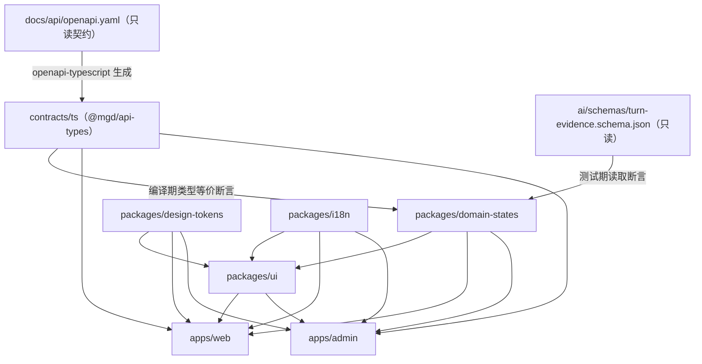

# 设计文档：全局前端页面（frontend-global-pages）

| 字段 | 内容 |
|---|---|
| 特性名 | frontend-global-pages |
| 实现语言 | TypeScript（Next.js App Router + React，`strict: true`） |
| 需求来源 | `.kiro/specs/frontend-global-pages/requirements.md`（G1 ~ G11、B0-1 ~ B4-2） |
| 页面契约 | `docs/design/SCREEN-SPEC.md`（SCR-01 ~ SCR-17） |
| 无障碍契约 | `docs/design/ACCESSIBILITY.md` |
| 设计系统契约 | `docs/design/DESIGN-SYSTEM.md` |
| 状态契约 | `docs/domain/INTERVIEW-STATE-MACHINE.md`、`ai/schemas/turn-evidence.schema.json` |
| API 契约（只读） | `docs/api/openapi.yaml`（OpenAPI 3.1.0，84 条路径，`components.schemas` 约 197 项） |
| 流水线 | `.github/workflows/ci.yml`（6 阶段） |
| 交付批次 | frontend-batch-0 ~ frontend-batch-4 |

## 1. 概述与设计目标

本设计把 requirements.md 的 31 条需求落成可实施的前端工程结构：一个 pnpm 工作区、四个共享包、两个 Next.js 应用、一套由 `docs/api/openapi.yaml` 生成的只读类型与 MSW 合成数据层、一套令牌驱动的组件库，以及三处接入既有 CI 的检查点。

设计目标按优先级排列：

1. **契约不可漂移**：项目状态、会话状态、便利设置三组枚举与 `docs/api/openapi.yaml`、`docs/domain/INTERVIEW-STATE-MACHINE.md`、`ai/schemas/turn-evidence.schema.json` 保持编译期或测试期强一致（满足 G1）。
2. **红线可执行**：「0 个改分控件」「不冒充数字人」「日志不含正文」「机构默认最小可见」等红线由类型系统或自动化扫描判定，而不是靠人工复核（满足 G8、G9、B4-1、B4-2）。
3. **五态与无障碍是结构而非补丁**：五态视图与无障碍属性由共享容器组件强制提供，页面无法「忘记写空态」（满足 G2、G4）。
4. **联调零改页面**：页面写标准 `fetch`，关闭 `Mock_Layer` 即切真实 API（满足 G6）。
5. **批次可独立合入**：批次 0 之后每批只新增页面与文案，不回改工作区与流水线结构（满足 G11）。

| 设计小节 | 满足需求 |
|---|---|
| 2 架构与路由 | B0-1、B0-2、G7、B4-2 |
| 3 Token_Pipeline | G5、G4（对比度） |
| 4 UI_Kit | G5、G4、G2 |
| 5 状态枚举共享模块 | G1 |
| 6 五态实现模式 | G2 |
| 7 i18n | G3 |
| 8 数据层 | G6 |
| 9 房间外壳 | B2-1、B2-2 |
| 10 机构端与后台 | B4-1、B4-2、G9 |
| 11 安全与隐私 | G8、G9 |
| 12 测试策略 | G10、G11 |
| 13 CI 集成 | B0-3、G11 |
| 14 批次顺序 | G11 |
| 15 偏离与未决 | 偏离 1、偏离 2 |
| 16 错误处理 | G2、B0-2 |

## 2. 架构

### 2.1 工作区目录结构

批次标注说明该目录由哪个批次创建；未标注者为既有内容。

```text
面个蛋/
├─ package.json                      # 批次 0：工作区根，仅脚本与 devDependencies，private: true
├─ pnpm-workspace.yaml               # 批次 0：packages: [apps/*, packages/*, contracts/ts]
├─ pnpm-lock.yaml                    # 批次 0：唯一锁文件
├─ tsconfig.base.json                # 批次 0：strict 基线，路径别名
├─ .github/
│  ├─ actions/setup-frontend/action.yml   # 批次 0：node + pnpm + 缓存 + frozen-lockfile 安装
│  └─ workflows/ci.yml               # 批次 0 修改：stage2 / stage3 / stage6 各加挂接步骤
├─ contracts/
│  └─ ts/                            # 批次 0：Api_Types 生成产物（pnpm 包 @mgd/api-types）
│     ├─ package.json
│     ├─ openapi.d.ts                # 生成物，禁止手工编辑
│     └─ SOURCE.md                   # 生成物来源：openapi.yaml 的 git commit hash
├─ packages/
│  ├─ design-tokens/                 # 批次 0：Token_Pipeline
│  │  ├─ tokens/{color,typography,space,breakpoint}.json
│  │  ├─ tokens/{contrast-pairs.json,NAMES.lock}
│  │  ├─ src/{index.ts,build-css.ts,contrast.ts,names.ts}
│  │  └─ generated/{tokens.css,theme.css}   # 生成物并提交，CI 校验 diff
│  ├─ domain-states/                 # 批次 0：项目态 / 会话态 / 便利设置枚举与断言
│  │  └─ src/{project.ts,session.ts,accommodations.ts,org.ts,assert-contract.ts,index.ts}
│  ├─ eslint-plugin-mgd/             # 批次 0：no-domain-state-literal 等本地规则
│  │  └─ rules/no-domain-state-literal.mjs
│  ├─ i18n/                          # 批次 0：I18n_Runtime
│  │  ├─ src/{config.ts,request.ts,format.ts,index.ts}
│  │  ├─ messages/zh-CN/*.json       # 批次 0 建 common/error；批次 1~4 按页面组增补
│  │  └─ messages/en-US/*.json
│  └─ ui/                            # 批次 0：UI_Kit（批次 1~4 增补业务组件）
│     ├─ src/primitives/…            # Button / Switch / Field / Skeleton / AlertDialog …
│     ├─ src/patterns/…              # StateView / ErrorPanel / StatusBadge / ChartWithTextEquivalent …
│     ├─ src/a11y/…                  # focus-trap、目标尺寸、forced-colors 兜底
│     └─ src/testing/control-registry.ts   # data-mgd-control 控件清册
├─ apps/
│  ├─ web/                           # 批次 0 脚手架；批次 1~4 填页面
│  │  ├─ next.config.ts  tsconfig.json  eslint.config.mjs  vitest.config.ts
│  │  ├─ src/app/[locale]/…          # 见 2.3 路由表
│  │  ├─ src/app/{error,not-found,loading}.tsx
│  │  ├─ src/lib/{api-fetch.ts,telemetry.ts,region-context.ts}
│  │  ├─ src/mocks/{browser.ts,server.ts,handlers/*.ts}   # Mock_Layer
│  │  └─ tests/…
│  └─ admin/                         # 批次 4 脚手架 + 7 个骨架页
└─ fixtures/synthetic/
   └─ ui/                            # 批次 1~4：按页面组分文件，全部 synthetic: true
```

新增第四个共享包 `packages/domain-states` 是对需求 B0-1 第 2 条的**追加**（该条要求"提供 design-tokens、ui、i18n 三个共享包"，未禁止追加）。理由：领域枚举既被 `packages/ui`（状态徽标）消费，也被两个应用消费，放进 `packages/ui` 会让 UI 组件库承担领域语义，放进应用则无法在两个应用间共享同一份断言。

### 2.2 依赖方向



约束：`packages/*` 之间只允许 `design-tokens → ui`、`domain-states → ui`、`i18n → ui` 三条边；`packages/ui` 不依赖任何应用；`contracts/ts` 不依赖任何包。该约束由 ESLint `import/no-restricted-paths` 的 zone 配置执行，违反即 `stage2-lint` 失败。

### 2.3 `apps/web` 路由表（SCR-01 ~ SCR-16）

全部页面位于 `src/app/[locale]/` 之下，`locale ∈ {zh-CN, en-US}`。

| SCR | 公网路径 | 文件 |
|---|---|---|
| SCR-01 | `/{locale}` | `[locale]/page.tsx` |
| SCR-01 | `/{locale}/demo` | `[locale]/demo/page.tsx` |
| SCR-02 | `/{locale}/auth` | `[locale]/auth/page.tsx` |
| SCR-03 | `/{locale}/dashboard` | `[locale]/dashboard/page.tsx` |
| SCR-04 | `/{locale}/projects/new` | `[locale]/projects/new/page.tsx` |
| SCR-05 | `/{locale}/projects/{id}/review` | `[locale]/projects/[id]/review/page.tsx` |
| SCR-06 | `/{locale}/projects/{id}/plan` | `[locale]/projects/[id]/plan/page.tsx` |
| SCR-07 | `/{locale}/projects/{id}/precheck` | `[locale]/projects/[id]/precheck/page.tsx` |
| SCR-08 / SCR-09 | `/{locale}/sessions/{id}` | `[locale]/sessions/[id]/page.tsx`（覆盖层为同层组件，非独立路由） |
| SCR-10 | `/{locale}/projects/{id}/rounds/{n}/result` | `[locale]/projects/[id]/rounds/[n]/result/page.tsx` |
| SCR-11 | `/{locale}/projects/{id}/report` | `[locale]/projects/[id]/report/page.tsx` |
| SCR-12 | `/{locale}/projects/{id}/practice/{pid}` | `[locale]/projects/[id]/practice/[pid]/page.tsx` |
| SCR-13 | `/{locale}/library` | `[locale]/library/page.tsx` |
| SCR-14 | `/{locale}/settings` | `[locale]/settings/page.tsx` |
| SCR-15 | `/{locale}/billing` | `[locale]/billing/page.tsx` |
| SCR-16 | `/{locale}/org/{orgId}/assignments` | `[locale]/org/[orgId]/assignments/page.tsx` |
| SCR-16 | `/{locale}/org/{orgId}/assignments/{assignmentId}` | `[locale]/org/[orgId]/assignments/[assignmentId]/page.tsx`（任务配置） |
| SCR-16 | `/{locale}/org/{orgId}/completion` | `[locale]/org/[orgId]/completion/page.tsx` |
| SCR-16 | `/{locale}/org/{orgId}/members` | `[locale]/org/[orgId]/members/page.tsx` |
| SCR-16 | `/{locale}/org/{orgId}/aggregates` | `[locale]/org/[orgId]/aggregates/page.tsx` |
| SCR-16 | `/{locale}/org/{orgId}/permissions` | `[locale]/org/[orgId]/permissions/page.tsx` |
| SCR-16 | `/{locale}/org/{orgId}/shares` | `[locale]/org/[orgId]/shares/page.tsx`（授权结果视图） |

房间页使用独立路由组 `(room)` 以获得全宽布局：`[locale]/(room)/sessions/[id]/page.tsx`；其余页面在 `(app)` 组内共享 1200px 最大宽度容器（G7 第 5 条）。

### 2.4 `apps/admin` 路由表（SCR-17）

`next.config.ts` 设 `basePath: '/admin'`，应用内部路由为 `src/app/[locale]/<page>`，因此公网路径为 `/admin/{locale}/<page>`：

| 页面 | 公网路径 |
|---|---|
| 区域监控 | `/admin/{locale}/regions` |
| 供应商与模型 | `/admin/{locale}/providers` |
| 版本治理 | `/admin/{locale}/versions` |
| 来源与内容安全 | `/admin/{locale}/sources` |
| 客服工单 | `/admin/{locale}/tickets` |
| 财务与补偿 | `/admin/{locale}/finance` |
| 审计日志 | `/admin/{locale}/audit-logs` |

**设计澄清**：需求 B4-2 第 1 条要求 `basePath = /admin`，第 2 条把路径写作 `/{locale}/admin/…`。两者字面不可同时成立（basePath 会前置 `/admin`，直写会得到 `/admin/{locale}/admin/…`）。本设计取 `/admin/{locale}/<page>`：既满足 SCREEN-SPEC 第 5 节对 SCR-17 的 `/admin/…` 前缀约定，又满足偏离 1 的语言前缀规则。该澄清在批次 4 PR 正文说明，不修改 SCREEN-SPEC。

## 3. Token_Pipeline（满足 G5、G4 第 4 条）

### 3.1 令牌 JSON 结构

`packages/design-tokens/tokens/color.json` 的形状（值取 DESIGN-SYSTEM 第 5 节中性占位色，品牌视觉属 OD-04 未决）：

```json
{
  "$comment": "语义映射为稳定契约，色值为可替换占位；变更语义名称集合将使 CI 失败",
  "color": {
    "primary":       { "value": "#2B5CE6", "onLight": true, "usage": "主操作、链接" },
    "success":       { "value": "#1F9D66", "onLight": true, "usage": "通过态 PASS" },
    "warning":       { "value": "#B7791F", "onLight": true, "usage": "弱项、降级提示" },
    "danger":        { "value": "#C53030", "onLight": true, "usage": "未通过态 FAIL、破坏性操作" },
    "info":          { "value": "#2B6CB0", "onLight": true, "usage": "EVALUATION_INCOMPLETE" },
    "neutral900":    { "value": "#1A202C", "onLight": true, "usage": "主文本" },
    "neutral600":    { "value": "#4A5568", "onLight": true, "usage": "次级文本" },
    "neutral100":    { "value": "#EDF2F7", "onLight": false, "usage": "分隔/背景" },
    "surface":       { "value": "#FFFFFF", "onLight": false, "usage": "卡片表面" },
    "focus":         { "value": "#805AD5", "onLight": true, "usage": "focus-visible 焦点环" }
  }
}
```

`typography.json` 提供 `display/h1/h2/h3/body/caption` 的 `size` 与 `lineHeight`（对齐 DESIGN-SYSTEM 第 6 节）与三条字族栈 `zh/en/mono`；`space.json` 提供 4px 基线的 `1/2/3/4/6/8/12`；`breakpoint.json` 提供 `desktop: 1024`、`tablet: 768`、`mobileMax: 767` 与 `contentMaxWidth: 1200`。

### 3.2 生成与消费

- `pnpm tokens:build` 执行 `src/build-css.ts`，输出两个生成物：`generated/tokens.css`（每个令牌一条 CSS 变量，如 `--mgd-color-primary`、`--mgd-font-body-size`、`--mgd-space-4`）与 `generated/theme.css`（Tailwind v4 的 `@theme inline` 块，把 Tailwind 的 `--color-*`、`--text-*`、`--spacing-*`、`--breakpoint-*` 指向前者的变量）。
- Tailwind 采用 v4 的 CSS-first 配置：应用的 `globals.css` 只需 `@import 'tailwindcss'` 与 `@import '@mgd/design-tokens/generated/theme.css'`，不存在 `tailwind.config.ts` 的 `presets` 数组（v4 已移除该机制）。
- 生成物提交入库并放在 `generated/`（而非 `dist/`，因为仓库 `.gitignore` 全局忽略 `dist/`）；`pnpm tokens:check` 一次性执行「名称锁比对 + 对比度校验 + 生成物 diff」，避免构建顺序依赖。
- 页面禁止硬编码色值与字号：ESLint 规则 `no-restricted-syntax` 拦截 `.tsx`/`.css` 中的 `#rrggbb`、`rgb(`、`px` 字号字面量（`className` 与 `style` 均覆盖），白名单仅 `packages/design-tokens`。

### 3.3 语义名称集合稳定性校验

`src/names.ts` 导出 `SEMANTIC_TOKEN_NAMES`（排序后的字符串数组）与快照文件 `tokens/NAMES.lock`。`pnpm tokens:check-names` 比对两者：

```text
[令牌语义名变更] 新增: color.brandAccent；移除: color.info
提示：语义映射是稳定契约，换肤只允许改色值（DESIGN-SYSTEM 第 10 节第 1 条）。
```

退出码非 0。品牌视觉替换（OD-04 关闭后）只改 `value`，`NAMES.lock` diff 必须为空。

### 3.4 对比度校验

`src/contrast.ts` 实现 WCAG 相对亮度与对比度算法，`pnpm tokens:check-contrast` 遍历「前景令牌 × 背景令牌」的**声明用途组合表**（`tokens/contrast-pairs.json`，逐对标注 `textSize: 'body' | 'large'`），阈值 body ≥4.5:1、large ≥3:1。失败输出：

```text
[对比度不足] color.warning on color.surface = 3.12:1（要求 body ≥4.5:1）
建议：调整 color.warning 的占位色值，或将该组合改为 large 文本用途。
```

### 3.5 批次 0 视觉基线

全局壳采用 `claude-design` 设计流程完成三向对比后收敛为 **A+B 融合**：A 取瑞士编辑系统的网格、编号、发丝线与留白，B 取训练仪器的状态可读性与实体控制感。该基线只规定信息秩序，不新增 PRD 未声明的功能或状态：

- 品牌入口使用纯文字 `面个蛋 MianGeDan`；OD-04 未关闭前不伪造 Logo、插画、照片或品牌字体。
- 导航使用稳定编号与无圆角分区；常规页面用「SCR 编号栏 + 页面简报」构图，房间页保留全宽能力。
- 操作反馈优先使用边界、文字、图标和明确状态，不使用装饰性渐变、虚构读数或静态媒体冒充实时输出。
- 颜色、字号、间距、焦点环与命中尺寸仍全部来自本节令牌；视觉收敛不得绕过 WCAG 2.2 AA。
- 390px 移动端导航改为两列换行，不使用横向滚动条；桌面 1280px 与移动端 388px 实际浏览器检查均无横向溢出，移动端最小可见交互目标为 56px。

## 4. UI_Kit 组件清单与状态模型（满足 G5、G4、G2）

### 4.1 组件清单

| 组件 | 职责 | 关键无障碍约定 |
|---|---|---|
| `Button` / `IconButton` | 主控制 | 命中区 ≥44×44（`IconButton` 用 `::after` 扩展命中区，不改视觉尺寸）；`disabled` 时不可聚焦并渲染原因 |
| `Switch` | 独立授权与便利设置开关 | `role="switch"`、`aria-checked`；命中区 ≥24×24；无群组联动 |
| `Field` | 表单字段容器 | `aria-describedby` 关联说明与错误；错误时 `aria-invalid` |
| `Skeleton` | 加载骨架 | 容器 `aria-busy="true"`，并提供 `aria-label` 忙碌文案 |
| `StatusBadge` | 项目态/会话态徽标 | 图标 + 文字标签双通道；`forced-colors` 下用边框区分 |
| `StateView` | 五态容器 | 见第 6 节 |
| `ErrorPanel` | 错误五要素面板 | `role="alert"`；五段文案结构化渲染 |
| `AlertDialog` | SCR-09 覆盖层与破坏性确认 | `role="alertdialog"`、`aria-modal`；焦点圈定与返回；取消与确认同等可达 |
| `ChartWithTextEquivalent` | 雷达/趋势/匹配图 | 图形 `aria-hidden`，同级渲染文字摘要 + `<table>` 等价版本 |
| `ToolPane` | 房间岗位工具容器 | `role="region"` + `aria-label`（editor/whiteboard/case/portfolio）；内部滚动 |
| `DisclosureNote` | 只读说明区（评分算法、60 分线等） | 无编辑控件，`aria-readonly` |

### 4.2 七态实现约定

`packages/ui/src/primitives/state-contract.ts`：

```ts
export type InteractiveVisualState =
  | 'default' | 'hover' | 'active' | 'disabled' | 'loading' | 'error' | 'focusVisible';

export interface InteractiveBaseProps {
  /** disabled 必须同时给出原因，用于渲染与断言（DESIGN-SYSTEM 第 8 节） */
  readonly disabledReason?: string;
  readonly loading?: boolean;
  /** error 态必须图标 + 文字，不允许只变色 */
  readonly errorMessage?: string;
  readonly controlId: string; // 写入 data-mgd-control，供控件清册扫描
}
```

实现约定：`disabled` 时输出 `aria-disabled` 与 `tabindex={-1}` 并渲染 `disabledReason`（缺失时组件抛出开发期错误）；`loading` 时输出 `aria-busy="true"` 与可读忙碌文案；`error` 时同时渲染 `ErrorIcon` 与 `errorMessage`；`focus-visible` 通过共享 CSS `outline: 2px solid var(--color-focus); outline-offset: 2px`，任何组件不得设置 `outline: none`（ESLint `no-restricted-syntax` 拦截）。

### 4.3 焦点与目标尺寸

`src/a11y/focus-trap.ts` 导出 `useFocusTrap(containerRef, { returnFocusTo })`，供 `AlertDialog` 使用；`src/a11y/target-size.css` 提供 `.mgd-target-24` 与 `.mgd-target-44` 两个工具类，组件测试断言 `getBoundingClientRect` 结果（jsdom 下改为断言应用了对应类与 `min-width/min-height` 计算值）。

## 5. 状态枚举共享模块与可执行校验（满足 G1）

### 5.1 枚举定义

`packages/domain-states/src/project.ts`：

```ts
export const PROJECT_STATUSES = [
  'DRAFT', 'PARSING', 'MATERIAL_REVIEW', 'PARSE_FAILED',
  'PLAN_GENERATING', 'PLAN_REVIEW', 'PLAN_FAILED', 'READY',
  'IN_SESSION', 'SCORING', 'ROUND_PASSED', 'ROUND_FAILED',
  'PRACTICING', 'EVALUATION_INCOMPLETE', 'COMPLETED',
] as const;
export type ProjectStatus = (typeof PROJECT_STATUSES)[number];
```

`session.ts` 同法导出 `SESSION_STATUSES`（`ROOM_CREATED` … `ENDED`，10 项）与 `SessionStatus`；`accommodations.ts` 导出 `ACCOMMODATION_KEYS`（9 项）与 `AccommodationKey`。

### 5.2 编译期契约断言

`assert-contract.ts` 利用生成类型做双向类型等价断言，任一侧漂移都会让 `tsc --noEmit` 失败：

```ts
import type { components } from '@mgd/api-types';
import type { ProjectStatus } from './project';
import type { SessionStatus } from './session';

type Exact<A, B> = [A] extends [B] ? ([B] extends [A] ? true : never) : never;

// docs/api/openapi.yaml: components.schemas.ProjectStatus
const _project: Exact<ProjectStatus, components['schemas']['ProjectStatus']> = true;
// docs/api/openapi.yaml: components.schemas.Session.room_status
const _session: Exact<SessionStatus, NonNullable<components['schemas']['Session']['room_status']>> = true;
void _project; void _session;
```

便利设置在 openapi 中是路径内联枚举，改为测试期断言：`tests/accommodations.contract.test.ts` 读取 `ai/schemas/turn-evidence.schema.json` 的 `properties.accommodations_in_effect.items.enum`，与 `ACCOMMODATION_KEYS` 做集合与顺序无关的等值比较。

### 5.3 状态机文档一致性断言

`tests/state-machine.contract.test.ts` 解析 `docs/domain/INTERVIEW-STATE-MACHINE.md` 第 5.1 节表格第一列（反引号包裹的英文状态）与第 6.2 节表格第一列，提取集合后与 `PROJECT_STATUSES`、`SESSION_STATUSES` 比较；不一致时输出缺失与多余项，并提示"以 PRD/状态机为准，不得在页面层修正"。

### 5.4 禁止页面自创状态名

两道机制叠加。

**（a）ESLint 自定义规则** `packages/eslint-plugin-mgd/rules/no-domain-state-literal.ts`，作用域 `apps/*/src/**`、`packages/ui/src/**`：

- 触发条件：`Literal` 节点的字符串值匹配 `/^[A-Z][A-Z0-9]*(_[A-Z0-9]+)+$/` 或属于三组枚举值集合。
- 例外：位于 `import` 语句；出现在 `packages/domain-states` 内；命中显式白名单 `ALLOWED_UPPER_LITERALS`（当前仅机构可见性投影值 `NOT_STARTED`、`IN_PROGRESS`、`COMPLETED_OR_EXITED`，以及 `PASS`、`FAIL` 在报告只读展示中的 `ResultStatus` 引用）。
- 报错文案：`不得在页面层书写领域状态字面量 "ROUND_PASSD"；请从 @mgd/domain-states 导入。若为新状态，先更新 docs/domain/INTERVIEW-STATE-MACHINE.md。`

该规则同时能抓住拼写错误（如 `ROUND_PASSD` 既不在枚举内也不在白名单内）。

**（b）源码扫描测试** `tests/no-invented-states.test.ts`：用 `fast-glob` 遍历 `apps/*/src/**/*.{ts,tsx}`，正则提取全部大写蛇形字面量，减去三组枚举与白名单，断言余集为空，失败时输出 `文件:行 命中值`。此测试覆盖 ESLint 未启用的文件类型（例如 `.mdx` 文案片段）并作为二次兜底。

## 6. 五态矩阵实现模式（满足 G2）

### 6.1 StateView 契约

```ts
export type PageState =
  | { kind: 'empty'; reasonKey: string; nextActionKey: string; onNext: () => void }
  | { kind: 'loading'; busyLabelKey: string; expectation?: LoadingExpectation }
  | { kind: 'error'; error: UserFacingError; onRetry: () => void }
  | { kind: 'forbidden'; requiredPermissionKey: string; acquirePath: AcquirePath }
  | { kind: 'recovering'; resumeAtKey: string; onResume: () => void }
  | { kind: 'ready' };

export interface LoadingExpectation {
  readonly nfrId: 'NFR-007' | 'NFR-013' | 'NFR-014' | 'NFR-015' | 'NFR-016';
  readonly seconds: number;
  readonly statistic: 'p95' | 'pct95';
}

export type AcquirePath = 'signIn' | 'grantConsent' | 'purchase' | 'contactOrgOwner';
```

`<StateView state={…}>{ready}</StateView>` 只在 `kind === 'ready'` 时渲染 children；其余分支渲染对应内置视图。页面组件不得自行拼装空态或错误态（ESLint zone 限制 `ErrorPanel` 仅可由 `StateView` 与覆盖层引用）。空态视图内禁止渲染数字型骨架数据，组件测试断言空态子树内不含 `/\d/` 的业务数值节点（G2 第 2 条）。

### 6.2 错误五要素结构

```ts
export interface UserFacingError {
  readonly code: components['schemas']['ErrorCode']; // openapi 的 21 项错误码
  readonly traceId: string;
  readonly dataRegion: components['schemas']['Region'];
  readonly impactKey: string;        // ①影响
  readonly dataRetainedKey: string;  // ②数据是否保留
  readonly retryActionKey: string;   // ③可重试动作
  readonly billingKey: string;       // ④是否计费
  readonly scoringKey: string;       // ⑤是否影响评分
}
```

i18n 键命名规范：`error.<code>.impact|dataRetained|retryAction|billing|scoring`，页面覆写用 `error.<code>.<scrId>.<facet>`（存在时优先）。`src/lib/error-presenter.ts` 提供 `presentError(envelope, scrId): UserFacingError`，对 openapi `Error` 信封逐码映射；缺失映射时 CI 的翻译键检查报错，避免运行期回落到原始键名。

### 6.3 长加载预期时长绑定

| 页面 | 场景 | NFR | 文案数值 |
|---|---|---|---|
| SCR-05 | 简历/JD 解析中 | NFR-015 | P95 ≤60 秒 |
| SCR-06 | 计划生成中 | NFR-016 | P95 ≤120 秒 |
| SCR-07 | 数字人建连检查 | NFR-007 | 95% ≤8 秒 |
| SCR-10 | 评分中 | NFR-013 | P95 ≤60 秒 |
| SCR-11 | 报告生成中 | NFR-014 | P95 ≤120 秒 |

数值集中在 `packages/i18n/src/nfr-expectations.ts` 定义一次，测试断言其与本表一致，避免文案漂移。

## 7. i18n 设计（满足 G3）

- **资源组织**：`packages/i18n/messages/{locale}/<namespace>.json`，命名空间按页面组切分（`common`、`error`、`scr01-landing` … `scr17-admin`），减少批次间合并冲突。
- **键命名**：`<namespace>.<block>.<element>`，全小写点分；固定文案红线单独收在 `common.redline.*`（`passCongrats`、`evaluationIncompleteNotFailure`、`practiceNoScoreChange`、`exportTrainingDisclaimer`）便于快照测试定位。
- **ICU 用法**：复数用 `{count, plural, one {…} other {…}}`；日期用 `{at, date, medium}`；货币用 `{amount, number, ::currency/CNY}`，金额单位为最小货币单位（openapi `Money.amount` 为分），格式化前除以 100 由 `format.ts` 的 `formatMoney(money, locale)` 统一处理。
- **路由与回退**：`proxy.ts`（Next.js 16 约定）使用 `packages/i18n/src/config.ts` 的 `SUPPORTED_LOCALES`、`DEFAULT_LOCALE = 'zh-CN'`、`FALLBACK_LOCALE = 'en-US'`；无前缀路径 308 重定向到带前缀等价路径；不支持的 locale 段按 `en-US` 渲染。根布局输出 `<html lang={locale}>`。
- **缺失键检测**：`pnpm i18n:check` 做三件事——①两语言键集合求对称差，非空即失败；②用 `ts-morph` 提取源码中 `t('…')` 的字面量键，检查在 `zh-CN` 与 `en-US` 均存在；③检查 ICU 占位符集合在两语言一致。失败输出 `缺失键: scr10-result.pass.congrats@en-US`。
- **界面语言与面试语言分离**：`interfaceLocale` 来自 URL 段，`interviewLanguage` 来自项目/账户数据（openapi `Language` 枚举），两者在 `settings` 页为两个独立控件，类型上不可互相赋值（`interviewLanguage` 使用品牌类型 `InterviewLanguage`）。
- **中英文分别撰写**：`messages/en-US/**` 不是机翻产物，`pnpm i18n:check` 额外校验两语言同键值不得完全相同（除品牌名、数字与代码类值的白名单），命中即提示需要人工撰写英文文案。

## 8. 数据层设计（满足 G6）

### 8.1 Api_Types 落点决策

**落点 = `contracts/ts`，同时作为 pnpm 工作区包 `@mgd/api-types`。**

理由：`contracts/README.md` 已把该目录定义为"只存放由源契约机器生成的类型/客户端产物"，并规定"禁止手工编辑生成物"（规则 1）与"生成物必须标注来源版本（源契约文件的 git 提交哈希）"（规则 3）。若另建 `packages/api-types`，会出现两个生成物落点、两套 diff 规则。把 `contracts/ts` 纳入 `pnpm-workspace.yaml` 即可让两个应用通过 `workspace:*` 消费，同时保留既有约定。`contracts/ts/SOURCE.md` 记录生成时 `docs/api/openapi.yaml` 的 commit hash 满足规则 3。

生成命令（根 `package.json` 脚本）：

```bash
pnpm api:generate   # openapi-typescript docs/api/openapi.yaml -o contracts/ts/openapi.d.ts && node tools/stamp-contract-source.mjs
pnpm api:check      # 重新生成到临时文件后与已提交产物 diff，非空即退出码 1
```

`api:check` 失败输出：`[契约生成物漂移] contracts/ts/openapi.d.ts 与 docs/api/openapi.yaml 不一致，请运行 pnpm api:generate 并提交产物。`

### 8.2 fetch 封装

`apps/web/src/lib/api-fetch.ts`：

```ts
import type { paths } from '@mgd/api-types';

export type ApiPath = keyof paths;
export type ApiResult<T> =
  | { readonly ok: true; readonly data: T; readonly traceId: string }
  | { readonly ok: false; readonly error: UserFacingError };

export interface ApiFetchInit<P extends ApiPath, M extends keyof paths[P]> {
  readonly method: M;
  readonly pathParams?: Record<string, string | number>;
  readonly query?: Record<string, string | number | undefined>;
  readonly body?: unknown;
  /** 写操作必填：openapi components.parameters.IdempotencyKey */
  readonly idempotencyKey?: string;
  readonly signal?: AbortSignal;
  readonly scrId: string; // 供 error-presenter 选择页面级文案覆写
}

export function apiFetch<P extends ApiPath, M extends keyof paths[P]>(
  path: P, init: ApiFetchInit<P, M>,
): Promise<ApiResult<ResponseOf<paths[P][M]>>>;
```

约定：`POST/PATCH/DELETE` 缺 `idempotencyKey` 时类型层报错（通过条件类型要求写方法必填）；封装内部不做业务重试，重试由页面的 `onRetry` 触发，保证"重试动作对用户可见"；响应非 2xx 时按 openapi `Error` 信封解析并交给 `presentError`。

### 8.3 Mock_Layer

- 目录：`apps/web/src/mocks/handlers/<scrId>.ts`，一个页面组一个文件，`handlers/index.ts` 汇总。浏览器侧 `browser.ts`（`setupWorker`）仅在 `NEXT_PUBLIC_MGD_MOCKS === 'on'` 时启动；测试侧 `server.ts`（`setupServer`）在 `vitest.setup.ts` 中始终启用。
- 每个 handler 至少导出三个场景工厂：`ok()`、`failure(code)`、`empty()`，测试通过 `server.use(scr03.failure('internal'))` 切换，驱动 G2 五态用例。
- fixture 位于 `fixtures/synthetic/ui/<scrId>.json`，顶层字段 `"synthetic": true`；虚构人名使用 `候选人 A / Candidate A` 形式，邮箱使用 `example.invalid` 域，不含手机号、证件号、地址、照片与媒体引用。
- **自动化扫描** `tests/mock-data-privacy.test.ts`：遍历 `fixtures/synthetic/ui/**` 与 `apps/*/src/mocks/**`，断言①每个 JSON 顶层 `synthetic === true`；②内容不匹配手机号（`1[3-9]\d{9}`）、身份证（18 位）、真实邮箱域（非 `example.invalid`/`example.com`）、`data:image`、`.mp4`/`.wav` 引用等模式；命中输出 `文件:行 命中模式`。注意 `tools/validate_docs.py` 的 `json` 套件已强制 `*.jsonl` 每行 `synthetic: true`，本测试补齐 `*.json` 与 TS 内联 mock。

## 9. SCR-08 / SCR-09 房间外壳设计（满足 B2-1、B2-2）

### 9.1 组件树

```text
<RoomShell>                       // (room) 路由组，全宽
├─ <RoomStatusBar>                // 轮次名、计时状态、网络、字幕开关、退出
├─ <RoomMain>
│  ├─ <QuestionPanel>             // 问题固定显示、可回看
│  ├─ <CaptionStream>             // aria-live="polite"
│  ├─ <TranscriptPanel>           // 候选人转写 + 修订窗口
│  ├─ <FollowUpPanel>
│  └─ <ToolPane[]>                // 仅渲染计划已启用工具
├─ <RoomAside>
│  ├─ <AvatarVideoRegion>         // 媒体桩驱动，始终开启语义
│  ├─ <SelfCameraRegion>          // 可关闭
│  └─ <RoundProgress>             // 轮次进度、输入模式
├─ <RoomControlBar>               // 麦克风、摄像头、停止数字人、文字输入、提交
└─ <OverlayHost>                  // SCR-09 单实例插槽
```

Tab 序：`RoomControlBar` 在 DOM 中位于 `RoomMain` 之后，但通过 `RoomShell` 顶部的 `<SkipToControls>` 与控件条内部顺序把「停止数字人」「提交」置于控件条前两位（ACCESSIBILITY 4.2 要求打断/停止在 Tab 序前段）。组件测试断言 `tabbable(container)` 的前四项包含 `stop-avatar` 与 `submit-answer` 两个 `controlId`。

### 9.2 会话态 → UI 映射

| 会话态 | 顶部状态条文案键 | 计时 | 计费提示 | 可用控件 |
|---|---|---|---|---|
| `ROOM_CREATED` | `scr08.status.roomCreated` | 否 | 未开始 | 退出 |
| `PRE_CHECK` | `scr08.status.preCheck` | 否 | 未开始 | 检查项重试、摄像头/麦克风开关、退出 |
| `AVATAR_CONNECTING` | `scr08.status.avatarConnecting`（含 NFR-007 预期） | 否 | 未开始 | 退出 |
| `LIVE` | `scr08.status.live` | 是 | 秒级计费中 | 全部控件 |
| `PAUSED_SYSTEM` | `scr08.status.pausedSystem` | 否 | 此段不计费 | 退出；作答与提交 disabled + 原因 |
| `RECONNECTING` | `scr08.status.reconnecting`（含倒计时） | 暂停 | 不计费 | 退出 |
| `DOWNGRADE_PROMPTED` | `scr08.status.downgradePrompted` | 否 | 不计费 | 覆盖层的同意 / 拒绝 |
| `TEXT_DEGRADED` | `scr08.status.textDegraded` | 是 | 不再消耗数字人额度 | 文字输入、提交、工具、退出；麦克风/摄像头 disabled + 原因 |
| `AUTH_PAUSED` | `scr08.status.authPaused` | 否 | 不计费 | 覆盖层重新认证 |
| `ENDED` | `scr08.status.ended` | 否 | 已结算 | 前往结果页 |

映射表实现为 `src/features/room/session-view-model.ts` 的 `Record<SessionStatus, RoomViewModel>`，`Record` 的完备性由 TS 保证（新增会话态不实现即编译失败）。

### 9.3 媒体桩接口

```ts
export type AvatarStubState = 'IDLE' | 'CONNECTING' | 'CONNECTED' | 'FAILED' | 'STOPPED';

export interface AvatarMediaPort {
  readonly state: AvatarStubState;
  /** 桩实现恒为 false：没有任何可渲染的真实媒体轨 */
  readonly hasRenderableTrack: boolean;
  connect(): Promise<void>;
  stopSpeaking(): void;      // 对应 NFR-009 的打断语义，桩仅切状态
  subscribe(listener: (s: AvatarStubState) => void): () => void;
}
```

实现约束（红线，见 G9 第 5 条）：

1. `AvatarVideoRegion` 仅在 `hasRenderableTrack === true` 时渲染媒体元素；桩实现下始终渲染 `<AvatarPlaceholderFrame>`（技术占位框 + 连接状态文字），不渲染人像图片、视频或"数字人发言"式文本。
2. `packages/ui` 与 `apps/web` 中禁止引入人像类静态资源：测试 `tests/no-fake-avatar.test.ts` 断言房间子树内不存在带 `src` 的 ``/`<video>`，且 `messages/*/scr08-room.json` 中 `room.avatar.*` 键值不含引号包裹的模拟发言（校验规则：不得出现以中文引号或英文引号开头的整句）。
3. 媒体桩不实现任何供应商 SDK 调用，`apps/web` 依赖清单中不存在 WebRTC/ASR/TTS 供应商包（`tests/dependency-boundary.test.ts` 断言）。

### 9.4 修订窗口与回合冻结

```ts
export interface TurnUiState {
  readonly turnIndex: number;
  readonly revisionOpen: boolean;   // 下一主问题开始即 false
  readonly frozen: boolean;         // frozen 时修订控件 disabled + 冻结说明
  readonly revisedText?: string;
}
```

`useTurnFreeze()` 在收到 `turn.next_main_question` 类事件（由 Mock_Layer 模拟）时把上一回合置 `frozen: true`、`revisionOpen: false`，并保留 `revisedText` 展示。冻结说明文案固定包含三点：本轮转写冻结、评分使用修订文本、原始转写仅诊断保留。

### 9.5 覆盖层触发与幂等

```ts
export type OverlayKind = 'pausedSystem' | 'reconnecting' | 'downgradePrompt' | 'authPaused';

export interface OverlayEvent {
  readonly kind: OverlayKind;
  readonly eventId: string;   // 服务端 event_id，用于去重
  readonly receivedAt: number;
}
```

`useOverlayCoordinator()` 规则：

1. **单实例**：只维护一个 `activeOverlay`；同时满足多个条件时按优先级 `authPaused > downgradePrompt > reconnecting > pausedSystem` 取一（`OverlayHost` 只渲染一个 `AlertDialog`）。
2. **事件去重**：`Map<eventId, receivedAt>` 去重；同 `kind` 在 5 秒窗口内重复到达仅保留首次，不重建实例、不重置倒计时（B2-2 第 8 条）。
3. **动作幂等**：`useIdempotentAction(actionId)` 在覆盖层实例挂载时生成一个 UUID 作为 `Idempotency-Key`，整个实例生命周期复用；`inFlight` 期间控件 `disabled`，重复点击不发第二个请求（B2-2 第 9 条、NFR-006）。
4. **无障碍**：容器 `role="alertdialog"` + `aria-modal="true"`，故障与降级说明段落 `role="alert"`；`useFocusTrap` 圈定焦点，关闭后返回触发元素。

四类覆盖层的文案要点分别对应 B2-2 第 1、2、4~6、7 条，键收在 `scr09-overlay.*` 并纳入双语快照。

## 10. SCR-16 / SCR-17 设计（满足 B4-1、B4-2、G9）

### 10.1 机构端最小可见（类型层保证）

```ts
/** 机构默认视图行：类型内不存在分数、通过/失败与报告正文字段 */
export interface OrgCompletionRow {
  readonly assignmentId: string;
  readonly memberAlias: string;               // 机构内别名，非真实姓名
  readonly accepted: boolean;
  readonly progress: 'NOT_STARTED' | 'IN_PROGRESS' | 'COMPLETED_OR_EXITED';
  readonly completedAt: string | null;
  readonly systemFault: boolean;
  readonly orgQuotaConsumedSeconds: number;
}

/** 被授权数据只能经品牌类型获得，无法由普通对象直接构造 */
declare const AUTHORIZED: unique symbol;
export type Authorized<T> = T & { readonly [AUTHORIZED]: true };

export function authorizeShare<T>(payload: T, grant: ShareGrant): Authorized<T> | null;
```

`<OrgCompletionTable rows={OrgCompletionRow[]}>` 的 props 类型使"渲染失败状态或分数"在编译期不可能发生（字段不存在）。被授权的结果切片走独立组件 `<AuthorizedShareView data={Authorized<SharedReportSlice>}>`，其 props 只接受品牌类型，而品牌类型只能由 `authorizeShare` 在存在有效 `ShareGrant` 时产生。未授权成员渲染 `org.completion.completedNotShared` 文案。

`progress` 的三个值是 SCREEN-SPEC 第 7 节定义的机构可见性投影，不是面试状态机状态；它们在 `no-domain-state-literal` 的白名单内，并在 `packages/domain-states/src/org.ts` 定义，避免与 G1 冲突。

### 10.2 小样本保护

`aggregates` 页的数据映射函数 `applySmallSampleGuard(buckets, minCohort = 10)` 在渲染前剔除 `cohortSize < 10` 的细分并返回 `hiddenCount`，页面渲染 `org.aggregates.smallSampleHidden` 说明。测试用 9 人与 10 人两组 fixture 断言边界。

### 10.3 `apps/admin` 工程配置

`next.config.ts`：`basePath: '/admin'`、`output: 'standalone'`；`package.json` 通过 `workspace:*` 依赖四个共享包；无自有令牌或组件副本。骨架页的未实现操作统一用 `<Button disabled disabledReason={t('admin.common.pendingBackend')}>`，或整块使用 `<DisclosureNote>` 只读说明，不渲染可点击但无行为的按钮。

### 10.4 「0 个改分控件」可执行校验

`packages/ui` 的每个交互组件把 `controlId` 输出为 `data-mgd-control` 属性。`tests/control-inventory.test.ts` 对 `apps/admin` 全部 7 个页面与 `apps/web` 的 `org/*` 页面：

1. 渲染页面（Mock_Layer 提供成功场景），用 `container.querySelectorAll('[data-mgd-control]')` 收集全量控件清册（`controlId` + 可访问名）。
2. 断言清册中不存在匹配禁用词表的项：`/score|scoring|unlock|gate|override|evidence[-_]?(text|body)|分数|评分结果|解锁|证据正文|改分/i`。
3. 清册写入快照文件 `__snapshots__/control-inventory.<page>.snap`，任何新增控件都会让快照失效，迫使评审看到新控件。
4. 补充源码级扫描：断言 `apps/admin/src/**` 不存在指向评分、解锁、证据写操作的 `apiFetch` 调用（openapi 中亦不存在此类端点，`/v1/admin/*` 仅有 providers、rubrics、audit-logs）。

## 11. 安全与隐私实现（满足 G8、G9）

### 11.1 遥测载荷白名单

```ts
export interface TelemetryEvent {
  readonly route: string;          // 归一化路由模板，如 /[locale]/projects/[id]/plan
  readonly scrId: string;
  readonly projectStatus?: ProjectStatus;
  readonly sessionStatus?: SessionStatus;
  readonly errorCode?: components['schemas']['ErrorCode'];
  readonly traceId: string;
  readonly at: string;             // ISO8601
}

export function reportEvent(e: TelemetryEvent): void;   // 唯一出口
```

`reportEvent` 是 `apps/*/src/lib/telemetry.ts` 的唯一导出，内部对入参做键白名单过滤（多余键在开发期抛错、生产期丢弃）。ESLint 规则禁止在应用代码中直接调用 `console.error`/`window.onerror` 上报，以及禁止把 `transcript`、`resume`、`answer`、`caption`、`token` 等命名的变量传入遥测。

`tests/telemetry-redaction.test.ts`：构造含正文与令牌字段的对象调用 `reportEvent`，断言实际出站载荷键集合等于白名单、且值中不含被注入的正文样本字符串。

### 11.2 打包产物与密钥

运行时配置只经服务端环境变量读取；`NEXT_PUBLIC_*` 仅允许 `NEXT_PUBLIC_MGD_MOCKS` 与 `NEXT_PUBLIC_MGD_APP_ENV` 两个非敏感键（`tests/public-env.test.ts` 断言）。`stage6-build` 后追加 `pnpm scan:bundle`：对 `.next` 产物做密钥模式扫描（沿用 `tools/validate_docs.py` 的 secrets 模式集），命中即失败。前端不持有任何供应商密钥。

### 11.3 数据区与敏感字段

`region-context.ts` 提供 `useDataRegion(): Region`，值来自响应体 `data_region`，只读、无切换入口；`apiFetch` 不接受区域参数。SCR-05 的敏感字段说明区渲染 `EXCLUDED_SENSITIVE_CATEGORIES`（常量类别名清单：电话、邮箱、证件号、详细地址、照片、性别、婚育），组件 props 类型不接受任何值字段；`tests/sensitive-fields.test.ts` 断言 SCR-04 ~ SCR-12 页面渲染树内不出现这些类别的值型字段名。

## 12. 测试策略（满足 G10、G11）

| 层次 | 工具 | 判定标准 |
|---|---|---|
| 契约一致性 | `tsc --noEmit` + Vitest | 第 5 节三处断言全部通过 |
| 单元 | Vitest | 令牌生成、对比度、`presentError`、`applySmallSampleGuard`、覆盖层协调器 |
| 组件 | Vitest + Testing Library | 每页五态可渲染；UI_Kit 七态断言 |
| 无障碍 | `axe-core` + 自建断言助手 | SCR-01 ~ SCR-17 核心页面 serious + critical 违规 = 0，中英文各跑一遍 |
| 快照 | Vitest 快照 | 四类红线文案双语快照 + 控件清册快照 |
| 幂等 | Vitest | 覆盖层重复事件、重复点击、支付重复提交各一例 |
| 隐私扫描 | Vitest | mock 数据、遥测载荷、敏感字段、伪造数字人、依赖边界 |

四类固定文案双语快照清单（G10 第 5 条）：`common.redline.passCongrats`、`common.redline.evaluationIncompleteNotFailure`、`common.redline.practiceNoScoreChange`、`common.redline.exportTrainingDisclaimer`，各含 `zh-CN` 与 `en-US` 两份。

测试数据只来自 `fixtures/synthetic/**` 与页面本地 mock（均带 `synthetic: true`）。覆盖率目标：`packages/ui` 与 `packages/domain-states` 行覆盖 ≥90%，`apps/*/src/lib` ≥85%，页面组件以五态用例齐备为准而非单纯行覆盖。

不破坏既有校验的保证：前端不新增 `*.jsonl`；新增 `*.json` 均为合法 JSON 且 fixture 带 `synthetic: true`；不修改 `docs/**`、`ai/schemas/**`、`services/**`、`go.work`。批次 0 的 PR 检查项包含本地执行 `python tools/validate_docs.py` 与逐模块 `go build ./...` 各一次。

**已识别的工具链摩擦**：`tools/validate_docs.py` 的 `fences` 套件与 JSONL 合成标记检查使用 `ROOT.rglob` 且未排除 `node_modules`（`yaml`、`json`、`placeholders` 三个套件已排除）。开发者在本地执行 `pnpm install` 之后再跑文档校验，会扫描到依赖包内的 Markdown 与 JSONL 而误报。批次 0 附带一处最小加固：为 `check_fences` 与 JSONL 分支补上与既有套件一致的 `node_modules` 排除条件，不改变任何校验语义。此改动属工具脚本而非已批准规范，需在批次 0 PR 正文说明。

## 13. CI 集成设计（满足 B0-3、G11）

### 13.1 复合 action 收敛安装逻辑

`.github/actions/setup-frontend/action.yml`（批次 0 新增）：`pnpm/action-setup@v4`（不传 `version`，从根 `package.json` 的 `packageManager` 字段读取 `pnpm@11.18.0`）+ `actions/setup-node@v4`（`node-version: 22`、`cache: pnpm`）+ `pnpm install --frozen-lockfile`。顺序上 pnpm 必须先于 `setup-node`，否则 `cache: pnpm` 找不到包管理器。三个 job 各自只增加 `- uses: ./.github/actions/setup-frontend` 与少量 `run` 步骤，把与其他窗口的文本冲突面压到最小。

工具链版本（批次 0 兼容性复核后锁定，全部精确固定，符合 AGENTS.md 第 3 节）：Node 22（CI）/ `engines.node >= 20.9`、pnpm 11.18.0、Next 16.2.12、React 19.2.8、TypeScript 5.9.3、ESLint 10.8.0、Tailwind 4.3.3、Vitest 4.1.10、MSW 2.15.0、next-intl 4.13.4、openapi-typescript 7.13.0、axe-core 4.12.1。`openapi-typescript@7.13.0` 的 peer 契约要求 TypeScript `^5.x`；使用 5.9.3 保证类型生成与 `tsc --noEmit` 共享同一受支持编译器，不降低 `strict: true` 基线。

### 13.2 各阶段新增步骤

| 阶段 | 新增步骤 | 理由 |
|---|---|---|
| `stage2-lint` | `pnpm lint`（ESLint，含自定义规则与 import zone）、`pnpm typecheck`（`tsc --noEmit`，含第 5.2 节断言）、`pnpm i18n:check`、`pnpm tokens:check-names`、`pnpm tokens:check-contrast`、`pnpm api:check` | ci.yml 已在此 job 末尾预留 TypeScript eslint/tsc 挂接点；键检查、令牌检查、生成物 diff 都是不需要浏览器环境的静态判定 |
| `stage3-unit-tests` | `pnpm test --run`（Vitest：单元 + 组件 + axe + 快照 + 幂等 + 隐私扫描） | 该 job 的语义就是单元测试，Go 与 Python 单测已在此；前端测试同级并列，避免把测试塞进 lint 阶段 |
| `stage6-build` | `pnpm build`（批次 0 起构建 `apps/web`；批次 4 起同时构建 `apps/admin`）、`pnpm scan:bundle` | ci.yml 已在此 job 末尾预留前端构建挂接点 |

`api:check` 放在阶段 2 而非阶段 4：`contracts/README.md` 规则 2 预告的阶段 4 挂接点是服务端契约生成管线（TASK-016），批次 0 不引入服务端生成物；把前端类型 diff 与其他静态检查合并可少改一个 job。当 TASK-016 的生成管线落地阶段 4 后，可把 `api:check` 平移过去，属实现细节调整，不影响本设计其他部分。

阶段依赖链保持 `stage1 → (stage2-lint ∥ stage2-golangci) → stage3 → stage4 → stage5 → stage6` 不变，本设计不新增 job、不改 `needs`。任一前端步骤非零退出即所在阶段失败并阻断后续阶段（B0-3 第 4 条）。

### 13.3 批次 0 对 ci.yml 的改动清单

只有三处追加，均在既有挂接注释处，不移动既有步骤：`stage2-lint` 末尾 7 行、`stage3-unit-tests` 末尾 3 行、`stage6-build` 末尾 4 行。批次 0 独立成 PR 合入，后续批次不再改 ci.yml（批次 4 只把 `pnpm build` 的过滤参数从单应用改为全工作区，1 行）。

## 14. 批次交付顺序与依赖

| 批次 | 分支 | 产出 | 前置 |
|---|---|---|---|
| 0 | `task/frontend-batch-0-web-scaffold` | 工作区 + 四个共享包 + `contracts/ts` + `apps/web` 脚手架与路由壳 + 全局 error/not-found/loading + CI 三处接入 + 工具脚本加固 | 无 |
| 1 | `task/frontend-batch-1-core-pages` | SCR-01 ~ SCR-07 页面、对应 i18n 命名空间、mock handler 与五态用例 | 批次 0 |
| 2 | `task/frontend-batch-2-room-shell` | SCR-08 房间外壳、媒体桩、SCR-09 四类覆盖层与幂等用例 | 批次 0、1（复用 SCR-07 便利设置展示） |
| 3 | `task/frontend-batch-3-results-report` | SCR-10 ~ SCR-15、`ChartWithTextEquivalent` 落地、四类红线文案快照 | 批次 0、1 |
| 4 | `task/frontend-batch-4-org-admin` | SCR-16 机构端 7 页、`apps/admin` 工程与 SCR-17 七个骨架页、控件清册快照 | 批次 0、3（复用报告切片类型） |

每批：先合并最新 `main` 再提 PR；标题 `feat(web-{batch}): 简述（SCR-xx, FR-xxx）`；PR 正文含页面→FR 映射表与偏离披露；合入同 PR 更新 `CHANGELOG.md` 的 `[Unreleased] / Added`（引用 SCR、FR 与批次标识，符合 CHANGELOG 格式约定的追踪 ID 要求）；在 `IMPLEMENTATION_PLAN.md` 第 5 节 EPIC-02 与 EPIC-09 的任务表中补前端批次追踪行，使批次标识与 SCR/FR/NFR 互相可查（DoD 第 1 项）。

## 15. 偏离与未决

### 15.0 已裁决事项（2026-08-01）

| 编号 | 事项 | 裁决 | 影响 |
|---|---|---|---|
| FE-R-01 | `apps/admin` 公网路径与 `basePath` 的字面冲突 | 采用 `/admin/{locale}/<page>`：`basePath: '/admin'` 前置，应用内部路由保持 `app/[locale]/<page>` | requirements.md 术语表与 B4-2 第 2 条已同步改写；SCREEN-SPEC 未修改（其 `/admin/…` 前缀仍成立） |
| FE-R-02 | `tools/validate_docs.py` 的 `fences` 套件与 JSONL 合成标记检查未排除 `node_modules` | 接受最小加固：为两处补 `node_modules` 排除，与 `yaml`/`json`/`placeholders` 三个既有套件写法一致，不改校验语义 | 批次 0 附带该改动并在 PR 正文披露；属工具脚本，非已批准规范 |

### 15.1 偏离 1：语言前缀路由

设计体现：`proxy.ts` 的 308 重定向 + `app/[locale]/` 目录结构 + `packages/i18n/src/config.ts` 的三个常量。SCREEN-SPEC 第 5 节的建议路径全部仍可访问（重定向到带前缀等价路径）。批次 0 PR 正文列出前缀规则与重定向行为。

### 15.2 偏离 2：以测试断言替代 Storybook

设计体现：第 4.2 节七态约定 + 第 12 节组件层与无障碍层判定标准 + `stage2`/`stage3` 的令牌与 axe 检查。批次 0 PR 正文说明等价物构成与覆盖范围。

### 15.3 本设计引入的决策项

| 编号 | 事项 | 负责人 | 所需证据 | 决策门槛 |
|---|---|---|---|---|
| FE-D-01 | `api:check` 是否从 CI 阶段 2 平移到阶段 4，与 TASK-016 的服务端契约生成管线合并 | 技术负责人 | TASK-016 生成管线落地后的阶段 4 步骤清单与耗时对比 | TASK-016 合入 main 后的首个前端批次 PR 评审 |
| FE-D-02 | 品牌视觉替换后是否补充截图回归（Storybook 或等价截图工具） | 品牌与法务负责人（OD-04）、Design Lead | OD-04 关闭时的品牌评审稿与组件视觉验收要求 | OD-04 关闭时 |
| FE-D-03 | `apps/admin` 是否合并进 `apps/web` 的同一部署单元 | 技术负责人、安全负责人 | 后台与用户端的网络暴露面与角色隔离评估 | EPIC-09 首个后台服务任务合入前 |

三项均不阻塞批次 0 ~ 4 的交付：未关闭前按本设计的保守默认执行（`api:check` 留在阶段 2、不引入截图回归、两个应用独立工程）。

## 16. 错误处理

| 场景 | 处理 |
|---|---|
| 渲染期未捕获错误 | `app/[locale]/error.tsx` 渲染 `ErrorPanel`（五要素 + 重试），只展示 `errorCode`、`traceId` 与可读说明，不含堆栈、令牌与用户内容 |
| 路由不存在 | `app/[locale]/not-found.tsx` 提供「返回工作台」与「返回落地页」两个入口 |
| 首屏数据加载 | `app/[locale]/loading.tsx` + 各页 `StateView` 的 `loading` 分支，长加载按第 6.3 节绑定 NFR 文案 |
| 报告页模块级失败 | 每个模块独立 `StateView`，失败模块单独重试，其余模块保持可读（B3-2 第 8 条） |
| 表单校验错误 | `Field` 输出 `aria-invalid` + `aria-describedby`，页面提交失败时把焦点移到第一个错误字段（G4 第 11 条） |
| 字体加载失败 | `next/font` 配合 `font-display: swap` 与系统字族栈回退，`size-adjust` 预留度量，布局不塌陷 |
| 强制颜色模式 | `@media (forced-colors: active)` 下所有语义状态改用 `border` + 图标表达，`StatusBadge` 与 `ErrorPanel` 各有一条对应测试 |
| 减少动效 | `@media (prefers-reduced-motion: reduce)` 关闭装饰动效；数字人区域不属装饰动效范围 |
