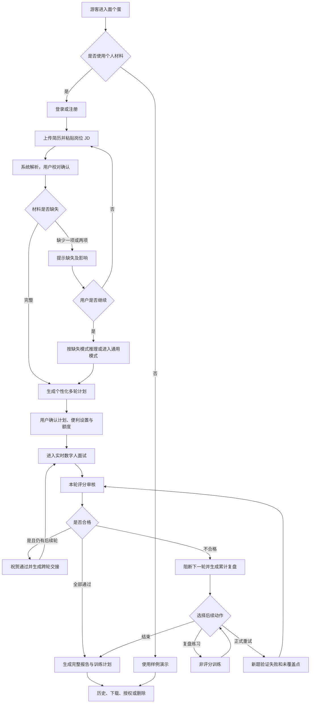
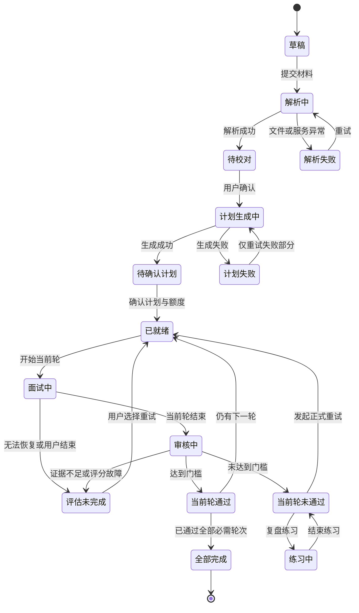
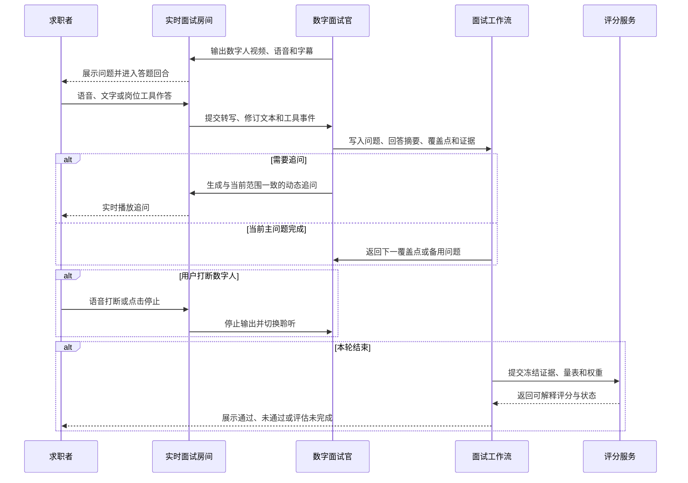
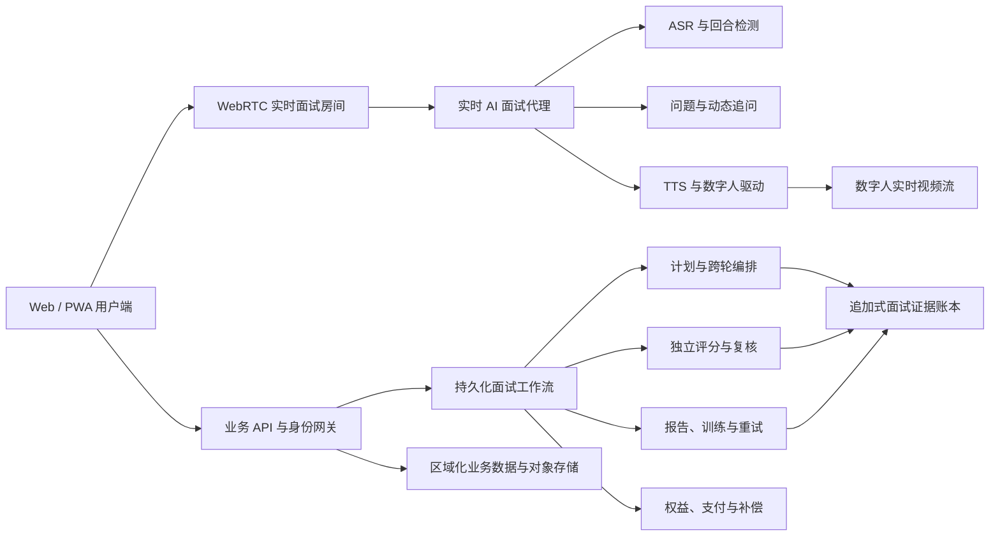

# 产品需求文档：面个蛋——实时数字人多轮模拟面试与训练平台 V1.0

## Document Header

| 字段 | 内容 |
|---|---|
| 产品名称 | 面个蛋 |
| 英文名称 | MianGeDan |
| 文档编号 | PRD-001 |
| 文档状态 | 需求基线已确认；待工程、设计、安全与法务评审 |
| 版本 | V1.0 |
| 创建日期 | 2026-08-01 |
| 最后更新 | 2026-08-01 |
| 目标市场 | 全球；首发支持中文与英文 |
| 首发平台 | 桌面优先的响应式 Web/PWA，兼容平板与移动 Web |
| 发布日期 | 不设主观日期，以本 PRD 的质量门槛和阶段退出条件为准 |
| 文档原则 | 首版覆盖完整生产闭环，不以团队规模、预算或工期削减已确认能力 |

> 中文品牌语：**面个蛋——多面几轮，少慌一点。**  
> 英文描述：**MianGeDan — Real-time AI Mock Interviews.**

---
## Executive Summary

**一句话定义：** 面个蛋是一款由用户简历和目标岗位 JD 驱动、使用实时虚拟数字人完成多轮模拟面试、逐轮审核、证据化评分、复盘训练与正式重试的求职能力训练平台。

面个蛋服务所有求职者，重点解决应届生、在职跳槽者和转岗用户在真实面试前缺少高质量练习机会的问题。用户上传 PDF 或 Word 简历，粘贴目标岗位完整 JD；系统解析并让用户校对，结合岗位、级别、地区、企业公开流程和用户背景，生成 1–5 轮个性化面试。数字面试官以实时音视频参与者身份进入面试房间，能够倾听、打断、追问、使用岗位工具，并在后续轮次继承前序纪要、评价和待验证风险。

每轮面试均执行统一、可解释的结构化评分。总分达到 60 且本轮关键能力均达到 60 才可进入下一轮；未通过则生成累计复盘和专项练习，用户可使用新题正式重试。历史失败回答仅用于回顾，新回答是主要评分证据；已验证维度锁定，若新证据矛盾则重新评估。产品不提供真实企业面试中的隐形答案，不向雇主预测录用结果，也不依据外貌、年龄、性别、情绪或其他保护属性评分。

**Quick Facts：**

- **目标用户：** 全球 16 岁及以上求职者；未达到当地成年年龄者适用监护人规则。
- **核心问题：** 简历深挖准备不足、岗位问题无法预测、口头表达缺少实战、训练与改进脱节。
- **北极星指标：** 7 日有效训练闭环完成率，正式上线后 90 天目标不低于 45%。
- **核心差异：** 实时数字人、多轮淘汰与交接、企业流程参考、证据评分、练习—重试闭环。
- **商业模式：** 免费体验、单次求职项目包、Pro 订阅、时长加油包、机构版。
- **品牌边界：** 模拟训练，不是题库、PPT 课堂、真实招聘系统或实际面试作弊工具。

---

## Table of Contents

1. Problem Statement
2. Goals & Objectives
3. User Personas
4. Product Overview & User Journey
5. User Stories & Requirements
6. Scoring & Decision Model
7. Functional Requirements
8. Success Metrics
9. Scope
10. Technical Considerations
11. Design & UX Requirements
12. Commercial Model
13. Privacy, Security & AI Governance
14. Non-Functional Requirements
15. Timeline & Milestones
16. Risks & Mitigation
17. Dependencies & Assumptions
18. Open Decisions
19. Stakeholder Sign-Off
20. Appendix

---

## Problem Statement

### The Problem

求职者通常只能通过题库、面经、朋友模拟或低互动 AI 问答准备面试。这些方式难以同时满足以下需求：

1. 根据个人简历进行可信、连续的深挖，提前暴露含糊、缺少数据、经历断档和岗位不匹配问题。
2. 根据完整 JD、岗位级别、企业流程和前序回答实时调整问题，而不是播放固定题目。
3. 训练在语音、摄像头、追问、打断、时间压力和岗位工具下的真实反应。
4. 以稳定量表提供可复核证据，而不是只给笼统建议或不可解释总分。
5. 将失败点转化为练习和新题重试，同时避免重复已经证明合格的内容。

### Current State

- 面经和题库提供信息，但无法判断用户是否真正会回答，也容易过期或鼓励背诵。
- 通用对话机器人可以提问，却通常缺少正式轮次、状态冻结、证据评分和故障恢复。
- 真人模拟质量高但昂贵、排期不稳定，难以覆盖所有岗位与语言。
- 演讲训练工具偏重语速和填充词，未必理解简历、JD、岗位技能和多轮招聘流程。
- 真实面试 Copilot 可能诱导用户在企业面试中依赖即时答案，与提升真实能力的目标冲突。

### User Impact

- 应届生不知道企业会如何追问项目和实习，表达容易失去结构。
- 在职跳槽者缺少高频练习时间，难以发现资历与岗位级别之间的证据缺口。
- 转岗者无法判断可迁移能力是否已被岗位要求充分证明。
- 使用文字、辅助技术或不同口音的用户可能被传统语音评分错误惩罚。
- 面试失败后缺少连续纪要和针对性训练，只能从头重复。

### Business Impact

- 求职训练需求强但高度阶段性，需要同时支持单次购买和订阅。
- 实时数字人具有持续算力和供应商成本，必须建立透明额度、会前预留和故障返还机制。
- 评分可信度、数据隐私和实时可靠性决定产品能否形成长期口碑，不能依靠提高 AI 通过率制造增长。
- 院校和职业服务机构存在组织化训练需求，但必须防止机构将模拟评分用于排名、招生或招聘筛选。

### Why Now

- 实时 WebRTC、流式 ASR/TTS、可编排大模型和数字人技术已经能够组合成低延迟互动链路。
- 结构化面试、行为锚点、证据评分和 AI 风险治理已有成熟原则可供产品化。
- 全球求职者越来越熟悉 AI 工具，但市场仍缺少将多轮真实感、可靠评分和持续训练统一起来的产品。

---

## Goals & Objectives

### Business Goals

1. 建立可信的全球实时数字人模拟面试品牌，覆盖中文和英文市场。
2. 形成免费体验、单项目付费、订阅与机构版并存的可持续商业模式。
3. 通过供应商抽象、数据区域隔离和严格质量门槛支持全球扩展。
4. 以用户能力提升和有效训练闭环为核心增长动力，而不是以 AI 判定通过率为商业目标。

### User Goals

1. 用自己的简历和真实目标 JD 快速创建个性化面试。
2. 在接近真实视频会议的环境中完成多轮、实时、有压力的练习。
3. 清楚理解每轮是否合格、为什么、哪些证据支持结论。
4. 针对失败和未覆盖点继续训练，避免重复已经合格的问题。
5. 掌握个人数据、录制、分享、删除和复核权利。

### Product Principles

- **真实互动优先：** 数字人必须实时输出音频和视频，不以静态头像或 PPT 代替。
- **事实优先：** 用户事实、AI 推理和外部来源严格区分。
- **证据优先：** 分数必须能够回到问题、回答、工具行为和行为锚点。
- **训练优先：** 不提供真实面试作弊能力，不把模拟结果包装成录用预测。
- **恢复优先：** 系统故障不判失败，状态、额度和证据均可恢复。
- **包容优先：** 输入方式和合理便利不构成扣分理由。

### Non-Goals

- 未经授权抓取 BOSS 直聘或其他招聘网站的全部职位。
- 提供职位聚合、自动投递、招聘 CRM 或 ATS。
- 替雇主筛选、排名、录用或淘汰真实候选人。
- 在真实企业面试中提供隐形答案、提示或不可见 Copilot。
- 通过外貌、性别、年龄、种族、国籍、残障、婚育、情绪、微表情或人格推断评分。
- 每次会话生成新面孔、未经授权克隆真人肖像或声音。
- 使用 PPT、预录课堂、自动讲课或 OpenMAIC 的播放场景。
- 首版提供原生 iOS 或 Android 应用，或中文、英文以外的正式语言。
- 首版提供真人面试官、真人教练或用户互相面试市场。

---

## User Personas

### Primary Persona A：应届毕业生

- **典型状态：** 20–25 岁，工作经验有限，项目和实习是主要证据。
- **行为：** 高频查看面经、临时背题、对企业多轮流程缺少认知。
- **需求：** 简历项目深挖、岗位基础能力验证、结构化表达、压力适应。
- **痛点：** 回答空泛、缺少数据、被追问后前后矛盾、容易紧张。
- **代表性诉求：** “我想知道面试官会怎么拷打我的项目，并练到追问时也能说清楚。”

### Primary Persona B：在职跳槽者

- **典型状态：** 有正式工作经历，时间碎片化，目标岗位可能提升职级或薪资。
- **行为：** 围绕少数目标公司集中准备，希望快速发现差距。
- **需求：** 经验可信度、复杂问题、决策权衡、岗位级别匹配和多轮连续验证。
- **痛点：** 经历描述停留在职责，缺少结果与影响；长期不面试导致表达生疏。
- **代表性诉求：** “我需要在真正面试前把经历讲透，而不是现场才发现证据不够。”

### Secondary Persona C：转岗或跨行业求职者

- **典型状态：** 目标岗位与既往经历不完全一致。
- **需求：** 识别可迁移能力、补齐岗位知识、练习解释转岗动机和能力证明。
- **痛点：** 简历匹配度低，不知道哪些经历可以作为新岗位证据。

### Secondary Persona D：院校或职业服务机构训练负责人

- **需求：** 创建训练任务、分配额度、了解完成情况与群体能力趋势。
- **边界：** 默认不能查看个人简历、回答、分数或录像，不得进行排名和筛选。

### Internal Persona E：平台运营与治理人员

- **需求：** 管理实时供应商、模型版本、量表、来源、故障、补偿与数据请求。
- **边界：** 最小权限、临时访问、不可直接改分、全部敏感操作可审计。

---

## Product Overview & User Journey

### Core User Journey

1. **了解与登录：** 游客浏览介绍和样例；上传个人资料前登录。
2. **提供材料：** 上传 PDF、DOC 或 DOCX 简历，粘贴完整岗位 JD。
3. **解析与校对：** 系统提取结构化信息、标注低置信度和面试线索，用户编辑并确认。
4. **生成计划：** 系统参考岗位、级别、地区和公开企业流程生成 1–5 轮面试方案。
5. **配置与会前检查：** 用户调整轮次、角色、时长、难度、工具和便利设置；检查设备与额度。
6. **实时面试：** 数字面试官以音视频参与者实时提问、倾听、追问和使用工具。
7. **逐轮审核：** 每轮按统一量表评分；合格显示祝贺并解锁下一轮，不合格阻断后续轮次。
8. **跨轮交接：** 后一轮获得简历、JD、前序纪要、评价、风险、已验证点和未覆盖点。
9. **报告与训练：** 生成累计纪要、能力雷达、岗位匹配、逐题证据和个人训练计划。
10. **练习与重试：** 练习不改分；正式重试使用新题和新回答重新计算失败维度及结果。
11. **历史与数据控制：** 用户跨设备查看、继续、下载、授权或删除记录。

### User Operation Flow



### Interview Project State Machine



### Realtime Turn Sequence



---
## User Stories & Requirements

> 本节中的线框图仅用于功能键、信息和状态对齐，不约束最终 UI、视觉风格或页面布局。

### US-01：提供个人简历与目标岗位

**User Story:**  
As a 求职者, I want to 上传并校对个人简历和目标岗位 JD, So that 系统能够基于真实材料生成个性化面试。

**价值陈述：**

- **作为** 求职者
- **我希望** 上传自己的简历并粘贴完整岗位 JD，由系统解析后让我确认
- **以便于** 后续问题、匹配度和评分都建立在准确、可控的事实基础上

**业务规则与逻辑：**

1. 上传个人资料前必须登录；游客只可使用样例数据。
2. 简历支持 `.pdf`、`.doc`、`.docx`，单文件最大 10 MB。
3. 解析字段包括：
   - 可选称呼、工作年限、求职状态。
   - 教育经历。
   - 工作或实习经历：组织、角色、时间、职责、行动、结果。
   - 项目经历：背景、角色、行动、技术或方法、结果。
   - 专业技能、工具、语言与熟练度。
   - 证书、奖项、论文、作品集。
   - 面试线索：空档、频繁变动、模糊主张、缺少量化、前后不一致、岗位不匹配。
4. 电话、邮箱、证件号码、详细地址、照片、性别、婚育等信息不得进入面试上下文。
5. 所有字段进入预览页；低置信度字段高亮，用户可以新增、修改、删除后确认。
6. 用户直接粘贴完整 JD；系统解析：岗位名称与级别、公司与行业、职责、必备技能、经验与教育、领域场景、通用能力、加分项，以及明确标注的 AI 推导面试重点。
7. 薪资福利和招聘联系人不进入面试评分上下文。
8. 缺失信息处理：
   - 只有 JD：通用岗位面试；不虚构候选人经历，不做简历深挖和经历匹配评分。
   - 只有简历：AI 推导岗位画像并标记，用户确认后进入面试。
   - 两者都缺失：通用面试，只评估表达、逻辑、沟通和应变。
   - 任一缺失：先弹窗说明影响；只有用户明确同意才继续。
9. 损坏、加密、超限、文件类型伪装或不安全文件必须拒绝并给出具体原因。
10. 解析或网络失败时保留原始输入，支持重试失败步骤或手动编辑。

**Acceptance Criteria：**

- **场景 1：成功解析并确认**
  - **GIVEN** 已登录用户上传合法简历并粘贴 JD
  - **WHEN** 解析完成
  - **THEN** 系统展示结构化字段、低置信度和面试线索，只有用户确认后才能生成计划
- **场景 2：敏感信息隔离**
  - **GIVEN** 简历包含电话、照片、性别或详细地址
  - **WHEN** 系统构建面试上下文
  - **THEN** 这些字段不会传给问题生成或评分服务
- **场景 3：材料缺失**
  - **GIVEN** 用户只提供一项或两项都未提供
  - **WHEN** 用户尝试继续
  - **THEN** 系统说明功能缺失，获得明确同意后按对应降级模式生成，推理内容可编辑且有标记
- **场景 4：文件异常**
  - **GIVEN** 文件损坏、加密、超过 10 MB 或检测为不安全
  - **WHEN** 用户上传
  - **THEN** 系统拒绝文件、解释原因且不丢失已经填写的 JD
- **场景 5：解析失败**
  - **GIVEN** 解析服务中断
  - **WHEN** 系统无法生成完整结构
  - **THEN** 用户输入被保留，可重试失败步骤或进入手动编辑

**功能线框图：**

```text
┌──────────────────────────────────────────────────────────┐
│ 创建面试项目                         中文 / English       │
├───────────────────────────┬──────────────────────────────┤
│ 简历                      │ 目标岗位 JD                  │
│ [上传 PDF/DOC/DOCX]       │ [粘贴完整 JD................]│
│ 文件状态 / 删除 / 替换    │ [解析 JD]                    │
├───────────────────────────┴──────────────────────────────┤
│ 结构化预览：经历 / 项目 / 技能 / 岗位要求 / 低置信度     │
│ [编辑] [确认] [查看未纳入面试的敏感字段]                 │
├──────────────────────────────────────────────────────────┤
│ 缺失影响提示 / AI 推理标记                  [生成计划]    │
└──────────────────────────────────────────────────────────┘
```

---

### US-02：生成个性化多轮面试计划

**User Story:**  
As a 求职者, I want to 查看并调整系统生成的多轮面试计划, So that 模拟流程符合目标岗位并且在开始前可控。

**价值陈述：**

- **作为** 求职者
- **我希望** 系统参考简历、JD、岗位级别和公开企业流程生成多轮面试
- **以便于** 在正式开始前理解每轮角色、重点、时长、难度和工具

**业务规则与逻辑：**

1. 系统按需联网查找公司、岗位、级别和地区的公开面试流程。
2. 来源优先级为：企业官方招聘页面、企业官方招聘内容、可信公开材料、候选人经验；记录链接、日期、类型和可信度。
3. 经验内容必须标记为非官方。无公司、无可靠来源或断网时使用通用岗位/级别模板，并标明 AI 推导。
4. 公开流程只决定轮次和考察重点，不直接决定产品的及格线。
5. 默认推荐三轮：
   - 筛选与简历深挖。
   - 岗位专业能力。
   - 综合或终面。
6. AI 可生成 2–5 轮；用户可调整为 1–5 轮。特殊岗位可以使用案例、作品集、管理或业务场景轮次。
7. 默认每轮 30 分钟；AI 推荐 15–60 分钟，用户可设 10–60 分钟。到达目标时间后不再开启新的主问题，但允许当前回答、必要追问和收尾，目标偏差不超过约 5 分钟。
8. 难度为基础、标准、挑战；只改变问题深度和追问压力，不改变及格线。
9. 用户可以增加、删除、重排轮次，编辑角色、重点、难度、时长、风格、数字人和声音，并恢复 AI 推荐。
10. 用户不能修改统一评分算法、60 分门槛、解锁逻辑、跨轮交接规则，也不能提前查看正式问题和答案。
11. 面试风格参数包括语气、节奏、追问强度、是否礼貌打断、提示程度和压力；任何模式均禁止侮辱、歧视、人身攻击和无关隐私问题。
12. 正式问题采用混合生成：会前生成能力目标、主问题方向、行为锚点、覆盖点和备用问题；会中根据回答动态追问，但不得越出已确认范围。
13. 每轮必须具备问题覆盖方案和评分量表；缺少任一项则不能开始该轮。
14. 生成失败时保留材料和成功部分，只重试失败模块；不完整计划不能进入面试。

**Acceptance Criteria：**

- **场景 1：可靠来源生成计划**
  - **GIVEN** 用户提供公司、岗位和地区且存在可靠公开资料
  - **WHEN** 系统生成计划
  - **THEN** 计划展示来源、日期、来源类型和可信度，非官方经验有清楚标识
- **场景 2：无可靠来源**
  - **GIVEN** 无公司信息、网络失败或来源不可靠
  - **WHEN** 系统生成计划
  - **THEN** 使用通用岗位级别模板并明确标记为 AI 推导，不伪装成企业流程
- **场景 3：用户编辑**
  - **GIVEN** 计划已生成
  - **WHEN** 用户调整 1–5 轮、时长、角色、工具或顺序
  - **THEN** 系统重新校验总权重、每轮问题与量表，但不允许修改统一门槛和证据规则
- **场景 4：计划不完整**
  - **GIVEN** 某轮没有问题覆盖方案或量表
  - **WHEN** 用户尝试开始
  - **THEN** 系统阻止进入并只重试缺失部分
- **场景 5：不安全问题**
  - **GIVEN** 生成内容包含歧视、无关隐私或危险内容
  - **WHEN** 安全检查执行
  - **THEN** 该内容被过滤并重新生成，不进入用户房间

**功能线框图：**

```text
┌──────────────────────────────────────────────────────────┐
│ 个性化面试计划                         [恢复 AI 推荐]     │
├──────────────────────────────────────────────────────────┤
│ 公开流程参考：来源 / 日期 / 官方或经验 / 可信度          │
├──────────────────────────────────────────────────────────┤
│ ① 筛选与简历深挖   30 分钟  标准  招聘角色   [编辑][拖动]│
│ ② 岗位专业能力     40 分钟  挑战  专业角色   [编辑][拖动]│
│ ③ 综合终面         30 分钟  标准  主管角色   [编辑][拖动]│
│ [+ 添加轮次]                                             │
├──────────────────────────────────────────────────────────┤
│ 工具：代码 / 白板 / 案例 / 作品集   便利设置：[配置]      │
│ 问题与评分量表：已就绪              [确认并进行会前检查] │
└──────────────────────────────────────────────────────────┘
```

---

### US-03：参加实时虚拟数字人面试

**User Story:**  
As a 求职者, I want to 与始终开启音视频的数字面试官实时互动, So that 我能练习真实面试中的表达、追问、打断和岗位工具。

**价值陈述：**

- **作为** 求职者
- **我希望** 在类似视频会议的房间中与实时数字人面试官交流
- **以便于** 训练临场口才、专业作答和压力下的真实反应

**业务规则与逻辑：**

1. 数字面试官必须以生成的 WebRTC 视频流和 TTS 音频流加入房间；不能默认使用静态头像或纯文字。
2. 使用固定、已授权的写实 2D 角色库；角色人格、专业背景、追问风格和本轮目标动态生成，不为每场会话生成新脸。
3. 用户可使用四类输入：实时语音、候选人摄像头、文字、岗位工具。用户摄像头和麦克风均不强制；数字人音视频必须开启。
4. 岗位工具包括代码编辑器、作品集展示、案例材料和白板，由 AI 按 JD、轮次和问题预配置，并在计划中由用户启停。正式房间不能临时加载未配置的辅助工具。
5. 用户可以通过自然语音打断、停止按钮或提交文字使数字人立即停止并切换聆听；实际播放内容才进入记录。
6. 数字人只在风格允许且用户严重偏题、超时或持续过长时礼貌打断；避免重叠说话，无法判断时询问用户是否回答完成。
7. 数字人字幕与候选人 ASR 文本实时展示。用户可以在下一道主问题前修订本轮转写；之后不能改写已冻结的正式回答。原始 ASR 仅用于诊断，修订文本作为评分证据。
8. 通信维度在语音模式下由回答结构与清晰度 60%、口语表现 40%组成；文字模式只评估结构与清晰度并归一化为该维度分数，口语标记为未评估而不是 0 分；混合模式综合有效证据。
9. 文字模式、摄像头关闭或合理便利不会扣分，报告必须标注输入模式及证据限制。
10. 逐字稿和工具事件默认保存；候选人的原始音频、视频默认不保存，只有单独明确同意才录制。禁止面部、情绪、年龄、性别、外貌和人格分析。
11. 正式面试不提供手动暂停。主动退出需确认并标记评估未完成；页面关闭或刷新有 3 分钟重连窗口；系统故障自动暂停且不计时。练习模式允许暂停。
12. 数字人音视频故障时暂停计时、保留状态并重连；仍无法恢复则询问是否降级为文字面试。用户同意后继续，拒绝则结束并标记评估未完成。

**Acceptance Criteria：**

- **场景 1：正常实时面试**
  - **GIVEN** 数字人音视频连接成功且用户完成设备检查
  - **WHEN** 用户通过语音、文字或工具回答
  - **THEN** 数字人根据实际回答实时追问，所有正式证据按回合持久化
- **场景 2：用户关闭设备**
  - **GIVEN** 用户不开摄像头或麦克风
  - **WHEN** 用户选择文字或其他可用输入
  - **THEN** 面试可继续，数字人仍保持视频和音频，未评估口语项不记零
- **场景 3：打断数字人**
  - **GIVEN** 数字人正在说话
  - **WHEN** 用户说话、点击停止或提交文字
  - **THEN** 数字人停止输出并进入聆听，未实际播放内容不写入正式问题
- **场景 4：数字人故障**
  - **GIVEN** 视频或音频持续失败
  - **WHEN** 自动重连仍未恢复
  - **THEN** 系统暂停并询问是否降级文字；同意则恢复，拒绝则评估未完成且返还故障额度
- **场景 5：转写修订**
  - **GIVEN** 当前回答 ASR 有误且尚未进入下一主问题
  - **WHEN** 用户修订并确认
  - **THEN** 评分使用修订文本，同时保留原始转写用于诊断审计

**功能线框图：**

```text
┌──────────────────────────────────────────────────────────┐
│ 面个蛋实时面试 · 专业能力轮    计时 / 网络 / 字幕 / 退出 │
├──────────────────────────────────────┬───────────────────┤
│ 数字面试官问题与实时字幕             │ 数字面试官视频流   │
│                                      │ 音频状态 / 角色    │
│ 候选人转写与修订                     ├───────────────────┤
│ 动态追问                             │ 候选人摄像头       │
│                                      │ 可关闭 / 输入模式  │
│ [岗位工具区域：代码/白板/案例/作品集]├───────────────────┤
│                                      │ 轮次进度 / 工具    │
├──────────────────────────────────────┴───────────────────┤
│ [麦克风] [摄像头] [停止数字人] [文字回答........][提交] │
└──────────────────────────────────────────────────────────┘
```

---

### US-04：获得评分、复盘、训练与正式重试

**User Story:**  
As a 求职者, I want to 获得证据化评分并针对薄弱点练习和重试, So that 我能理解问题、真正改进并解锁后续轮次。

**价值陈述：**

- **作为** 求职者
- **我希望** 知道每轮是否合格、分数证据、岗位匹配和下一步训练
- **以便于** 把一次模拟转化为可验证的能力提升

**业务规则与逻辑：**

1. 通过本轮时首先展示：“恭喜你通过本轮面试，已进入下一轮”。同时展示总分、60 分线、关键维度、简短优势与注意点、流程进度和下一轮角色/重点/难度/时长。
2. 后续轮次开始前不展示可能泄露正式考点的完整标准答案。
3. 不合格、全部完成或用户结束整场流程时生成完整或部分报告，内容包括：
   - 状态、轮次数、各轮分数和训练用途声明。
   - 六维雷达图和文字等价版本。
   - JD 必备与加分项的岗位匹配度、简历证据、面试已证明和未证明项。
   - 多轮轨迹、交接影响、能力锁定与分数变化。
   - 逐题问题、回答摘要、追问、分数、证据、做得好、缺失、矛盾和建议结构。
   - 语音或文字沟通分析，以及工具表现。
   - 优势、风险、优先训练计划、原始记录和删除入口。
4. 各轮在开始前拥有公开权重，默认等权；只有公开企业流程明确核心轮次时 AI 才可调整。总和 100%，开始后不可修改。
5. 最终分为各轮最新有效得分的加权结果；所有必需轮次均需通过，平均分不能覆盖某轮失败。未完成轮次使整场状态为评估未完成并生成部分报告。
6. AI 教练根据薄弱点生成原题练习或变体练习、提示、框架、示例和逐步反馈。练习不改变正式分数或解锁状态。
7. 正式重试生成针对失败及未覆盖点的新问题，不重复已通过的相同问题。
8. 能力维度锁定规则：达到 60 的维度锁定为已验证；重试只验证失败与未覆盖维度；新分替换失败维度旧分，并与锁定分重新计算总分。新回答若直接矛盾于锁定证据，则解锁并重新评估。
9. 旧失败回答只用于复盘，正式重试回答是主要评分证据。
10. 用户可以对问题、维度或轮次发起一次自动正式复核；使用原始冻结证据、量表和权重，显示复核前后结果和原因。复核后通过则解锁；证据不足则评估未完成并允许重试。
11. 保存策略：简历与 JD 原件及结构化数据保存至用户删除；逐字稿、报告、工具和训练记录保存 12 个月；用户明确授权的原始音视频保存 30 天。到期前提醒，可下载或删除。
12. 删除一次面试必须级联删除相关报告、训练和媒体；不得使用个人数据训练模型，除非另行明确同意。

**Acceptance Criteria：**

- **场景 1：本轮通过**
  - **GIVEN** 本轮总分和全部关键维度均达到 60
  - **WHEN** 审核完成
  - **THEN** 首先显示祝贺文案并解锁下一轮，展示必要摘要但不泄露后续完整答案
- **场景 2：本轮未通过**
  - **GIVEN** 总分或任一关键维度低于 60
  - **WHEN** 审核完成
  - **THEN** 阻断下一轮，生成从第一轮到当前轮的累计纪要、证据和训练入口
- **场景 3：练习与重试隔离**
  - **GIVEN** 用户完成非评分练习
  - **WHEN** 查看正式记录
  - **THEN** 原分和解锁状态不变；只有发起正式重试并完成新回答才重新计算
- **场景 4：能力锁定**
  - **GIVEN** 某维度已达到 60 且重试证据不矛盾
  - **WHEN** 用户重试失败维度
  - **THEN** 锁定分保留，新分只替换需要重评的维度并重新计算总分
- **场景 5：评分复核**
  - **GIVEN** 用户对一次尝试发起首次复核
  - **WHEN** 系统使用冻结证据和量表重新计算
  - **THEN** 展示旧分、新分和理由；禁止修改证据或权重，版本完整保留
- **场景 6：报告部分失败**
  - **GIVEN** 雷达图或单个报告模块生成失败
  - **WHEN** 其他结果已可用
  - **THEN** 展示可用模块并只重试失败部分，不丢失评分证据

**功能线框图：**

```text
通过态
┌──────────────────────────────────────────────────────────┐
│ 🎉 恭喜你通过本轮面试，已进入下一轮                     │
│ 本轮 72 / 100   及格线 60   关键维度：全部通过           │
│ 优势摘要 / 下一轮注意点 / 进度                           │
│ [立即进入下一轮] [稍后继续]                              │
└──────────────────────────────────────────────────────────┘

完整报告
┌──────────────────────────────────────────────────────────┐
│ 状态 / 总分 / 各轮轨迹 / 岗位匹配度                      │
├───────────────────┬──────────────────────────────────────┤
│ 六维雷达与文字表   │ JD 必备项：已证明 / 未证明 / 风险    │
├───────────────────┴──────────────────────────────────────┤
│ 逐轮纪要 / 逐题证据 / 沟通分析 / 工具表现                │
│ 个人训练计划                                            │
│ [复盘练习] [正式重试] [申请复核] [下载] [删除]           │
└──────────────────────────────────────────────────────────┘
```

---

### US-05：登录并管理个人资产与历史

**User Story:**  
As a 求职者, I want to 登录并跨设备管理简历、岗位、面试和训练历史, So that 我的正式数据安全归属于个人账户并可持续使用。

**价值陈述：**

- **作为** 求职者
- **我希望** 在需要使用个人数据时登录，并随时继续或管理历史项目
- **以便于** 跨设备完成多轮训练且保持数据可控

**业务规则与逻辑：**

1. 游客可以浏览产品介绍和使用样例数据的演示；上传个人资料或创建个人面试前必须登录。
2. 登录方式包括邮箱验证码、Google、Apple 和微信；支持绑定多个身份。手机号码不作为必填项。
3. 注册时接受服务条款、隐私政策和数据处理说明；录制、机构共享和模型训练另行授权。
4. 支持中文和英文界面；界面语言与面试语言相互独立。简历和 JD 自动识别语言，但面试语言必须由用户确认。
5. 个人资产包括：
   - 简历库：解析、编辑、替换、版本和删除。
   - 岗位库：JD、结构化要求、来源和版本。
   - 面试记录：按岗位、公司、日期、语言和状态筛选。
   - 训练进度：薄弱点、练习和正式重试轨迹。
6. 项目状态包括草稿、生成中、已就绪、面试中、当前轮通过、当前轮未通过、评估未完成和全部完成。
7. 用户可以继续面试、复盘、重试、查看报告、重命名、复制、下载和删除，并复用简历或 JD 创建不同难度、语言或风格的项目。
8. 草稿、已完成记录和历史跨设备同步；同一正式面试只能在一台设备上处于活动状态。
9. 第三方登录故障时提供邮箱替代；验证码具有有效期、频率限制和风险验证。
10. 正式面试期间令牌刷新失败时暂停并要求重新认证，不扣时间、不判失败。
11. 绑定身份必须分别验证，防止误合并；账户数据严格隔离。
12. 删除活动项目时明确说明将终止面试；删除状态必须真实反映数据库、对象存储和第三方处理进度。

**Acceptance Criteria：**

- **场景 1：登录节点**
  - **GIVEN** 游客正在查看介绍或样例
  - **WHEN** 尝试上传个人简历
  - **THEN** 系统要求登录并在成功后返回原操作，不丢失允许暂存的非敏感输入
- **场景 2：跨设备继续**
  - **GIVEN** 用户有未完成且当前无活动设备的项目
  - **WHEN** 在另一设备登录
  - **THEN** 可从最后有效状态继续，评分版本和证据不变
- **场景 3：并发设备**
  - **GIVEN** 正式面试已在一台设备进行
  - **WHEN** 第二台设备尝试进入
  - **THEN** 阻止并发进入，并允许用户经过确认安全转移会话
- **场景 4：身份绑定**
  - **GIVEN** 用户尝试绑定另一个登录身份
  - **WHEN** 两侧身份未全部验证或存在已有账户冲突
  - **THEN** 不执行合并，提供恢复与人工支持路径
- **场景 5：账户删除**
  - **GIVEN** 用户重新验证后确认删除账户
  - **WHEN** 删除任务执行
  - **THEN** 系统展示真实进度，完成级联删除或不可逆匿名化，并保留法定财务记录但解除内容关联

**功能线框图：**

```text
┌──────────────────────────────────────────────────────────┐
│ 面个蛋工作台      新建面试   简历库   岗位库   中文/EN  │
├──────────────────────────────────────────────────────────┤
│ 当前项目：岗位 / 轮次 / 状态 / 下一动作   [继续面试]     │
├──────────────────────────────────────────────────────────┤
│ 筛选：公司 / 岗位 / 日期 / 语言 / 状态                   │
│ 项目 A  当前轮通过  [下一轮] [报告] [更多]               │
│ 项目 B  当前轮未通过[练习] [正式重试] [报告]             │
│ 项目 C  全部完成    [报告] [复制项目] [下载]              │
├──────────────────────────────────────────────────────────┤
│ 账户与隐私：登录身份 / 授权 / 数据导出 / 删除             │
└──────────────────────────────────────────────────────────┘
```

---

### US-06：购买面试项目并管理使用额度

**User Story:**  
As a 求职者, I want to 在开始前了解完整价格和可用额度, So that 正式面试不会因余额不足被中途打断。

**价值陈述：**

- **作为** 求职者
- **我希望** 在确认计划后看到完整价格、权益和消费记录
- **以便于** 安心完成全部计划和包含的正式重试

**业务规则与逻辑：**

1. 简历、JD 解析和计划预览在购买前完成；系统按轮次数、时长、数字人规格和包含的重试计算完整报价。
2. 单次项目包覆盖已确认的 1–5 轮首次正式面试，以及每个失败轮次的一次正式重试。
3. 第一轮开始前修改计划会重新报价；开始后简历、JD、轮次、权重和计费版本冻结。增加轮次或时长只支付差额，减少配置释放未使用额度。
4. 免费账户首次获得 60 分钟数字人额度，可以体验计划、正式面试、报告和一次练习。
5. 只计算数字人音视频已连接且正式面试处于进行中的实际秒数。生成、评分、报告等待、故障暂停和重连均不计费。
6. 用户主动退出只扣实际使用时间；因系统故障转为文字时，从故障点起不再消耗数字人额度。用户主动用文字回答但数字人正常运行时仍计数字人时间。
7. 每轮开始前预留足够额度；不足时阻止开始并提供购买，不得在面试中弹出续费、广告或余额不足。
8. 用户可查看项目、轮次、开始时间、使用秒数、返还原因和余额的逐笔账单。
9. Pro 按月提供时长和重试权益，可购买额外时长。未使用时长最多结转一个账期，总余额不超过月度额度两倍。
10. 取消续费后权益保留至账期结束；到期不删除历史，也不影响导出或删除权利。续费价格或权益变化必须提前通知并重新同意。
11. 中国区支持人民币、本地支付和合规发票；国际区支持主要银行卡、本地货币、税费展示和收据。
12. 自动续费单独勾选并在扣款前提醒。未使用项目按适用地区规则退款；系统故障造成未完成时自动返还本轮全部预留额度，可选择重试或退款。
13. 支付成功未到账时订单保持处理中并禁止重复扣款；支付失败保留计划；重复扣款自动识别并原路退回。
14. 订阅到期但正在正式面试时允许当前轮正常结束。退款、付费状态和争议不得影响评分、复核或解锁。

**Acceptance Criteria：**

- **场景 1：购买前透明报价**
  - **GIVEN** 面试计划已确认
  - **WHEN** 用户进入购买页
  - **THEN** 展示总价、包含轮次、预计最大时长、重试权益、税费和有效期
- **场景 2：额度预留**
  - **GIVEN** 用户额度足以完成当前轮
  - **WHEN** 开始面试
  - **THEN** 系统预留并保证本轮不会因余额变化中断
- **场景 3：系统故障返还**
  - **GIVEN** 系统责任导致本轮评估未完成
  - **WHEN** 故障确认
  - **THEN** 全部预留额度自动返还，账本记录原因且用户获得重试或退款入口
- **场景 4：幂等支付**
  - **GIVEN** 支付回调重复、超时或状态不明
  - **WHEN** 系统重试处理
  - **THEN** 同一订单只记一次权益和一次扣款
- **场景 5：订阅到期**
  - **GIVEN** 账期在正式面试进行中结束
  - **WHEN** 当前轮尚未完成
  - **THEN** 当前轮继续至正常结束，后续轮次开始前再校验权益

**功能线框图：**

```text
┌──────────────────────────────────────────────────────────┐
│ 项目报价：轮次 / 总时长 / 正式重试 / 有效期              │
│ 预计总价：本地货币 + 税费                                │
├──────────────────────────────────────────────────────────┤
│ 免费额度 / 单次项目包 / Pro / 时长加油包                 │
│ [支付方式] [自动续费单独授权]                [确认购买]  │
├──────────────────────────────────────────────────────────┤
│ 额度流水：项目 / 轮次 / 使用秒数 / 返还 / 余额           │
│ [发票或收据] [取消续费] [退款或故障申诉]                 │
└──────────────────────────────────────────────────────────┘
```

---

### US-07：参加机构组织的训练项目

**User Story:**  
As a 求职者或机构训练负责人, I want to 在严格授权下组织和参与训练, So that 机构能够提供资源而求职者继续控制个人数据。

**价值陈述：**

- **作为** 求职者，我希望参加机构训练但不被默认查看简历、回答和分数。
- **作为** 机构负责人，我希望创建任务并了解完成情况和聚合趋势。
- **以便于** 实现组织化训练而不演变为学生排名或招聘筛选。

**业务规则与逻辑：**

1. 机构角色包括所有者、管理员、指导老师或职业顾问、隐私审计、财务和求职者；财务、审计、教学和管理权限默认分离。
2. 支持邀请链接、机构邮箱、批量名单、SSO 和 SCIM。用户以个人账户加入，不创建由机构完全控制的影子账户。
3. 加入前展示机构名称、可见数据、训练期限和退出影响。退出后机构立即失去个人数据访问权，用户保留自己的材料和记录。
4. 机构资助的未消耗权益按合同处理，但不能删除用户已生成的面试内容。机构邀请不能替代未成年用户的监护人同意。
5. 机构可以配置岗位或岗位类别、材料要求、轮次、角色、时长、难度、语言、工具、截止时间、练习次数和机构额度。
6. 机构模板不能修改 60 分线、统一评分算法、保护属性规则、证据标准、跨轮解锁和正式复核。
7. 机构默认只能看到任务是否接受、未开始、进行中、已完成或退出、完成时间、系统故障和机构额度消耗。
8. 总分、雷达、单轮结果、完整报告、逐字稿和音视频必须由用户针对具体任务分别授权，选择范围、有效期且可撤回。拒绝分享时只显示已完成但未共享结果，不能显示失败。
9. 聚合分析可展示岗位类别、能力维度、完成率和提升趋势；细分群体少于 10 人时不展示。禁止个人排行榜、排名、候选人搜索和推荐给雇主。
10. 模拟结果不得用于招生、毕业、奖惩、实习分配或招聘决定。
11. 用户可查看哪位机构人员何时访问了哪些数据；撤回后在线访问立即失效。机构不得将模型训练或报告共享作为参加训练的前提。
12. 机构上传材料执行版权声明、恶意文件检测和访问控制；机构停用后成员令牌和共享链接立即失效。

**Acceptance Criteria：**

- **场景 1：默认最小可见**
  - **GIVEN** 用户完成机构任务但未授权结果分享
  - **WHEN** 指导老师查看任务
  - **THEN** 只能看到已完成和时间，不能看到分数、简历、报告正文或录像
- **场景 2：细粒度授权**
  - **GIVEN** 用户只授权分享雷达图 30 天
  - **WHEN** 机构人员访问
  - **THEN** 仅展示雷达及期限，其他模块不可见，到期自动失效
- **场景 3：小样本保护**
  - **GIVEN** 某细分群体少于 10 人
  - **WHEN** 机构请求聚合分析
  - **THEN** 系统隐藏该细分或合并到更大群体
- **场景 4：退出机构**
  - **GIVEN** 用户退出或机构移除成员
  - **WHEN** 关系终止
  - **THEN** 机构访问立即失效，用户个人记录保留，审计记录继续存在
- **场景 5：禁止改分**
  - **GIVEN** 机构管理员编辑训练模板
  - **WHEN** 尝试改变及格线、量表或个人分数
  - **THEN** 系统拒绝操作并记录审计事件

**功能线框图：**

```text
┌──────────────────────────────────────────────────────────┐
│ 机构训练项目：任务 / 截止时间 / 额度 / 成员              │
├──────────────────────────┬───────────────────────────────┤
│ 任务配置                  │ 完成情况                     │
│ 岗位 / 轮次 / 语言 / 工具│ 未开始 / 进行中 / 已完成     │
│ [发布任务]                │ 结果：未共享 / 已授权        │
├──────────────────────────┴───────────────────────────────┤
│ 聚合趋势（人数不足 10 不展示）                           │
│ [权限] [授权记录] [访问审计] [席位与账单]                │
└──────────────────────────────────────────────────────────┘
```

---

### US-08：运营、评分治理与系统管理

**User Story:**  
As a 平台运营或治理人员, I want to 在严格授权和审计下管理实时系统与评分版本, So that 产品稳定、可追溯且无法被后台人员随意改分或窥视。

**价值陈述：**

- **作为** 实时运营、AI 配置、评分治理、安全、客服或财务人员
- **我希望** 使用职责分离的后台管理系统
- **以便于** 处理故障、版本、补偿和数据请求，同时保护用户内容

**业务规则与逻辑：**

1. 后台角色包括超级管理员、实时运营、AI 配置、评分治理、来源内容、客服、隐私安全和财务；超级管理员不默认拥有用户内容访问权。
2. 实时运营查看区域在线房间、排队、容量、各供应商延迟和错误、路由、熔断、状态节点和检查点；默认只有匿名会话编号和技术指标。
3. 运营人员不能加入、旁听或代替用户回答。
4. 模型与供应商注册表按区域、语言和能力管理。变更包含版本、说明、测试、审批和回滚；新模型必须离线评测、影子运行、小流量灰度再放量。
5. 活跃正式面试固定开始时版本；故障切换记录原因。密钥由独立密钥系统管理，后台不展示完整值。
6. 量表、维度、权重边界、行为锚点和门槛全部版本化；变更需要产品、面试专业和安全/公平性三方审批，并通过中英文、岗位和输入模式校准。
7. 后台不能直接编辑个人分数。存在系统性偏差时可停用版本，将受影响项目标记为评估待复核并提供免费重试，不能批量改写历史分数。
8. 企业流程来源记录链接、类型、日期、地区、岗位、可信度和失效日期；支持冲突、复核、下架和版权投诉。禁止配置绕过网站协议、登录、验证码或反爬机制。
9. 客服默认只看账户状态、订单、额度、故障代码和用户主动提交材料；可以重触发失败任务，但不能修改回答。查看逐字稿需用户针对会话授权；媒体访问需用户申请和双人审批。
10. 系统确认故障可返还额度；大额退款或人工补偿双人审批。敏感访问通知用户并进入访问记录。
11. 数据权利请求工单化追踪数据库、缓存、索引、对象存储、备份和第三方完成状态。紧急破窗访问限重大安全或法律事件，限定理由、时长并事后复核。
12. 审计日志追加写入且管理员不可删除；后台强制抗钓鱼多因素认证，高风险操作重新验证。
13. 提示词、模型、量表、工作流和前端可独立灰度回滚；发布系统阻止不兼容结构、缺失量表或未通过安全测试的版本。

**Acceptance Criteria：**

- **场景 1：后台默认脱敏**
  - **GIVEN** 实时运营查看故障会话
  - **WHEN** 打开监控详情
  - **THEN** 只显示匿名技术状态，不显示姓名、简历、回答或媒体
- **场景 2：模型发布**
  - **GIVEN** 新模型未完成离线、影子和灰度测试
  - **WHEN** 配置人员尝试全量发布
  - **THEN** 系统阻止并显示缺失门槛
- **场景 3：后台改分**
  - **GIVEN** 任一后台角色尝试直接编辑个人分数或解锁状态
  - **WHEN** 提交操作
  - **THEN** 系统拒绝，个体结果只能通过正式复核服务产生新版本
- **场景 4：客服访问内容**
  - **GIVEN** 用户未授权查看逐字稿
  - **WHEN** 客服打开工单
  - **THEN** 逐字稿和媒体不可见；授权后仍受会话范围和有效期限制
- **场景 5：供应商禁用**
  - **GIVEN** 某区域供应商被紧急停用
  - **WHEN** 新会话创建
  - **THEN** 按区域规则切换已验证替代方案，活跃会话按冻结或故障恢复规则处理
- **场景 6：发布回滚**
  - **GIVEN** 灰度版本指标退化
  - **WHEN** 自动或人工触发回滚
  - **THEN** 新会话回到稳定版本，进行中的正式会话不被中途改变

**功能线框图：**

```text
┌──────────────────────────────────────────────────────────┐
│ 运营治理后台：区域 / SLO / 房间 / 告警 / 错误预算        │
├──────────────────────┬───────────────────────────────────┤
│ 供应商与模型          │ 版本治理                         │
│ 路由 / 延迟 / 熔断    │ 提示词 / 量表 / 校准 / 灰度      │
├──────────────────────┼───────────────────────────────────┤
│ 来源与内容安全        │ 客服 / 退款 / 数据权利请求       │
│ 可信度 / 失效 / 下架  │ 默认脱敏 / 临时授权 / 双人审批   │
├──────────────────────┴───────────────────────────────────┤
│ 审计日志 / 破窗访问 / 发布记录 / 回滚 / 事故复盘         │
└──────────────────────────────────────────────────────────┘
```

---

## Scoring & Decision Model

### Scoring Principles

评分遵循结构化、岗位相关、证据化、可解释、可复核和版本冻结原则。问题生成模型只能提交证据，不能直接写最终分数；评分服务使用冻结的量表、权重和证据独立计算。

### Six-Dimension Radar

| 维度 | 默认权重 | 主要证据 |
|---|---:|---|
| 专业能力 | 25% | 岗位知识、方法、工具、正确性、深度 |
| 问题解决 | 20% | 分析、拆解、方案、权衡、验证与复盘 |
| 沟通表达 | 15% | 结构、清晰度、相关性、口语表现或文字表达 |
| 经验证据 | 15% | 简历主张的具体性、一致性、行动、结果与量化 |
| 行为与协作 | 15% | 合作、冲突、责任、影响、职业判断 |
| 学习与适应 | 10% | 反思、学习速度、变化应对、迁移能力 |

- 岗位可对单一维度最多调整 ±5 个百分点，总和必须为 100%。
- 权重在正式项目开始前公开；开始后冻结。
- 不适用维度必须在计划阶段重新分配权重，不能在评分后临时删除。

### Behavior Anchors

| 等级 | 映射分 | 行为锚点 |
|---:|---:|---|
| 1 | 20 | 无法回答、严重偏题或关键事实错误 |
| 2 | 40 | 部分回答、模糊、缺少证据或未完成关键推理 |
| 3 | 60 | 达到岗位基础要求，内容正确且基本完整 |
| 4 | 80 | 具体、结构清楚、证据充分，体现成熟实践 |
| 5 | 100 | 深入、量化、能解释权衡、边界、反思和迁移 |

评分可以在相邻锚点间按证据完整度插值，但必须引用对应锚点和证据。

### Round Gate

```text
本轮通过 = 本轮加权总分 ≥ 60
          且 本轮指定的每个关键维度分数 ≥ 60
```

- 非关键维度低于 60 记录为弱项，但不单独导致失败。
- 基础、标准和挑战难度使用同一门槛。
- 证据不足、评分服务失败或关键转写不可恢复时，结果为“评估未完成”，不是失败，也不解锁下一轮。
- 通过后显示祝贺并生成跨轮交接；未通过立即阻断后续轮次。

### Job Match

```text
岗位匹配度 = 已被简历或面试证据证明的 JD 要求权重之和 ÷ 全部 JD 要求权重之和
```

- 必备项与加分项分开展示。
- 只有 JD 时可以计算岗位要求覆盖，但没有简历时不得生成经历一致性评分。
- 没有 JD 时不展示岗位匹配百分比。
- 匹配度与面试分数相互独立，不作为单轮解锁的隐藏因素。

### Communication by Input Mode

- 语音：沟通维度由回答结构与清晰度 60%、口语表现 40%组成。
- 文字：结构与清晰度归一化为沟通维度得分；口语表现标记未评估，不记零、不扣分。
- 混合：按实际有效证据合并；报告明确标识模式。
- 摄像头开关不影响任何分数。
- 使用字幕、延长时间、降低语速、禁止打断等便利设置不进入评分证据。

### Cross-Round Handoff

后一轮接收以下冻结上下文：

1. 简历结构化事实和 JD 结构化要求。
2. 从第一轮到前一轮的问题、回答摘要、追问、未回答和工具行为。
3. 各维度得分、优势、弱点、风险、证据和通过状态。
4. 已验证能力、待深入点、未覆盖点、矛盾和建议难度。
5. 不应重复的问题及允许重新验证的原因。

后一轮应受前序结果影响：弱项更深入、风险需验证、未覆盖点补问；已通过的相同问题不重复，除非出现直接矛盾或新的岗位场景需要迁移验证。

### Retry and Dimension Locking

1. 不合格维度和未覆盖点进入正式重试范围。
2. 达到 60 的维度锁定为已验证。
3. 重试使用新问题，历史失败回答仅供回顾。
4. 新回答是主要评分证据，新分替换失败维度旧分。
5. 新总分由锁定维度与重评维度重新加权计算。
6. 若新证据直接否定锁定维度的旧证据，该维度解锁并重新评估。
7. 每轮最新有效正式尝试参与最终结果；练习从不参与。

### Final Result

- 各轮默认等权；如可靠企业流程明确核心轮次，AI 可在开始前建议调整。
- 最终总分为各轮最新有效得分的公开权重加权值。
- 所有必需轮次均需通过；高平均分不能覆盖任何一轮未通过。
- 有未完成轮次时整场为评估未完成，并生成部分报告。
- 最终结果和岗位匹配度分开显示。

### Formal Review

- 每次正式尝试允许一次自动复核。
- 复核使用相同不可变证据、量表、权重和版本，不允许补充或改写回答。
- 展示原结果、新结果和改变原因；全部版本保留。
- 复核后达到门槛则解锁；证据仍不足则标记评估未完成并允许重试。

---

## Functional Requirements

| Req ID | Requirement | Priority | Source |
|---|---|---|---|
| FR-001 | 支持 PDF、DOC、DOCX 简历上传，单文件最大 10 MB | P0 | US-01 |
| FR-002 | 解析简历并允许逐字段编辑、低置信度标记和确认 | P0 | US-01 |
| FR-003 | 从面试上下文排除电话、邮箱、证件、地址、照片和保护属性 | P0 | US-01 |
| FR-004 | 支持粘贴完整 JD、结构化解析、AI 推理标记和人工校对 | P0 | US-01 |
| FR-005 | 对简历、JD 或两者缺失提供明确提示和经同意的降级模式 | P0 | US-01 |
| FR-006 | 检测损坏、加密、超限、伪装和恶意文件 | P0 | US-01 |
| FR-007 | 按公司、岗位、级别和地区查找公开面试流程并保存来源元数据 | P0 | US-02 |
| FR-008 | 官方来源优先，经验来源标记非官方，无可靠来源退回通用模板 | P0 | US-02 |
| FR-009 | AI 生成 2–5 轮计划，用户可配置 1–5 轮和 10–60 分钟时长 | P0 | US-02 |
| FR-010 | 支持轮次增删重排、角色、重点、难度、风格、头像、声音和工具配置 | P0 | US-02 |
| FR-011 | 在开始前冻结量表、轮次权重、流程、版本和正式问题覆盖方案 | P0 | US-02 |
| FR-012 | 使用预生成主线和实时动态追问的混合问题策略 | P0 | US-02 |
| FR-013 | 数字面试官以实时 WebRTC 视频和音频参与者加入房间 | P0 | US-03 |
| FR-014 | 使用固定授权写实 2D 角色库和动态面试官人格 | P0 | US-03 |
| FR-015 | 支持语音、候选人摄像头、文字和岗位工具四类输入 | P0 | US-03 |
| FR-016 | 候选人摄像头和麦克风可关闭，数字人音视频始终开启 | P0 | US-03 |
| FR-017 | 支持自然打断、停止按钮、回合检测和避免重叠说话 | P0 | US-03 |
| FR-018 | 提供双向字幕、ASR 修订窗口和原始/修订文本版本 | P0 | US-03 |
| FR-019 | 支持代码编辑器、白板、案例和作品集工具及事件证据 | P0 | US-03 |
| FR-020 | 数字人故障时暂停、重连并询问是否降级文字 | P0 | US-03 |
| FR-021 | 每轮按总分和关键维度双门槛审核并控制解锁 | P0 | US-04 |
| FR-022 | 通过时展示祝贺、摘要和下一轮信息 | P0 | US-04 |
| FR-023 | 生成六维雷达、岗位匹配、逐题证据、多轮轨迹和训练计划 | P0 | US-04 |
| FR-024 | 支持非评分练习、正式重试、能力锁定和矛盾重评 | P0 | US-04 |
| FR-025 | 每次正式尝试支持一次使用冻结证据的自动复核 | P0 | US-04 |
| FR-026 | 支持报告局部失败重试和部分报告 | P0 | US-04 |
| FR-027 | 游客样例、邮箱验证码、Google、Apple、微信登录及多身份绑定 | P0 | US-05 |
| FR-028 | 中文和英文界面与面试语言独立配置 | P0 | US-05 |
| FR-029 | 提供简历库、岗位库、项目状态、训练进度和跨设备历史 | P0 | US-05 |
| FR-030 | 同一正式面试仅允许一台活动设备并支持安全转移 | P0 | US-05 |
| FR-031 | 计划确认后给出完整项目报价并在每轮开始前预留额度 | P0 | US-06 |
| FR-032 | 按实际数字人活动秒数计费，系统等待和故障不计费 | P0 | US-06 |
| FR-033 | 支持免费额度、单项目包、Pro、加油包、账单、退款和自动故障返还 | P0 | US-06 |
| FR-034 | 机构支持邀请、SSO、SCIM、角色分离和训练任务 | P0 | US-07 |
| FR-035 | 机构默认只见完成状态，个人结果按任务细粒度授权 | P0 | US-07 |
| FR-036 | 机构聚合分析实施不少于 10 人的小样本保护且无个人排名 | P0 | US-07 |
| FR-037 | 运营后台管理区域、实时链路、模型、供应商、来源和错误预算 | P0 | US-08 |
| FR-038 | 模型、提示词、量表和工作流版本化、灰度、冻结和回滚 | P0 | US-08 |
| FR-039 | 后台禁止直接改分，敏感内容访问采用用户授权或破窗流程 | P0 | US-08 |
| FR-040 | 数据权利请求、删除任务、访问通知和追加式审计可追踪 | P0 | US-08 |

---

## Success Metrics

**metric measurement framework：** 采用自定义的激活、训练闭环、能力提升、留存、收入与质量护栏框架；所有指标均使用稳定事件和版本化口径计算。

### North Star Metric

**指标：** 7 日有效训练闭环完成率。  
**定义：** 成功确认个性化计划的用户中，在 7 日内完成一次有效正式面试终局、查看报告，并完成至少一次针对性练习或正式重试的比例。  
**目标：** 正式上线后 90 天不低于 45%。  
**原因：** 同时衡量真实面试参与、反馈消费和改进行动，比注册量、对话次数或 AI 通过率更接近用户价值。

### Pre-Launch Hard Gates

- 关键用户流程验收通过率 100%。
- 中文和英文核心流程达到 WCAG 2.2 AA。
- 同一回答和量表重复评分时，95% 的维度分数差异不超过 3 分，及格结论一致率不低于 98%。
- 与独立专家盲评相比，轮次通过结论一致率不低于 85%，维度分数平均绝对差异不超过 10 分。
- 禁止属性进入评分证据的比例为 0。
- 实时性能、可用性、容灾和恢复指标全部通过压测与故障演练。
- 完成隐私影响评估、AI 风险评估、独立渗透测试和无障碍审计。
- 严重泄露、越权、重复扣费和评分证据丢失问题为 0。

### 90-Day Product Targets

| 指标 | 目标 | 统计口径 |
|---|---:|---|
| 24 小时内开始第一轮 | ≥70% | 已确认计划用户 |
| 已开始单轮有效完成率 | ≥85% | 已开始轮次 |
| 整场到达有效终局 | ≥70% | 已开始正式项目 |
| 报告查看率 | ≥90% | 有可用报告用户 |
| 7 日内进入练习或重试 | ≥55% | 有正式结果用户 |
| 正式重试至少一项薄弱维度提升 ≥10 分 | ≥60% | 正式重试用户 |
| 薄弱维度中位数提升 | ≥8 分 | 相同岗位、相近难度重试 |
| 新题遵守不重复已通过原题规则 | ≥95% | 正式重试题目 |
| 报告具有可执行帮助 | ≥80% | 报告反馈用户 |
| 用户自评信心提升 | ≥75% | 完成闭环用户 |
| 报告满意度 | ≥4.3/5 | 提交评价用户 |
| 净推荐值 | ≥40 | 有效调查样本 |
| 7 日留存 | ≥35% | 新注册并确认计划用户 |
| 30 日留存 | ≥20% | 新注册并确认计划用户 |
| 免费到付费 90 日转化 | ≥8% | 获得免费额度用户 |
| 单项目包 30 日有效使用 | ≥60% | 购买项目包用户 |
| 非系统故障退款率 | <5% | 已支付订单 |

### Guardrails

- AI 面试通过率不作为增长、收入或团队绩效指标。
- 付费和免费使用相同评分规则。
- 90 天目标属于首轮经营假设；调整必须记录指标版本、口径和原因，不得追溯修改历史数据。
- 指标按地区、语言、输入模式、岗位族和便利模式切分，防止平均值掩盖不公平或局部退化。

### Analytics Events

事件名称采用稳定英文标识，事件载荷不包含简历正文、完整回答或原始媒体：

- `account_created`：账户创建并确认数据区域。
- `resume_parse_confirmed`：简历结构由用户确认。
- `jd_parse_confirmed`：JD 结构由用户确认。
- `plan_confirmed`：计划、权重和版本冻结。
- `round_started`、`round_completed`：正式轮次开始和有效结束。
- `round_result_published`：通过、未通过或评估未完成发布。
- `report_viewed`：用户查看完整或部分报告。
- `practice_started`、`formal_retry_started`：进入练习或正式重试。
- `review_requested`：发起正式复核。
- `avatar_downgrade_prompted`、`text_downgrade_accepted`：数字人故障与降级选择。
- `consent_changed`、`data_export_requested`、`deletion_requested`：隐私操作。
- `entitlement_reserved`、`usage_refunded`：额度预留和返还。

---

## Scope

### In Scope

- 全球账户体系、中英文界面和独立面试语言。
- PDF、DOC、DOCX 简历上传、结构化解析、编辑和敏感字段排除。
- 完整 JD 粘贴、解析、编辑、缺失信息推理和通用模式。
- 按需查找公开企业流程，记录来源、日期、类型和可信度。
- 1–5 轮可编辑面试计划、正式轮次冻结和跨轮交接。
- 固定授权写实 2D 数字人角色库、动态面试官人格和实时 WebRTC 音视频。
- 语音、摄像头、文字、代码、白板、案例和作品集输入。
- 预生成主线、实时追问、打断、字幕、转写修订和故障恢复。
- 六维评分、关键维度门槛、岗位匹配、雷达、证据解释和自动复核。
- 本轮通过祝贺、失败阻断、累计报告、AI 教练、正式重试和能力锁定。
- 个人资产、跨设备历史、下载、授权、保留和删除。
- 免费体验、单项目包、Pro、加油包、本地化支付、退款和额度账本。
- 机构独立租户、训练任务、细粒度授权和聚合分析。
- 运营、供应商、模型、量表、来源、客服、安全、审计和发布治理后台。
- 中国、欧盟、国际三个数据区及全球隐私、安全、未成年人和无障碍基线。
- 桌面优先响应式 Web/PWA；平板支持完整流程，移动 Web 支持资产、报告、语音和文字面试。

### Out of Scope

- 未经授权抓取 BOSS 直聘或其他招聘网站全部职位。
- 职位聚合、职位搜索市场、自动投递或代替用户申请。
- 雇主 ATS、候选人筛选、排名、录用预测或真实招聘决策。
- 真实面试中的隐形答案、不可见提示或作弊 Copilot。
- 基于容貌、年龄、性别、种族、国籍、婚育、残障、情绪、微表情或人格推断评分。
- 每场生成新脸或克隆未授权真人肖像、声音。
- PPT、预录课堂或 OpenMAIC 式课堂播放。
- 原生 iOS、Android 应用。
- 中文、英文以外的正式语言。
- 真人面试官、真人教练和用户互相面试市场。

### Scope Interpretation

“首版全覆盖”指完整覆盖上述 In Scope 的生产级闭环，不表示将 Out of Scope 的不同产品形态纳入。验证阶段只控制用户和流量，不通过删除关键能力形成低配版本。

---

## Technical Considerations

### High-Level Architecture



### Architectural Decisions

1. **控制面与媒体面分离：** 业务状态、计费和评分不依赖单一实时媒体进程；媒体故障不会丢失项目状态。
2. **业务工作流与 AI 决策分离：** Temporal 管理解析、计划、轮次、审核、解锁、报告、计费等可靠长流程；LangGraph 管理面试官内部的覆盖点、追问和交接。LLM 无权直接改变业务状态。
3. **对话与评分分离：** 面试官提交证据；评分服务使用冻结量表独立计算，支持重复运行和正式复核。
4. **供应商抽象：** LLM、ASR、TTS、数字人和搜索分别定义统一能力接口，可按地区、语言、延迟、质量和可用性路由。
5. **事件证据优先：** 问题、实际播放内容、回答、修订、工具事件、评分和复核采用追加记录；纠正通过新版本实现，不覆盖历史。
6. **区域隔离：** 中国、欧盟和国际数据区各自部署完整链路和区域内备份，默认不跨区处理用户内容。

### Recommended Technology Baseline

| Layer | Baseline | Notes |
|---|---|---|
| Web/PWA | Next.js、React、TypeScript | 桌面优先，支持 SSR、国际化和可访问语义 |
| Realtime media | WebRTC/SFU；LiveKit 作为技术基线 | 可自托管或云部署，支持音视频、数据通道、打断和弱网 |
| Core backend | Go | 账户、项目、计费、权限、业务 API 和高并发控制面 |
| AI services | Python | 文档解析、LangGraph、模型网关、评分、报告与评测 |
| Durable workflow | Temporal | 跨故障恢复、超时、重试、幂等和长流程状态 |
| AI decision graph | LangGraph | 会话状态、覆盖点、动态追问、跨轮上下文 |
| Transactional store | PostgreSQL | 用户、项目、版本、分数、权限、订单和审计索引 |
| Object storage | S3-compatible regional storage | 原始简历、导出物和明确授权的媒体 |
| Ephemeral state | Redis | 短期会话、限流、锁和在线状态，不作为唯一证据存储 |
| Async events | Regional event streaming | 解析、评分、报告、通知、删除和补偿任务 |
| Search/retrieval | 区域搜索索引与可审计来源库 | 企业流程、岗位知识和来源元数据 |
| Observability | OpenTelemetry | 指标、追踪和结构化日志；内容默认脱敏 |

最终供应商和托管方式必须经过阶段 0 评测，不在 PRD 中锁定单一商业厂商。

### Core Services

- 身份与账户服务。
- 简历/JD 摄取、恶意文件隔离和结构化解析服务。
- 企业流程搜索、来源管理和可信度服务。
- 面试计划与版本服务。
- 实时房间、媒体代理和数字人驱动服务。
- 面试状态机与跨轮交接服务。
- 证据账本、评分、复核和公平性监控服务。
- 报告、训练、重试和导出服务。
- 权益、订单、税费、发票、退款和补偿服务。
- 机构租户、任务、授权和聚合分析服务。
- 通知、数据权利、删除和审计服务。
- 运营、模型、量表、供应商和发布治理服务。

### Key Data Entities

| Entity | Purpose |
|---|---|
| User / Identity | 用户、登录身份、年龄状态、语言与数据区域 |
| ConsentGrant | 授权类型、范围、有效期、撤回和证据 |
| Resume / ResumeVersion | 原始文件、结构化事实、置信度和版本 |
| JobProfile / JobVersion | JD 原文、结构化要求、AI 推理和版本 |
| ProcessSource | 来源链接、类型、日期、地区、可信度和失效 |
| InterviewProject | 项目状态、语言、模式、机构关系和商业权益 |
| PlanVersion / RoundConfig | 轮次、权重、角色、时长、工具、量表版本 |
| Session / Turn | 房间、问题、实际播放、回答、修订和工具事件 |
| EvidenceItem | 可评分证据、出处、覆盖点和矛盾关系 |
| ScoreVersion | 维度分、总分、门槛、模型/量表版本和解释 |
| HandoffPackage | 跨轮纪要、已验证点、风险和后续重点 |
| Practice / RetryAttempt | 非评分练习与正式重试的隔离记录 |
| Entitlement / UsageLedger | 额度、预留、消费、返还和来源 |
| Organization / Assignment | 机构、成员、任务、权限和聚合策略 |
| AccessAudit / Incident | 敏感访问、破窗、发布、故障和补偿 |

### API and Integration Principles

- API 使用版本化契约、幂等键、区域路由和细粒度授权。
- 浏览器不直接持有模型、支付或数字人供应商密钥。
- 实时媒体使用短期房间令牌；业务 API 与媒体令牌相互隔离。
- 外部网页内容仅作为不可信数据进入结构化提取，不得作为系统指令。
- 第三方回调采用签名验证、重放防护和幂等处理。
- 删除、导出、退款和评分属于可查询的异步任务，必须返回真实进度。
- 具体 API 路径、字段和错误码由后续技术设计文档定义，本 PRD 只冻结用户可见行为和领域边界。

### Scaling Strategy

- 各数据区在区域内多可用区部署，媒体、代理和异步 Worker 水平扩缩。
- 每个区域发布前通过预计峰值两倍的完整数字人并发压测。
- 可用容量达到 70% 时自动扩容；无法扩容则停止创建新房间并提供预约，保护已开始面试。
- 模型和供应商路由按语言、地区和实时健康选择，不在一次活跃正式面试中无记录地切换。

---

## Design & UX Requirements

### UX Principles

- **降低开始成本：** 上传、粘贴、解析、校对和生成计划分步完成，随时保留草稿。
- **正式感但不压迫：** 房间像真实视频会议，品牌语言可以轻松，评分和故障提示必须严谨。
- **状态明确：** 用户始终知道当前轮次、输入模式、网络、录制状态、是否计时和下一步。
- **不泄题：** 开始前展示范围和标准，不展示正式问题；后续轮次前不提前给完整答案。
- **可恢复：** 错误提示说明影响、数据是否保留、可重试动作和是否计费。
- **不使用暗黑模式：** 订阅、续费、录制、机构分享和模型训练均单独、清楚、可撤回。

### Interview Room Functional Layout

用户提供的参考图只用于确认以下功能，不作为 UI 或布局视觉依据：

- 数字面试官以摄像头画面形态显示并持续输出音视频。
- 候选人有独立摄像头区域且可关闭。
- 主区域展示问题、候选人回答、字幕和动态追问。
- 底部提供语音、摄像头、打断、文字输入和提交。
- 角色工具和轮次状态在房间内可访问。

### Accessibility

全部核心流程强制达到 WCAG 2.2 AA，并覆盖：

- 完整键盘操作、清晰焦点、屏幕阅读器语义和可访问登录。
- 200% 及以上缩放、高对比度、非颜色唯一提示、减少动态效果。
- 雷达、趋势和匹配图提供文字和表格等价版本。
- 实时字幕、完整文字流、问题固定显示和可下载逐字稿。
- 面试前可选：纯文字、混合输入、降低数字人语速、重复问题、延长思考/回答时间、调整静默阈值、禁止主动打断、减少动画和工具键盘替代。
- 便利设置在正式开始后冻结；系统故障除外。设置不进入评分模型，报告只记录使用了便利模式，不推断具体残障。
- 手语用户可使用摄像头，但系统不做自动手语准确度、情绪或人格评分；文字作为正式评分证据。
- 中英文分别执行自动化、键盘、屏幕阅读器和残障用户可用性测试。

### Responsive Platform Rules

- **Desktop Web/PWA：** 完整正式面试、所有岗位工具、计划编辑和报告。
- **Tablet：** 完整流程，优化触控白板、案例和作品集。
- **Mobile Web：** 账户、资产、报告、复盘、语音和文字面试；复杂代码和白板明确推荐桌面或平板。
- **Native apps：** 不在首版范围，但领域 API、身份和数据模型不得阻止未来接入。

### Localization

- UI 语言和面试语言独立保存。
- 翻译不仅覆盖文本，还包括错误、字幕、支付、隐私、无障碍名称和报告解释。
- 中英文评分使用各自校准集，不使用简单机器翻译量表代替专业验证。
- 日期、时间、货币、税费和数字按地区本地化。

---

## Commercial Model

### Free Experience

- 游客使用样例材料体验非个人化演示。
- 登录用户首次获得 60 分钟数字人额度。
- 免费体验包含个性化计划、正式面试、完整报告和一次复盘练习，不降低评分透明度、隐私或恢复能力。

### Single Job Project Pack

- 围绕一个冻结的简历/JD 项目，覆盖 1–5 轮首次正式面试和每个失败轮次的一次正式重试。
- 计划确认后按轮次、时长和数字人规格给出完整报价；开始前修改会重新报价。
- 适合阶段性、单一目标岗位用户。

### Pro Subscription

- 支持多个岗位项目、月度数字人时长、更多正式重试、全部岗位工具和长期训练追踪。
- 未使用时长最多结转一个账期，余额上限为月度额度两倍。
- 可购买时长加油包；每轮开始前预留，不在面试中续费。

### Institution Plan

- 按席位、机构额度和使用量收费。
- 包含任务、SSO/SCIM、角色、授权、聚合分析、账单和审计。
- 不出售用户内容，不提供筛选、排名或雇主 API。

### Pricing Validation

正式价格需在数字人、ASR、TTS、LLM、媒体和支付的真实单位成本验证后确定。首轮测试区间：

- 单次项目包：人民币 39–69 元或国际市场 6–10 美元起，具体价格随完整计划时长透明计算。
- Pro：人民币 99–149 元/月或国际市场 15–22 美元/月作为测试区间。
- 中国与国际市场按购买力、税费和本地成本定价，不做简单汇率换算。

### Commercial Ethics

- 付费不改变评分标准、60 分线、复核或解锁。
- 数据删除、隐私控制、证据解释、无障碍和故障恢复不收费。
- 不出售简历、面试记录或用户画像。
- 不以训练分数向雇主推荐用户。

---

## Privacy, Security & AI Governance

### Age Policy

- 正式个性化服务最低年龄为 16 岁；当地法律要求更高年龄时采用更高标准。
- 16 岁至当地法定成年年龄用户，上传简历、保存记录和付费需可验证监护人同意。
- 未满 16 岁只能使用无登录、无上传的样例演示。
- 未成年用户不保存原始音频或视频，不向机构默认分享任何个人结果。
- 不强制所有用户上传身份证；采用年龄声明、风险校验和必要的监护人验证，避免过度收集。

### Data Regions

- 建立中国、欧盟、国际三个相互隔离的数据域。
- 注册时按常住地区推荐并由用户确认；创建后不得静默迁移。
- 中国区内容不默认调用境外模型；欧盟区优先在欧盟境内处理。
- 备用和灾备系统位于同一法定数据区域。
- 发生合法跨境需求时，必须完成影响评估、适用合同、备案或安全评估和单独告知。

### Consent Center

以下授权相互独立：核心服务必要处理、保存原始音视频、机构共享、非必要产品分析、模型训练或研究、营销通知。模型训练默认关闭，拒绝不影响核心服务。

用户可在线完成查询、导出、更正、删除、撤回授权和限制处理；删除覆盖缓存、索引、对象存储和第三方处理器，并显示真实进度。

### Retention

| Data | Default Retention |
|---|---|
| 简历和 JD 原件及结构化版本 | 用户删除或账户终止处理完成前 |
| 逐字稿、评分、报告、工具和训练记录 | 12 个月 |
| 明确授权的原始音频和视频 | 30 天 |
| 支付与发票凭证 | 按适用财务法规保留，并与面试正文解除关联 |
| 安全与访问审计 | 按地区风险与法律要求定义，内容最小化 |

到期前提醒并提供下载或删除。删除单次面试级联至相关报告、练习、重试和媒体。

### Security Controls

- 传输加密、静态加密、敏感字段独立密钥和定期轮换。
- 用户、机构、数据区和生产运维严格隔离；行级或属性级授权。
- 后台强制抗钓鱼多因素认证、临时权限、重新验证和双人审批。
- 文件在隔离环境解析，检测病毒、宏、压缩炸弹、文件伪装和解析器漏洞。
- 建立软件物料清单、依赖与密钥扫描、代码安全测试、渗透测试和事件响应。
- 日志禁止记录简历正文、完整回答、令牌和原始媒体。
- 上线前完成隐私影响评估、AI 风险评估、独立渗透测试和恢复演练；控制体系按 ISO 27001、SOC 2 和当地网络安全要求建设。

### AI Governance

- 每个结果关联模型、提示词、量表、权重、证据和计算版本。
- 模型升级不修改历史分数；纠正必须生成新版本。
- 每次重大更新按语言、口音、岗位、年限、输入模式和便利设置进行公平性测试。
- 禁止保护属性、外貌、情绪、微表情、人格和与岗位无关的隐私进入评分。
- 所有报告和导出标记“模拟训练结果，不代表真实企业录用结论”。
- 机构不得将结果用于招生、就业筛选或惩罚；不向雇主提供筛选 API。
- 如未来进入真实招聘决策，必须作为独立产品重新评估高风险 AI 义务，不能沿用本产品授权。

---

## Non-Functional Requirements

### Availability and Reliability

| Req ID | Category | Target |
|---|---|---|
| NFR-001 | 核心账户、资产、计划、历史和报告可用性 | 月度 ≥99.95% |
| NFR-002 | 实时面试房间可用性 | 月度 ≥99.95% |
| NFR-003 | 排除主动退出和用户本地断网后的正式面试有效完成率 | ≥99.5% |
| NFR-004 | 部署拓扑 | 每数据区至少跨三个可用区 |
| NFR-005 | 证据持久化 | 下一主问题前完成上一有效回答持久化 |
| NFR-006 | 幂等性 | 回答、评分、支付、额度与退款重复副作用为 0 |

### Realtime Performance

| Req ID | Metric | Target |
|---|---|---|
| NFR-007 | 数字人音视频建立 | 95% ≤8 秒；99% ≤15 秒 |
| NFR-008 | 用户发言结束至数字人开始回应 | P50 ≤1.5 秒；P95 ≤3 秒；P99 ≤5 秒 |
| NFR-009 | 用户打断至数字人停止发声 | P95 ≤500 毫秒 |
| NFR-010 | ASR 最终文本 | P95 ≤1 秒 |
| NFR-011 | 口型与音频偏差 | ≤200 毫秒 |
| NFR-012 | 默认数字人视频 | ≥720p、24fps；弱网优先连续音频 |
| NFR-013 | 单轮评分生成 | P95 ≤60 秒 |
| NFR-014 | 完整报告生成 | P95 ≤120 秒 |
| NFR-015 | 10 MB 内简历解析 | P95 ≤60 秒 |
| NFR-016 | 面试计划生成 | P95 ≤120 秒 |

### Recovery and Disaster Recovery

- 页面刷新、崩溃或短暂断网提供 3 分钟重连窗口，恢复到最后已确认回合。
- 供应商切换时暂停计时，等待不计入回答时间。
- 单可用区故障 60 秒内自动接管。
- 数据区域级严重故障 RTO 不超过 30 分钟。
- 已确认回答和评分证据 RPO 为 0；其他非关键状态 RPO 不超过 5 秒。
- 每日完整备份、持续增量和时间点恢复；每季度真实恢复演练。
- 每半年执行供应商断连、数据库故障、消息积压和区域故障演练。

### Observability and Operations

- 指标按数据区、语言、输入模式、供应商、岗位族和版本切分。
- 建立公开状态页、结构化事故时间线、错误预算和复盘。
- 关键 SLO 月度错误预算耗尽时暂停非必要发布，优先恢复稳定性。
- 监控使用匿名技术标识，禁止把面试正文作为日志标签或追踪属性。

### Accessibility and Security

- 核心流程符合 WCAG 2.2 AA，并通过自动化、人工和残障用户测试。
- 生产环境执行最小权限、区域隔离、加密、密钥轮换和追加式审计。
- 严重数据泄露、越权访问、评分证据丢失和重复扣费为上线零容忍项。

---

## Timeline & Milestones

本项目不以主观日期或团队规模削减范围。每一阶段只有达到退出条件才可进入下一阶段；阶段差异是验证对象和流量，不是功能缺失。

### Phase 0：组件与供应商验证

**Deliverables：**

- 使用合成简历、合成 JD 和授权测试角色验证中英文 ASR、LLM、TTS、数字人和 WebRTC。
- 对比延迟、口型、打断、弱网、数据区、授权链、单位成本和可替换性。
- 每项核心能力至少验证一个主方案和一个替代方案。

**Exit Criteria：** 所有候选组件达到本 PRD 实时、安全、授权和区域要求；不合格供应商不能进入真实用户链路。

### Phase 1：完整内部 Alpha

**Deliverables：**

- 个人端、机构端、运营后台、支付、隐私、删除和全部 1–5 轮闭环。
- 真实实时数字人链路，不允许用静态头像、预录或人工替代。
- 完成评分回归、安全红队、无障碍基础测试、供应商和数据库故障演练。

**Exit Criteria：** 全部 P0 功能完成，关键流程通过率 100%，无开放的 P0 风险或严重缺陷。

### Phase 2：封闭 Beta

**Minimum Coverage：**

- 中文用户不少于 1,000 人，英文用户不少于 1,000 人。
- 中国、欧盟、国际区均有真实测试用户。
- 覆盖不少于 20 类岗位族和不同级别。
- 覆盖应届、在职跳槽、转岗和需要合理便利的用户。
- 累计不少于 10,000 个有效正式轮次。
- 评分样本由独立专家盲评校准。

**Exit Criteria：** 达到评分硬门槛、SLO、安全、隐私、无障碍和支付补偿要求；Beta 身份、风险和退款政策清楚展示。

### Phase 3：Three-Region Production Validation

**Deliverables：**

- 中国、欧盟、国际区分别完成两倍预计峰值容量压测。
- 完成区域内容灾、供应商切换、跨区域账户边界、支付、删除和机构隔离测试。
- 验证单一区域故障不扩散，备用系统不违法跨境。

**Exit Criteria：** 三个数据区域全部达到硬门槛后，才可称为全球首版完成。

### Phase 4：Global General Availability

- 按 1% → 5% → 20% → 50% → 100% 流量逐步放量。
- 每一步覆盖完整监测周期；SLO、评分、退款、安全或报告质量异常时停止放量。
- 活跃面试继续使用冻结版本，新会话回滚至稳定版本。
- 同时上线中英文状态页、客服、隐私请求和事故通知渠道。

### Continuous Governance

- 每月评分稳定性与公平性复测。
- 每季度恢复、供应商切换和数据删除演练。
- 每半年更新岗位覆盖和企业流程来源质量。
- 重大模型、量表或数字人变更重新经过离线、影子、灰度和回滚验证。

---

## Risks & Mitigation

| Priority | Risk | Impact | Primary Mitigation | Launch Rule |
|---|---|---|---|---|
| P0 | 评分错误、偏差或不一致 | 用户被错误指导、信任受损 | 独立评分、证据量表、黄金集、专家校准、公平性测试、正式复核 | 必须达到评分硬门槛 |
| P0 | AI 编造简历、岗位或企业流程 | 训练方向误导 | 用户事实账本、推理标记、人工确认、来源日期和可信度 | 无来源内容不得冒充企业事实 |
| P0 | 简历、JD 或网页提示注入 | 数据泄露、模型越权 | 指令与数据隔离、结构化提取、工具白名单、无密钥模型、红队 | 完成注入和外泄测试 |
| P0 | 数字人、ASR、TTS 或模型故障 | 面试中断 | 多供应商网关、区域内备份、熔断、重连、经同意的文字降级 | 核心能力必须有已验证替代方案 |
| P0 | 肖像、声音或深度伪造争议 | 法律和品牌风险 | 固定授权角色库、授权链、AI 身份标记、禁止未授权克隆 | 授权材料完成专项审查 |
| P0 | 数据泄露、越权或违法跨境 | 高额法律和用户损害 | 三数据区、加密、最小权限、审计、影响评估和处理协议 | 隐私、安全和恢复评估全部通过 |
| P0 | 外部流程失真、过期、侵权或违反协议 | 错误训练和法律风险 | 官方优先、来源元数据、有效期、下架、禁止绕过限制 | 无可追溯来源自动退回通用模板 |
| P0 | 口音、语言或 ASR 错误导致不公平 | 错误评分 | 用户修订、文字模式、分语言校准和口音覆盖测试 | 中英文分别达到门槛 |
| P1 | 用户背答案或刷分 | 分数失真 | 新题变体、维度锁定、旧回答不作重试主要证据、矛盾重评 | 报告区分练习和正式结果 |
| P1 | 机构或雇主滥用结果 | 歧视、产品越界 | 无排名、无筛选 API、细粒度授权、小样本保护、训练水印 | 机构导出和权限通过滥用测试 |
| P1 | 高压面试和负面报告伤害信心 | 用户流失或心理压力 | 禁止侮辱、反馈聚焦行为、先优势后改进、停止与恢复选择 | 压力模式完成安全内容测试 |
| P1 | 便利设置被当成弱点 | 排斥残障用户 | 配置与评分隔离、文字不记零、残障用户测试 | WCAG 与实测通过 |
| P1 | 额度或支付故障 | 多扣费、面试中断 | 会前预留、秒级账本、幂等订单、自动返还、双人审批 | 重复扣费为 0 |
| P1 | 模型升级质量退化 | 分数和体验漂移 | 离线、影子、灰度、冻结和自动回滚 | 未通过回归不能正式放量 |
| P1 | 日志或客服暴露内容 | 隐私事故 | 默认脱敏、临时授权、用户通知、追加审计 | 日志与后台完成敏感数据扫描 |
| P2 | 用户网络过差 | 实时体验不稳定 | 会前检测、就近节点、弱网适应、重连和文字降级 | 监控并提供清楚救济 |

### Residual Risks to Disclose

- 模拟评分不能保证真实企业录用结果。
- 企业流程可能变化，非官方来源仅供训练参考。
- AI 问题和建议结构不代表唯一正确答案。
- 用户设备与网络可能影响实时体验和语音识别。
- 公平性测试可以持续降低风险，但不能宣称评分绝对客观。
- 无法完全阻止用户自行将报告给第三方，所有导出必须带训练用途标记。

### Contingency Principles

- P0 风险未关闭时禁止正式发布。
- P1 风险必须存在已上线控制、监控和责任角色。
- P2 风险可以存在，但必须有说明、恢复和用户救济。
- 任何系统责任故障不得自动判失败，也不得让用户承担数字人时长。

---

## Dependencies & Assumptions

### External Dependencies

- 各数据区合格的 WebRTC/SFU 基础设施。
- 中英文 ASR、LLM、TTS 和实时数字人主/备供应商。
- 授权清楚的数字人肖像和声音素材。
- 区域化对象存储、支付、税务、邮件和身份提供商。
- 合法可访问的企业招聘流程和岗位知识来源。
- 独立面试专家、无障碍测试用户、安全测试与法律顾问。

### Internal Dependencies

- 统一用户、组织、授权和数据区域模型。
- 版本化量表、黄金评测集、专家校准流程和发布治理。
- 追加式证据账本、幂等业务工作流和真实删除编排。
- 中英文内容、安全政策、客服流程和状态页。
- 额度、支付、退款、发票和故障补偿账本。

### Assumptions

- 用户对自行上传材料拥有合法处理权，并负责确认结构化事实准确性。
- 用户使用现代浏览器；正式数字人面试需要稳定网络和音频播放能力。
- 候选人摄像头和麦克风可以关闭，产品仍能以文字等模式提供有效训练。
- 企业公开流程只用于训练规划，不能被解释为企业承诺或真实招聘门槛。
- 评分结果属于训练反馈，不构成法律、招聘或职业结果保证。
- 最终工程组织、预算和日期由技术评估确定，但不得改变本 PRD 已确认的产品边界和质量门槛。

---

## Open Decisions

以下项目属于专项验证，不是未确认的产品需求；必须在对应发布门槛前完成并形成独立决策记录。

| Decision | Required Evidence | Decision Gate | Accountable Role |
|---|---|---|---|
| 最终 WebRTC、数字人、ASR、TTS、LLM 主/备供应商 | 中英文质量、实时 SLO、数据区、授权、成本、故障切换 | Phase 0 退出前 | 技术负责人、AI 负责人、安全负责人 |
| 正式定价与各地区套餐 | 单分钟完全成本、用户研究、税费、支付成本和价格实验 | 封闭 Beta 真实付费前 | 产品与商业负责人 |
| 中国、欧盟、国际区最终法律实施方案 | 隐私/AI 影响评估、跨境机制、未成年人、支付和消费者规则 | 各区域生产验证前 | 法务与隐私负责人 |
| 面个蛋商标、域名、社交账号和应用商店名称 | 中国与主要国际市场专项检索和申请策略 | 公开品牌发布前 | 品牌与法务负责人 |
| 正式峰值容量基线 | 市场预测、Beta 并发、供应商配额和成本模型 | Phase 3 压测计划前 | SRE 与商业负责人 |
| 团队、预算与日历排期 | 技术设计、工作分解、采购和合规计划 | 项目执行计划批准前 | 项目发起人与工程负责人 |

---

## Stakeholder Sign-Off

| Stakeholder Role | Scope | Status | Date |
|---|---|---|---|
| 需求发起人 / 产品决策人 | 产品定位、用户旅程、US-01 至 US-08、商业与质量基线 | 已逐项确认 | 2026-08-01 |
| Product Lead | PRD 完整性与指标 | 待正式评审 | — |
| Engineering Lead | 架构、容量、依赖与工程可行性 | 待正式评审 | — |
| AI / Scoring Lead | 模型、量表、校准与公平性 | 待正式评审 | — |
| Design Lead | 交互、实时房间与响应式体验 | 待正式评审 | — |
| Accessibility Lead | WCAG 与合理便利 | 待正式评审 | — |
| Security / Privacy | 安全、数据区、授权与事件响应 | 待正式评审 | — |
| Legal / Compliance | 商标、内容来源、全球隐私与 AI 规则 | 待正式评审 | — |
| Finance / Payments | 定价、税务、支付、退款与发票 | 待正式评审 | — |
| QA / SRE | 验收、SLO、压测、容灾与发布门槛 | 待正式评审 | — |

---

## Appendix

### A. Reference Sources

#### Product and Workflow References

- OpenMAIC 开源项目：<https://github.com/3135804887-ops/OpenMAIC>
- BOSS 直聘用户协议，作为禁止未经授权抓取的边界依据：<https://www.zhipin.com/web/common/protocol/protocol-2019-09-30.html>
- Microsoft 官方招聘流程：<https://careers.microsoft.com/v2/global/en/hiring-tips>
- Amazon 官方面试循环：<https://www.amazon.jobs/content/en/how-we-hire/interview-loop>
- Yoodli 面试训练：<https://yoodli.ai/use-cases/interview-preparation>
- Yoodli 官方定价：<https://yoodli.ai/pricing>
- Final Round AI：<https://www.finalroundai.com/>
- interviewing.io：<https://interviewing.io/>

#### Scoring and AI Risk References

- U.S. OPM Structured Interviews：<https://www.opm.gov/policy-data-oversight/assessment-and-selection/structured-interviews>
- U.S. OPM Structured Interview Guide：<https://www.opm.gov/policy-data-oversight/assessment-and-selection/structured-interviews/guide/>
- NIST AI Risk Management Framework：<https://www.nist.gov/itl/ai-risk-management-framework/ai-risk-management-framework-faqs>

#### Realtime and Architecture References

- LiveKit Agents：<https://docs.livekit.io/agents/>
- Temporal：<https://docs.temporal.io/>
- LangGraph Persistence：<https://docs.langchain.com/oss/python/langgraph/persistence>
- OpenTelemetry：<https://opentelemetry.io/docs/>
- 百度曦灵：<https://cloud.baidu.com/doc/qianfan-docs/s/Om98dklzg>
- 阿里云虚拟数字人：<https://help.aliyun.com/zh/avatar/product-overview/>
- 腾讯云智能数智人：<https://cloud.tencent.com/product/ivh>
- Azure Real-time Avatar：<https://learn.microsoft.com/en-us/azure/ai-services/speech-service/text-to-speech-avatar/real-time-synthesis-avatar>
- LiveAvatar：<https://docs.liveavatar.com/>
- MuseTalk：<https://github.com/TMElyralab/MuseTalk>
- LiveTalking：<https://doc.livetalking.ai/en/>

#### Privacy, AI and Accessibility References

- 中国《个人信息保护法》：<https://www.npc.gov.cn/WZWSREL25wYy9jMi9jMzA4MzQvMjAyMTA4L3QyMDIxMDgyMF8zMTMwODguaHRtbD9yZWY9aW1i>
- 中国个人信息出境规则：<https://www.cac.gov.cn/2024-03/22/c_1712776611775634.htm>
- EU GDPR Article 8：<https://eur-lex.europa.eu/legal-content/EN-DE/TXT/?from=EN&uri=CELEX%3A32016R0679>
- European Commission DPIA Guidance：<https://commission.europa.eu/law/law-topic/data-protection/information-business-and-organisations/obligations/when-data-protection-impact-assessment-dpia-required_en>
- EU AI Act：<https://eur-lex.europa.eu/eli/reg/2024/1689/>
- California CCPA：<https://oag.ca.gov/privacy/ccpa>
- U.S. FTC COPPA：<https://www.ftc.gov/legal-library/browse/rules/childrens-online-privacy-protection-rule-coppa>
- WCAG 2.2：<https://www.w3.org/TR/WCAG22/>
- W3C Captions Guidance：<https://www.w3.org/WAI/media/av/captions/>
- W3C Transcripts Guidance：<https://www.w3.org/WAI/media/av/transcripts/>

### B. Glossary

| Term | Definition |
|---|---|
| JD | Job Description，目标岗位完整职位描述 |
| 正式面试 | 参与评分、解锁和历史正式结果的模拟面试 |
| 练习 | 不改变正式分数或解锁状态的复盘训练 |
| 正式重试 | 使用新题和新回答重新评估失败或未覆盖维度的尝试 |
| 关键维度 | 本轮必须达到 60 分的能力维度 |
| 能力锁定 | 正式重试时保留已验证维度，除非出现矛盾证据 |
| 评估未完成 | 因证据不足、系统故障或用户结束而无法形成有效通过/失败结论 |
| 跨轮交接 | 后一轮接收的前序纪要、评价、风险和覆盖状态 |
| 证据账本 | 追加记录问题、回答、工具、评分、复核和状态变化的可审计记录 |
| 数据区域 | 中国、欧盟或国际的隔离处理与存储边界 |
| 合理便利 | 为残障、言语、听力、视觉、肢体或神经多样性用户提供的非惩罚性设置 |

### C. Requirement Traceability

| Confirmed Area | Primary Sections |
|---|---|
| 简历、JD 与缺失模式 | US-01、FR-001 至 FR-006 |
| 企业流程、多轮计划与问题策略 | US-02、FR-007 至 FR-012 |
| 实时数字人与输入模式 | US-03、FR-013 至 FR-020、NFR-007 至 NFR-012 |
| 评分、报告、训练与重试 | US-04、Scoring & Decision Model、FR-021 至 FR-026 |
| 登录、语言与历史 | US-05、FR-027 至 FR-030 |
| 商业、额度与退款 | US-06、Commercial Model、FR-031 至 FR-033 |
| 机构租户与授权 | US-07、FR-034 至 FR-036 |
| 运营与治理 | US-08、FR-037 至 FR-040 |
| 全球隐私、安全、年龄和 AI 边界 | Privacy, Security & AI Governance |
| 无障碍 | Design & UX Requirements、NFR Accessibility |
| 发布与风险 | Timeline & Milestones、Risks & Mitigation |

### D. Change Log

| Version | Date | Author | Changes |
|---|---|---|---|
| 1.0 | 2026-08-01 | Codex，基于需求发起人逐项确认 | 初始完整需求基线 |

---

**End of PRD-001 — 面个蛋 V1.0**
