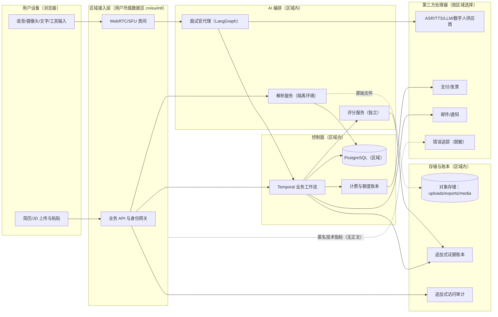

# 隐私数据地图（PRIVACY-DATA-MAP）

| 字段 | 内容 |
|---|---|
| 文档编号 | SEC-PRIV-001 |
| 版本 | 0.1.0（已批准 2026-08-01 规范评审） |
| 追踪 | PRD-001 "Privacy, Security & AI Governance"（Data Regions、Consent Center、Retention、Age Policy）；US-05、US-07；FR-003、FR-027、FR-035、FR-040 |
| 一致性锚点 | `docs/data/DATA-CLASSIFICATION.md`、`docs/data/RETENTION-MATRIX.md`、`docs/security/THREAT-MODEL.md`、`docs/architecture/DEPLOYMENT.md` |

## 1. 目的

绘制面个蛋全部个人数据的产生、流向、存储、共享与删除路径，明确每类数据经过哪些系统与第三方处理器、位于哪个数据区、依据何种授权，使隐私评审（PIA/DPIA）、数据权利请求与删除编排有据可依。

## 2. 范围

- 个人数据类别与数据流向（含用户内容流与匿名指标流的分离）。
- 第三方处理器清单与数据保护协议要求。
- 法律依据映射（PIPL / GDPR / CCPA / COPPA）与同意中心六类授权。
- 跨境规则与合法跨境流程。

## 3. 非目标

- 不重复威胁分析（见 THREAT-MODEL）与保留期限细节（见 RETENTION-MATRIX）。
- 不提供法律意见；区域法律实施方案属未决事项 OD-03（法务与隐私负责人）。

## 4. 个人数据类别总账

| 类别 | 示例 | 分类级别 | 默认保存 | 进入面试上下文 |
|---|---|---|---|---|
| 账户与身份 | 邮箱哈希、第三方身份 subject、年龄状态 | restricted | 至账户删除 | 否 |
| 简历原件与 JD 原文 | PDF/DOC/DOCX 文件、粘贴文本 | restricted | 至用户删除 | 仅解析后安全结构 |
| 结构化简历/JD | resume-profile / job-profile | confidential | 至用户删除 | 是（敏感字段已排除） |
| JD 排除内容 | 薪资福利、公司福利、招聘联系人及其联系方式 | restricted | 仅随 JD 原文保存；结构化版本只存排除类别 | **否（FR-004 硬性排除）** |
| 敏感字段 | 电话、邮箱、证件号、详细地址、照片，以及外貌/性别/年龄/种族/国籍/残障/婚育/宗教/情绪/微表情/人格等保护属性 | restricted | 仅原始上传隔离存储；结构化版本只存排除类别 | **否（SEC-040 硬性排除）** |
| 面试逐字稿与修订 | ASR 文本、修订文本、文字回答 | restricted | 12 个月 | 是（评分证据） |
| 工具事件 | 代码/白板/案例/作品集事件 | confidential | 12 个月 | 是 |
| 评分与报告 | ScoreVersion、报告 | confidential | 12 个月 | 产生方 |
| 原始音视频 | 经单独明确授权的录制 | restricted | 30 天（默认不保存） | 否 |
| 商业数据 | 订单、额度账本、发票 | confidential（支付凭证 restricted） | 按财务法规且解除内容关联 | 否 |
| 授权与审计 | ConsentGrant、AccessAudit | confidential | 按地区法律与风险、内容最小化 | 否 |
| 匿名技术指标 | 延迟、错误率、容量 | internal | 按监控策略 | 否 |
| 机构聚合数据 | ≥10 人群体趋势 | internal | 按机构合同 | 否 |

## 5. 数据流向图

红线：

1. 用户内容（简历、逐字稿、回答、报告、授权媒体）**不离开所属数据区**；监控与错误追踪只携带匿名技术指标（禁止正文作为标签/属性）。
2. 浏览器不持有模型/支付/数字人供应商密钥；供应商只看到其处理所需的最小数据（如 ASR 供应商只见语音流）。
3. 机构默认不在数据流中：个人内容仅在用户按任务细粒度授权后对机构可见，且只可见授权范围内模块。
4. JD 调用模型适配器前先剔除薪资福利、公司福利和招聘联系人；这些内容不得进入岗位画像、面试上下文或评分上游。仅简历模式只传已确认且通过 SEC-040 的安全画像，不传简历原文。

## 6. 第三方处理器清单

| 处理器类别 | 处理的数据 | 是否存储用户内容 | 区域要求 | 协议要求 |
|---|---|---|---|---|
| WebRTC/SFU | 实时音视频流、数据通道消息 | 否（转发） | 每区独立部署或区域内节点 | DPA + 区域处理条款 |
| ASR | 语音流（实时转写） | 否（实时处理，不留存） | 中国区内容不默认调用境外模型 | DPA；禁止用于其模型训练 |
| TTS | 问题/追问文本 | 否 | 同上 | DPA |
| LLM | 脱敏后的任务文本、结构化事实、证据摘要 | 否（无密钥、无其他用户数据） | 同上 | DPA；零保留或最短保留配置 |
| 数字人 | TTS 音频、角色驱动参数 | 否（角色库授权链存档于平台侧） | 同上 | 肖像/声音授权链 + DPA |
| 支付/发票 | 订单、金额、法定发票信息 | 是（法定保留） | 区域化支付供应商 | PCI DSS 范围控制 + 当地财务法规 |
| 邮件/通知 | 邮箱地址、通知模板变量（无正文内容） | 仅投递日志 | 区域化 | DPA |
| 错误追踪 | 匿名技术指标、堆栈（脱敏） | 否 | 区域化端点 | 禁止正文上报的 SDK 级过滤 |
| 对象存储 | 原始文件、导出物、授权媒体 | 是（加密） | 区域内桶 | 静态加密 + 区域锁定 |

## 7. 法律依据与授权映射

| 法域 | 关键义务 | 产品落地 |
|---|---|---|
| 中国 PIPL（含出境规则） | 告知-同意、敏感个人信息单独同意、出境评估/备案 | 注册时数据处理说明；原始音视频单独明确授权；默认不跨境，合法跨境走第 9 节流程 |
| 欧盟 GDPR（含 Article 8） |  lawful basis、儿童同意年龄（16 或成员国更低至 13，按就高原则与本地规则）、DPIA | 同意中心六类独立授权；16 岁至当地成年年龄需监护人同意；上线前完成 DPIA |
| 美国 CCPA | 查询/删除/限制、不出售个人信息 | 权利请求工单化；**不出售**简历、面试记录或用户画像 |
| 美国 COPPA | 13 岁以下儿童保护 | 未满 16 岁仅无登录样例演示，不收集个人信息 |

同意中心六类授权（相互独立、可撤回、拒绝不影响核心服务）：

| consent_type | 控制的数据流 |
|---|---|
| `core_service` | 提供核心服务的必要处理（注册时接受条款/隐私/数据处理说明） |
| `raw_av_recording` | 原始音频/视频保存（默认关闭；30 天；未成年强制不可用） |
| `org_sharing` | 机构结果共享（按任务单独授权：范围、有效期、可撤回） |
| `product_analytics` | 非必要产品分析（默认关闭） |
| `model_training` | 模型训练或研究（默认关闭；拒绝不影响核心服务） |
| `marketing` | 营销通知 |

数据权利（查询、导出、更正、删除、撤回授权、限制处理）在线完成；删除覆盖数据库、缓存、索引、对象存储、备份与第三方处理器，展示真实进度（FR-040）。

## 8. 未成年人数据流特别规则

- 未满 16 岁：仅样例演示，无登录、无上传、无个人数据收集。
- 16 岁至当地法定成年：上传简历、保存记录、付费前需可验证监护人同意（ConsentGrant 记录）；**不保存原始音频或视频**；不向机构默认分享任何个人结果。
- 机构邀请不能替代监护人同意。

## 9. 跨境规则

1. 默认：中国、欧盟、国际三区相互隔离；备用与灾备在同一法定数据区域内；不为容灾擅自跨境。
2. 合法跨境需求（如用户主动跨国迁移账户）必须完成：影响评估 → 适用合同条款 → 备案或安全评估（按适用法域）→ 单独告知用户 → 执行与审计。
3. 账户创建后不得静默迁移数据区。

## 10. 关键规则（红线）

1. 敏感字段零进入面试上下文；保护属性零进入评分证据。
   TASK-013 以解析前脱敏、模型输出后清洗、Schema/版本写入前递归扫描、上下文/评分材料组装前
   再次扫描四道门落实；任一命中 fail-closed，错误与日志仅记录类别/路径，不记录原值。
2. 原始音视频默认不保存；任何录制链路必须核对有效授权。
3. 日志与追踪零正文；监控零个人标识。
4. 机构默认零可见；授权撤回后在线访问立即失效。
5. 默认零跨境；例外必须走第 9 节流程并留痕。

## 11. 异常处理

| 异常 | 处理 |
|---|---|
| 发现正文进入日志/追踪 | 按隐私事故分级处置（SEV 响应）、清除、复盘、修订 SDK 过滤规则 |
| 授权状态不确定（同步延迟） | 按"未授权"保守处理；授权服务恢复后对账 |
| 第三方处理器违约或泄露 | 启动事件响应、暂停该供应商（区域内切换已验证替代）、依法通报、用户告知 |
| 删除任务部分失败 | 任务保持 failed 并重试，向用户展示真实进度；第三方删除以凭证/回执收敛 |
| 用户跨区迁移请求 | 走第 9.2 条流程；未完成前保持原区处理 |

## 12. 验证方式

1. 上线前完成隐私影响评估（PIA/DPIA）与 AI 风险评估（Pre-Launch Hard Gate）。
2. 数据流审计：每季度核对本图与实际数据流（含第三方）的一致性。
3. 删除演练：每季度端到端删除任务演练，验证数据库/缓存/索引/对象存储/备份/第三方全部收敛。
4. 扫描：日志与追踪管道的敏感数据扫描（发布与月度）。
