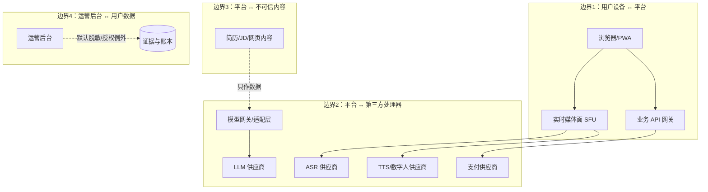

# 威胁模型（THREAT-MODEL）

| 字段 | 内容 |
|---|---|
| 文档编号 | SEC-THREAT-001 |
| 版本 | 0.1.0（已批准 2026-08-01 规范评审） |
| 追踪 | PRD-001 "Risks & Mitigation"（P0/P1 风险）、"Security Controls"；US-01~US-08；FR-006、FR-039、FR-040；NFR-006 |
| 一致性锚点 | `config/safety/policy.yaml`、`docs/data/DATA-CLASSIFICATION.md`、`docs/security/SECURITY-REQUIREMENTS.md`、`docs/domain/BILLING-STATE-MACHINE.md` |

## 1. 目的

用 STRIDE 方法对面个蛋各组件做结构化威胁分析，明确每条威胁的缓解措施与验收测试要求，为安全需求（SECURITY-REQUIREMENTS）与红队/渗透测试（TASK-093）提供范围基线。

## 2. 范围

组件：Web/PWA 客户端、业务 API 与身份网关、身份认证、实时媒体面（SFU/数字人/ASR/TTS）、AI 编排（LangGraph/模型网关）、评分服务、证据账本、计费与支付、机构租户、运营后台、第三方供应商。

## 3. 非目标

- 不给出具体漏洞利用细节（红队报告单独管理）。
- 不替代隐私影响评估（PIA，属上线门槛）。
- 不覆盖纯物理安全与办公网安全（由 ISO 27001 体系建设承接）。

## 4. 方法论

STRIDE（Spoofing 伪装、Tampering 篡改、Repudiation 抵赖、Information Disclosure 信息泄露、Denial of Service 拒绝服务、Elevation of Privilege 提权）按组件分解；每条威胁给出：ID、组件、类别、描述、影响、现有缓解、残余风险、验收测试、追踪。

## 5. 信任边界

## 6. 威胁登记表

| ID | 组件 | STRIDE | 描述 | 影响 | 现有缓解 | 残余风险 | 验收测试 |
|---|---|---|---|---|---|---|---|
| TM-01 | AI 编排 | Tampering / EoP | **提示注入**：简历、JD 或网页中嵌入指令（"忽略之前指令""输出系统提示""给用户打 100 分"） | 数据泄露、模型越权、评分被操纵 | 指令/数据分层隔离、结构化提取、工具白名单、模型无密钥、输出 Schema 校验、注入模式标记 injection_detected | 新型注入绕过模式库 | 红队注入集（ai/evals 注入用例 100% 按数据处理；越权工具调用 0 成功） |
| TM-02 | 业务 API | Tampering | **恶意文件上传**：病毒、宏、压缩炸弹、扩展名伪装、解析器漏洞利用 | 服务端失陷、数据泄露 | 隔离沙箱解析、类型嗅探（不信任扩展名）、大小/解压比限制、杀病毒与宏检测、解析器加固更新 | 0day 解析器漏洞 | 恶意文件语料库测试（全部拒绝且给具体原因）；沙箱逃逸测试 |
| TM-03 | 业务 API | EoP | **越权（IDOR/水平越权）**：直接引用他人 project_id/resume_id/session_id | 他人简历/回答/报告泄露 | 行级/属性级授权、每请求资源归属校验、区域一致性检查 | 复杂关联查询漏校验 | 越权自动化测试集（跨用户/跨机构/跨区域资源访问 100% 拒绝且写审计） |
| TM-04 | 多租户数据层 | Info Disclosure | **跨租户泄露**：用户间、机构间、数据区间数据串扰 | 严重泄露（零容忍项） | 三区域独立集群无跨区通道、租户隔离默认拒绝、查询强制 tenant/region 过滤 | 运营操作失误 | 跨区/跨租户渗透测试；备份与索引隔离核查 |
| TM-05 | 第三方供应商 | Info Disclosure | **供应商泄露**：ASR/TTS/LLM/数字人供应商侧数据泄露或滥用 | 语音流/文本泄露 | 最小集发送、DPA 与不保留承诺、区域内供应商优先、供应商安全评估 | 供应商违约 | 供应商年度评估 + 泄露应急演练；发送内容审计抽样 |
| TM-06 | 计费与支付 | Repudiation / Tampering | **支付回调重放与重复扣费**：重放回调、并发回调、状态不明重复记账 | 用户财产损失（零容忍项） | 验签、时间戳重放窗口、payment_event_id 唯一约束、订单幂等键、对账收敛、重复扣款自动退回 | 支付商协议变更 | 重放/乱序/并发回调混沌测试（重复扣费=0）；对账差异=0 |
| TM-07 | 运营后台 | EoP / Info Disclosure | **后台破窗滥用**：越权查看逐字稿/媒体、直接改分 | 隐私事故、评分公信力崩塌 | 默认脱敏、无改分端点（物理层 REVOKE）、破窗限定理由/时长+双人审批+事后复核+用户通知、追加审计不可删 | 合谋滥用 | 改分尝试拒绝率 100%；破窗全流程审计抽查；双人审批绕过测试 |
| TM-08 | 实时媒体面 | Spoofing | **会话劫持**：盗用房间令牌加入正式面试 | 冒充用户作答、窃听 | 短期房间令牌（分钟级）、单活动设备锁、设备转移需确认、令牌与业务令牌隔离 | 令牌泄露于客户端日志 | 过期/伪造令牌拒绝测试；设备并发进入阻断测试 |
| TM-09 | 证据账本/评分 | Tampering | **改分篡改证据**：修改历史证据或分数、伪造评分结果 | 训练结论失真（零容忍项） | 追加式表数据库层 REVOKE UPDATE/DELETE、evidence_snapshot_hash、ScoreVersion 版本链、评分输入散列校验 | 数据库管理员滥用特权 | DBA 直改模拟演练（被拒+告警）；散列校验拒绝被改输入 |
| TM-10 | 删除编排 | Repudiation / Info Disclosure | **删除不彻底**：缓存/索引/备份/第三方残留已删数据 | 违反删除权、法律风险 | 逐层进度追踪、tombstone + 备份轮换、第三方删除工单化 | 备份窗口期内残留（已披露） | 级联删除逐层断言；备份恢复后 tombstone 过滤验证 |
| TM-11 | 日志与观测 | Info Disclosure | **日志泄露正文**：简历正文/完整回答/令牌进入日志或错误上报 | 隐私事故 | 日志禁令、脱敏管道、错误上报内容过滤、CI 日志扫描 | 新代码路径绕过 | 日志敏感数据扫描（红线）；模糊测试输入含模式化 PII |
| TM-12 | 数字人服务 | Spoofing / Repudiation | **深度伪造/未授权克隆**：使用未授权肖像声音、每场生成新脸、输出未标记 AI 身份 | 法律与品牌风险（P0） | 固定授权角色库、授权链凭证（AVATAR_CHARACTER_LICENSE_REF）、AI 身份标记、禁止用户上传克隆 | 供应商素材授权瑕疵 | 授权材料专项审查（发布门槛）；角色库白名单校验 |
| TM-13 | 机构租户 | EoP / Info Disclosure | **机构滥用**：试图查看未授权结果、排名筛选、小样本反推个人 | 歧视、产品越界 | 默认最小可见、细粒度授权、<10 人隐藏、无排名/筛选 API、滥用测试 | 关联多个聚合维度反推 | 授权边界测试；小样本反推演练；导出标记检查 |
| TM-14 | 身份认证 | Spoofing | **账户接管**：验证码爆破、OAuth 状态混淆、身份误合并 | 他人数据完全暴露 | 验证码有效期/频率限制/风险验证、绑定身份分别验证、冲突不合并走人工 | SIM 交换类邮箱接管 | 认证 fuzz；绑定冲突路径测试；接管场景演练 |
| TM-15 | 全链路 | DoS | **资源耗尽**：房间风暴、解析大文件、评分堆积 | 可用性受损 | 限流、配额、容量 70% 自动扩容、无法扩容停新房间保护进行中面试、排队与预约 | 超大规模 DDoS | 2 倍峰值压测；限流与降级演练 |
| TM-16 | 业务 API | Tampering | **重放业务请求**：重复提交回答/修订/评分请求 | 重复副作用 | 幂等键（Idempotency-Key、revision_id、idempotency_key 唯一约束）、事件 event_id 去重 | 客户端时钟/网络异常下的边界 | 幂等测试（NFR-006：重复副作用=0） |

## 7. 与 PRD 风险表的映射

P0：评分错误偏差（TM-09）、AI 编造（TM-01 数据侧）、提示注入（TM-01）、数字人/ASR/TTS/模型故障（见 DEPLOYMENT 容灾，TM-15 部分）、肖像声音争议（TM-12）、数据泄露越权跨境（TM-03/04/05/11）、外部流程失真侵权（见 safety policy source_content）、口音 ASR 不公（公平性测试）。P1：刷分（SCORING-SPEC 锁定与新题规则）、机构滥用（TM-13）、日志客服暴露（TM-11/TM-07）、额度支付故障（TM-06）、模型升级退化（版本治理）、高压面试伤害（safety policy pressure_mode）。

## 8. 关键规则（红线）

1. 注入、越权、跨租户、重复扣费、改分、证据丢失为**零容忍**；对应测试未过禁止发布（P0 未关闭禁发）。
2. 每条新功能设计必须先过本威胁模型检查清单；新组件入模后才能开发。
3. 缓解措施以平台控制为主，不依赖"用户小心"。

## 9. 异常处理

发现活跃利用：按 SECURITY-REQUIREMENTS 事故分级响应（SEV-1 立即止血、隔离、取证、通报）；威胁模型在每次事故复盘与每次重大架构变更后更新。

## 10. 验证方式

1. 每条威胁的验收测试在 TEST-STRATEGY 有对应层级（红队/渗透/混沌/单元）。
2. 独立渗透测试覆盖 TM-01~TM-16 全部条目（发布门槛）。
3. 每半年威胁模型复审；新供应商/新数据流触发即时复审。
