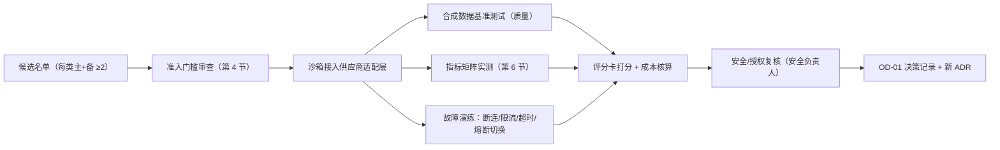

# Phase 0 供应商评测方案（PHASE0-PROVIDER-EVALUATION）

| 字段 | 内容 |
|---|---|
| 文档编号 | TEST-PHASE0-001 |
| 版本 | 0.1.0（已批准 2026-08-01 规范评审） |
| 追踪 | PRD-001 Timeline（Phase 0）、Risks（供应商故障 P0、肖像/深度伪造 P0）；OD-01；NFR-007 ~ NFR-012；TASK-030、TASK-091、TASK-096 |
| 一致性锚点 | `docs/ai/PROVIDER-ADAPTERS.md`（能力契约）、`docs/architecture/DEPLOYMENT.md`（区域与故障切换）、`fixtures/synthetic/`（评测数据） |

## 1. 目的

将未决事项 OD-01（WebRTC/数字人/ASR/TTS/LLM 主备供应商选择）转化为可执行、可打分、可复核的评测方案，使 Phase 0 退出决策基于证据而非主观判断。

## 2. 范围

- 五类能力的候选供应商评测：WebRTC/SFU、ASR、TTS、LLM、实时数字人。
- 每项核心能力至少评测一个主方案和一个替代方案（PRD Phase 0 硬性要求）。
- 中英文双语、多口音、弱网、故障切换、数据区合规、授权链与单位成本。

## 3. 非目标

- 不在本文选定任何供应商（结论写入 OD-01 决策记录与新 ADR）。
- 不使用真实用户数据或真实简历进行评测（仅 `fixtures/synthetic/` 与新增 `synthetic: true` 材料）。
- 不评测 PRD 范围外能力（如视频生成大模型、克隆服务）。

## 4. 评测准入门槛（进入评测名单的必要条件）

任一不满足即淘汰，不进入打分：

1. 支持在用户所属数据区内处理（或提供区域化部署/端点）；中国区内容不默认出境。
2. 可签署数据处理协议（DPA），承诺不留存用户内容用于其模型训练。
3. 数字人候选必须提供**固定授权角色库**与完整肖像/声音授权链；不支持每场生成新脸、不做未授权克隆。
4. 提供沙箱/试用环境与可核算的单价模型。
5. 安全自评：传输加密、密钥管理、SOC 2/ISO 27001 或等效证明。

## 5. 评测维度与评分卡

每项能力按 100 分制打分，权重如下；**红线项一票否决**。

| 维度 | 权重 | 评测内容 |
|---|---|---|
| 实时性能（SLO 达成） | 30 | 对照 NFR-007 ~ NFR-012 逐项实测（见第 6 节指标表） |
| 中英文质量 | 25 | 黄金集盲评：ASR 字准率（含口音集）、TTS 自然度 MOS、LLM 追问相关性与安全性、数字人口型/表现力 |
| 数据区与合规 | 15 | 区域处理能力、DPA、零保留配置、日志行为 |
| 授权与品牌安全 | 10 | 角色库授权链、AI 身份标记能力、深度伪造防护条款 |
| 故障与可替换性 | 10 | 熔断/降级行为、适配层接入工作量、退出成本（数据/合同锁定） |
| 单位成本 | 10 | 按标准面试分钟推算完全成本（含重试与失败调用） |

红线项（一票否决）：数据默认出境、拒绝 DPA 零保留、授权链不完整、无法满足打断 P95 ≤500ms（数字人/ASR 链路合计）、无法提供固定角色库。

## 6. 指标测试矩阵（实测口径）

| 指标 | 目标 | 测量方法 |
|---|---|---|
| 数字人音视频建立 | 95% ≤8s；99% ≤15s | 合成会话 ×200 次/供应商/区域，冷启动计时 |
| 用户发言结束→数字人开始回应 | P50 ≤1.5s；P95 ≤3s；P99 ≤5s | 合成语音问答脚本回放，全链路计时（ASR+LLM+TTS+Avatar） |
| 打断→停止发声 | P95 ≤500ms | 语音打断 + 停止按钮各 ×100 次 |
| ASR 最终文本时延 | P95 ≤1s | 流式送话，最终文本到达计时 |
| 口型与音频偏差 | ≤200ms | 录制样本对齐分析 |
| 默认视频规格 | ≥720p、24fps；弱网优先音频连续 | 带宽节流（1 Mbps / 512 kbps / 256 kbps + 30% 丢包）下观测降级行为 |
| ASR 质量 | 中英文及口音集字准率达到门槛（门槛值由 AI 负责人随校准基线确定并记录） | 合成语音集：普通话/方言口音/中式英文/美式英文各 ≥30 样本 |
| 长会话稳定性 | 60 分钟会话无内存/连接退化 | 合成脚本长跑 ×10 |

## 7. 评测流程

1. **接入纪律**：所有候选只通过供应商适配层接入，禁止业务代码直连；接入工作量本身记入"可替换性"分。
2. **故障演练**：模拟主供应商断连，验证熔断（closed/open/half_open）、切换暂停计时、活跃会话状态恢复；切换不得跨境。
3. **数据纪律**：评测仅使用合成材料；评测日志不得含任何真实个人信息；沙箱凭证按区域密钥管理。
4. **输出物**：每类能力一份评分卡 + 原始测量数据 + 推荐主/备结论，提交技术、AI、安全负责人三方签字，形成 OD-01 决策记录与 ADR。

## 8. 关键规则

1. 无真实用户数据进入任何供应商评测链路。
2. 任一候选未通过准入门槛不得进入打分；红线项不达标即否决。
3. 每项核心能力必须有至少一个**已验证**的替代方案，Phase 0 才算通过（PRD 退出条件）。
4. 不合格供应商不能进入真实用户链路；评测结论按区域分别得出（同一供应商可在不同区域结论不同）。
5. 评测过程与数据留档，支撑后续年度供应商复评。

## 9. 异常处理

| 异常 | 处理 |
|---|---|
| 候选拒绝提供沙箱或单价 | 记入不可替换性低分；无法核算成本则该项 0 分 |
| 实测数据与供应商承诺严重不符 | 以实测为准并在决策记录中标注 |
| 评测期间供应商服务降级 | 记录为故障样本；不因此延长评测窗口 |
| 两候选总分接近（差 <5 分） | 以红线项与故障演练结果为决胜项，并在决策记录写明理由 |

## 10. 验证方式

- 本方案执行完成 = 五类能力评分卡齐全 + OD-01 决策记录签署 + 对应 ADR 入库。
- 评测脚本与测量数据入库留档（`ai/evals/` 增补供应商评测目录，数据标记 synthetic）。
- Phase 0 退出条件按 RELEASE-CHECKLIST Phase 0 检查单逐项核验。
